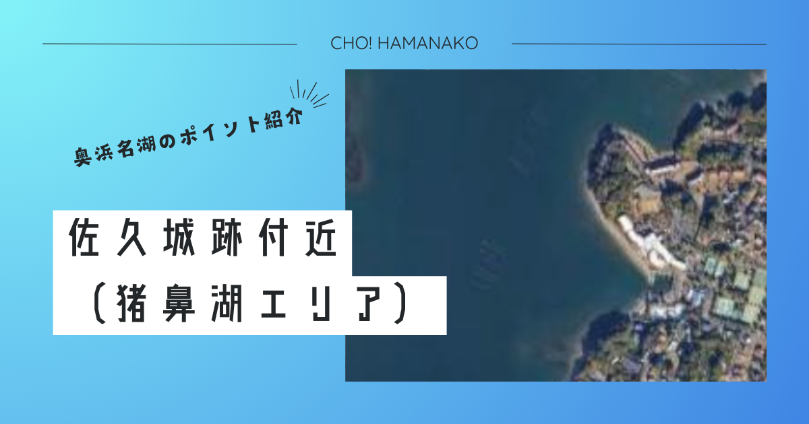

import Map from "@components/Map.astro";
import GMapButton from "@components/GMapButton.astro";
import BlogCard from "@components/BlogCard.astro";
import Callout from "@components/Callout.astro";

「釣！浜名湖」へようこそ！

今回フォーカスするのは、猪鼻湖（いのはなこ）の入り口に位置する <strong>「佐久城跡（さくじょうせき）周辺」</strong> です。

ここは単なる史跡公園ではありません。浜名湖の多くが「遠浅の干潟」であるのに対し、このエリアは護岸からわずか数メートルで水深がガクンと落ち込む <strong>「急深（きゅうしん）」</strong> な地形を形成しています。この「深さ」こそが、猪鼻湖へと出入りする魚たちの主要な <strong>「回遊ルート（魚道）」</strong> となり、特に冬のカレイや夜の大型チヌ狙いにおいて、奥浜名湖屈指のポテンシャルを秘めているのです。

歴史の静寂に包まれながら、一撃必殺の大物を狙う――。そんな知的でエキサイティングな釣りを支える全データを、3000文字超の圧倒的ボリュームでお届けします。

---

## 🧭 ポイント概要：猪鼻湖の「門番」としての地形

佐久城跡周辺を攻略する最大の鍵は、その <strong>「立地」</strong> と <strong>「水深」</strong> にあります。

### ① 猪鼻湖の「ボトルネック」を狙い撃つ
猪鼻湖は「瀬戸（せと）」という狭い水路を通じて浜名湖本湖と繋がっています。佐久城跡はその水路を抜けてすぐの場所にあり、 <strong>「潮の流れが収束し、魚が必ず通過する場所」</strong> です。
- <strong>メリット</strong>：回遊待ちの釣りが非常に成立しやすい。潮が動くタイミングで、仕掛けを「適切な深さ」に置いておくだけで、魚の方からコンタクトしてきます。

### ② 奥浜名湖では稀有な「足元からの深さ」
多くのポイントが100m投げても水深1m、という世界の中で、ここは足元から3m〜5m、投げればそれ以上の深さが確保されています。
- <strong>チョイ投げの聖地</strong>：フルキャストの必要がありません。20m〜30mほど軽く投げれば、魚が溜まる <strong>「ブレイクライン（斜面）」</strong> を直撃できます。これは初心者や、重いタックルを扱いにくいお子様にとって最大の利点です。

### ③ 完璧なファシリティ
- <strong>駐車場・トイレ</strong>： <strong>佐久城公園</strong> 内に完備されています。
- <strong>アクセス</strong>： <strong>三ヶ日IC</strong> から車で約15分。天竜浜名湖鉄道 <strong>「浜名湖佐久米駅」</strong> から徒歩圏内という、「駅チカ釣行」が可能な希少なスポットです。

---

## 🌊 水中構造と戦略：斜面の「肩」を制する者が勝利する

佐久城跡のボトムは、砂に少量の泥と石が混じった構成です。

### ターゲットを誘い出す「3つのピンポイント」

1. <strong>カケ上がりの「肩」</strong>
   足元から深場へと落ち込む「斜面の始まり」です。ここにプランクトンや小魚が溜まりやすく、カレイやチヌが下から見上げながらエサを探しています。仕掛けを遠くに投げすぎず、この <strong>「斜面の途中」</strong> に落ち着かせることが最重要です。
   
2. <strong>城跡の「基礎石」周り</strong>
   水中には当時の石積みの一部や、崩れた石が沈んでいる箇所があります。ここには <strong>カニやエビ</strong> が居着いており、ウキ釣りで丁寧にタナ（水深）を合わせれば、居付きの良型クロダイを引っ張り出すことができます。
   
3. <strong>潮目（サクメ側の流れ）</strong>
   佐久米方面から流れてくる潮と、猪鼻湖内からの引き潮がぶつかるポイント。海面をよく観察し、ゴミが溜まっているような「潮目」があれば、そこがルアーフィッシング（セイゴ・シーバス）の絶好のトレースラインとなります。

---

## 🎣 シーズン別・本命ターゲット攻略

### 【❄️ 冬：12月〜3月】カレイ：三ヶ日の「座布団」を獲る
冬の猪鼻湖といえばカレイです。水深のあるこのエリアは水温が安定しやすく、産卵前後の大型が集結します。
- <strong>タクティクス</strong>： <strong>「ブッコミ釣り」</strong> で2〜3本の竿を出し、アオイソメを贅沢に房掛け（数匹刺し）にします。アタリがあっても焦らず、 <strong>「タバコ一服」</strong> 待つくらいの余裕を持って食い込ませるのが、佐久城跡流の作法です。

### 【🌸 春〜🍂 秋】ナイト・チニング：闇に紛れる巨魚
夜間、公園の灯りが届かない静寂の中で、警戒心の解けた大型クロダイが足元の浅場まで差してきます。
- <strong>タクティクス</strong>： <strong>「フリーリグ」</strong> や <strong>「チヌ専用プラグ」</strong> を使用。ゆっくりとボトムを小突くように誘うと、強烈な「ガツン！」という手応えとともに、猪鼻湖の主が姿を現します。

---

## ⚠️ 歴史・史跡への敬意と「絶対的」安全ルール

この場所は、浜松市が指定する貴重な <strong>「歴史遺産」</strong> です。アングラーである前に、一人の訪問者としてのマナーが問われます。

> [!IMPORTANT]
> <strong>【史跡保護】石積みを傷つけない</strong>
> 公園内の石積みや遺構は数百年という時を超えてきたものです。
> - <strong>「ピトン（竿立て）の打ち込み」「石積みへの落書き」「撒き餌の放置」</strong> は絶対に厳禁です。釣り座の汚れは、帰る前に必ず水で洗い流しましょう。

> [!CAUTION]
> <strong>【生命の守り】アカエイと夜間の段差</strong>
> 1. <strong>「すり足」の徹底</strong>：波打ち際を歩く際は、 <strong>アカエイ</strong> を踏まないよう足を擦って歩くシャッフル歩行を義務付けてください。
> 2. <strong>夜間の視界</strong>：街灯がないため、夜間は非常に暗くなります。 <strong>ヘッドライト</strong> は高輝度のものを用意し、足元の段差（特に古い石積み付近）での転倒に注意してください。

---

## 🚀 まとめ：時が止まったような静寂の中で、「深化」する釣りを

佐久城跡周辺は、猪鼻湖の豊かな生態系と、戦国時代のロマンが融合した特別なフィールドです。

- <strong>「深さ」を味方につけた圧倒的な回遊量</strong>
- <strong>「公園」としての快適なファシリティ</strong>
- <strong>「歴史」に守られた穏やかな雰囲気</strong>

このポイントを訪れる際は、ぜひ一度城跡の石積みを眺め、かつての武士たちが眺めたであろう猪鼻湖の景色に想いを馳せてみてください。その余裕が、きっと釣果という形になって返ってくるはずです。

マナーを守り、安全第一で、奥浜名湖の「深化」する釣りを楽しんでください！

---

<BlogCard slug="mikkabi-eki" />
隣接する「三ヶ日駅前」ポイント。汽水域の豊かさを多角的に狙うなら、こちらの情報も必見です。

<BlogCard slug="setosuidou" />
猪鼻湖の入り口「瀬戸」。ここを通った魚たちが佐久城跡へとやってきます。潮の流れを理解するための重要記事。

---

### エキスパート向け攻略リソース
<BlogCard slug="lunker-seabass-fukabori" />
猪鼻湖入り口の急深地形を読み解く、真冬のランカーシーバス深掘りガイド。
