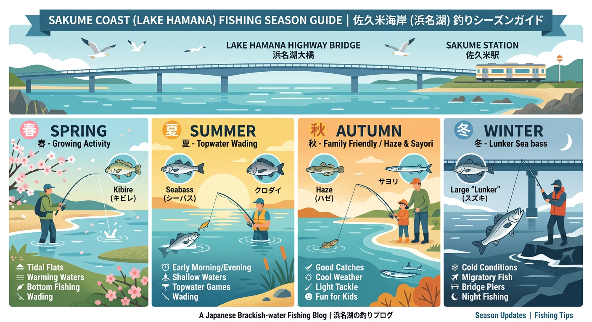

import Map from "@components/Map.astro";
import GMapButton from "@components/GMapButton.astro";
import TackleCard from "@components/TackleCard.astro";

『釣！浜名湖』をご覧いただきありがとうございます！

今回ご紹介するのは、奥浜名湖の北側に位置する **「佐久米（さくめ）海岸」** です！

エサ釣りでもルアー釣りでも安定した釣果が出るバランスの良いポイント。特に地形の変化に富んでいるため、水の中へ立ち込む「ウェーディング」のルアーゲームが特におすすめです。

<Map lat={34.785074} lng={137.606548} name="佐久米海岸" />

## 佐久米海岸の基本情報

<GMapButton url="https://maps.app.goo.gl/yTuuXiNVYRupUyRg6" />

*   **ポイント名**：佐久米海岸（さくめかいがん）
*   **所在地**：静岡県浜松市浜名区三ヶ日町佐久米
*   **アクセス方法**：東名高速「浜名湖SAスマートIC」から車で約2分。
*   **駐車場**：海岸の入り口付近に数台の駐車スペースがあります。
*   **トイレ**：ぷらっとパーク経由で浜名湖SA内の施設を利用可能です。

### ポイントの特徴

**1. 遠浅の砂利浜エリア**
足元が安全でウェーディングしやすく、夏から秋にかけてはルアーマンに大人気のスポットです。

**2. 深さのある護岸エリア**
消波ブロック付近は足元から適度に水深があり、ウキ釣りや投げ釣りに適しています。特に夜釣りがおすすめです。

**3. シビアな「居着き」狙い**
高速道路の橋脚付近は深場になっており、冬でも居着くランカーシーバスが潜む玄人好みのエリアでもあります。

### 🐟️シーズン別攻略ガイド

*   **🌸 春（3月〜6月）**：キビレ、シーバス
    *   **【攻略】** 水温上昇とともに活性がアップ。ブッコミ釣りでのボトム狙いが面白い時期です。

<TackleCard id="kibire/ima-chappy-80" />

*   **☀️ 夏（7月〜9月）**：クロダイ、キビレ、ハゼ
    *   **【攻略】** 夜の電気ウキ釣りがおすすめ。日中はトップでのウェーディングも楽しい！

<TackleCard id="kibire/ima-popkey-80" />

*   **🍂 秋（10月〜11月）**：ハゼ、シーバス、サヨリ
    *   **【攻略】** 砂浜でハゼの数釣りが本格化します。

<TackleCard id="haze/sasame-choi-haze-set-5go" />

*   **❄️ 冬（12月〜2月）**：ランカーシーバス
    *   **【攻略】** 橋脚回りに潜むランカー一発狙い。集中力が鍵を握ります。

<TackleCard id="seabass/shimano-exsence-silent-assassin-99f" />

## おすすめタックルと釣り方

*   **対象魚**：シーバス、キビレ、クロダイ、ハゼ
*   **釣り方**：ウェーディングルアー、ウキ釣り、投げ釣り

ウェーディング派の方は、エイなどの危険生物に注意し、必ずエイガード等を着用して安全に楽しみましょう。

<TackleCard id="kibire/shimano-bremia-bb-s78ml" />

## 周辺の観光情報

### 浜名湖佐久米駅
アニメの聖地としても有名な駅。冬にはホームに無数のゆりかもめが舞い降りる幻想的な光景が見られます。

<TackleCard id="travel/rakuten-travel-stay" />

## まとめ：浅場から深場まで、寒くなるほど夢膨らむポイント

佐久米海岸は、手軽なハゼ釣りからストイックなランカー狙いまで、多様な釣りに応えてくれる魅力的なフィールドです。マナーを守って、奥浜名湖の豊かな恵みを体感してください！

> [!WARNING]
> **最後にお願い！**
> 
> ゴミは必ず持ち帰りましょう。地域のルールを守り、美しい浜名湖の景色を守りながら、安全に釣行を楽しんでくださいね！
