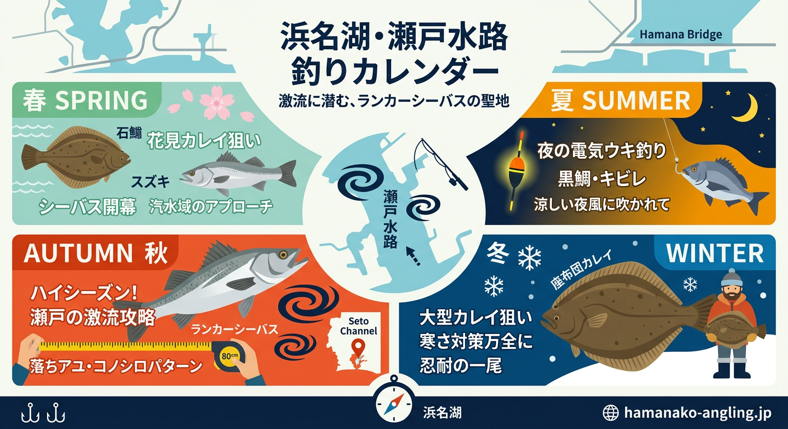

import Map from "@components/Map.astro";
import GMapButton from "@components/GMapButton.astro";
import TackleCard from "@components/TackleCard.astro";

『釣！浜名湖』をご覧いただきありがとうございます！

今回は、奥浜名湖と本湖を繋ぐパワフルな釣り場 **「瀬戸水道（せとすいどう）」** をご紹介します！

ここは浜名湖内で一番有名な「シーバス」の超人気スポットでありながら、「冬から春は座布団カレイ」、「夏から秋はキビレの数釣り」など、1年を通して大物が期待できる非常にポテンシャルの高い良ポイントです。

<Map lat={34.769507} lng={137.548233} name="瀬戸水道" />

## 瀬戸水道の基本情報

<GMapButton url="https://www.google.com/maps/search/?api=1&query=34.769507,137.548233" />

*   **ポイント名**：瀬戸水道（せとすいどう）
*   **所在地**：静岡県浜松市浜名区三ヶ日町大崎
*   **アクセス方法**：東名高速「三ヶ日IC」から車で約10分ほどです。
*   **駐車場**：遊覧船のりば、または橋の北西側（有料）、そして橋の下のスペースにあります。
*   **トイレ**：近くの観光施設のものを（マナーを守って）借りることができます。
*   **近くの釣具店**：植むら釣具店、えさや小寺さん（エサ自販機あり！）
*   **近くのコンビニ**：ファミリーマート三ヶ日インター店、ミニストップ三ヶ日都筑店

瀬戸水道は、北側の「猪鼻湖（いのはなこ）」と南側の「浜名湖」をキュッと結ぶ、非常に狭い一番くびれた部分（水道）のことです。

### ポイントの特徴

**1. 屈指の激流スポット**
浜名湖内で最も有名な表浜名湖の「今切口」と並ぶほどの激流スポットです。スズキ（シーバス）釣りの聖地として有名で、アベレージサイズも良く、60cmオーバーが連発することもあります。

**2. 急深な地形と岩盤の底質**
強い流れによって底が削られ、最大水深は10m近くに達します。底には硬い岩盤が露出しているため、オモリや針を不用意に沈めすぎると一瞬で根掛かりするハードなポイントでもあります。

**3. 真の「狙い目」は水道の出入り口**
激しすぎる流れの真ん中よりも、流れがヨレて少し緩やかになる「北（猪鼻湖側）」と「南（浜名湖側）」の出入り口付近が、魚が餌を待つ絶好のポイントになります。

### 🐟️シーズン別攻略ガイド

*   **🌸 春（4月〜6月）**：シーバス、カレイ
    *   **【攻略】** 北側（猪鼻湖側）でカレイのブッコミ釣り。シーバスは激流の中の「ヨレ」に潜む回遊個体を狙い撃ち！
*   **☀️ 夏（7月〜9月）**：クロダイ、シーバス、ハゼ
    *   **【攻略】** 水道の出入り口で五目釣り。夜は電気ウキで仕掛けを流れに乗せる「流し釣り」が効果抜群です。
*   **🍂 秋（10月〜11月）**：ランカーシーバス、クロダイ、サヨリ
    *   **【攻略】** 瀬戸門が最も熱狂するハイシーズン！ドリフト釣法を駆使して、憧れのランカーを仕留めましょう。
*   **❄️ 冬（12月〜3月）**：座布団カレイ、大型シーバス
    *   **【攻略】** 猪鼻湖神社の北側エリアで肉厚な座布団級を狙うのが冬の醍醐味。一撃の重みがある時期です。

## おすすめタックルと釣り方

*   **対象魚**：シーバス、カレイ、クロダイ、キビレ
*   **釣り方**：エサ釣り（ブッコミ）、ルアー（ドリフト、レンジバイブ）
*   **おすすめエサ**：青ジャムシ（房掛けでアピール！）

### 投げ釣りの極意
激流に負けないよう「20～30号」の重いオモリと PE 1号以下のラインを使用し、水圧を減らして仕掛けを安定させるのがコツです。仕掛けの絡みを防ぐ天秤は必須アイテム。

<TackleCard id="karei/daiwa-prime-surf-t25-405-w" />
<TackleCard id="karei/sasame-canon-ball-karei" />

### ルアー攻略のポイント
ルアーマンは「レンジ（水深）コントロール」を意識しましょう。魚は流れに向かって泳いでいます。シンペンを流れに乗せてスゥ〜ッと流すドリフト釣法が武器になります。

<TackleCard id="seabass/shimano-encounter-s96m" />
<TackleCard id="seabass/daiwa-lates-93ml-r" />

## 瀬戸水道の周辺観光情報

釣りの合間にぜひ目を向けてほしいのが、瀬戸水道のすぐ南東に浮かぶ小さな無人島 **「礫島（つぶてじま）」** です。夕暮れ時には夕日に照らされて神秘的な姿を見せてくれます。

<TackleCard id="travel/rakuten-travel-stay" />

## まとめ：激流を制し、憧れのランカーと出会う

瀬戸水道は、初心者から上級者まで、自らのテクニックと知識を試される奥浜名湖の「聖地」です。足場が低く、今切口よりも安全に激流の釣りを体験できるため、リバーシーバスのような感覚でドリフト技術を磨くのに最適な道場とも言えます。

> [!WARNING]
> **最後にお願い！**
> 
> 釣り場をいつまでも綺麗に保つために、ゴミは必ず持ち帰りましょう。
> 地域のルールと駐車場のマナーを守り、周囲のアングラーと譲り合いながら、最高に楽しいフィッシングライフを楽しんでくださいね！
