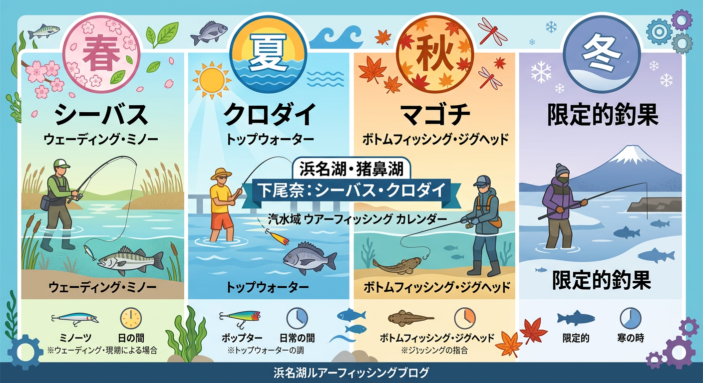

import Map from "@components/Map.astro";
import GMapButton from "@components/GMapButton.astro";

『釣！浜名湖』をご覧いただきありがとうございます！

今回は、猪鼻湖の西海岸に広がる **「下尾奈（しもおな）地区」** をご紹介します！

下尾奈地区は、リゾートホテルなどが点在する静かな西側の広大なシャローエリア（浅瀬）がメインのポイントです。

特にルアーでチヌやシーバスを狙うアングラーにとっては、奥浜名湖有数のウェーディングスポットとして知る人ぞ知るエリアなんですよ！

<Map lat={34.784421} lng={137.546814} name="下尾奈地区" />

## 下尾奈エリアの基本情報

<GMapButton url="https://maps.app.goo.gl/8yf1EVx3iQqhCNEg6" />

*   **ポイント名**：下尾奈周辺（猪鼻湖西側）
*   **所在地**：静岡県浜松市浜名区三ヶ日町下尾奈
*   **アクセス方法**：東名高速「三ヶ日IC」から車で約10分。天竜浜名湖鉄道「尾奈駅」から徒歩圏内。
*   **トイレ**：天竜浜名湖鉄道「尾奈駅」のトイレを利用するのが無難です。
*   **近くの釣具店**：フィッシングジョイ、えさや小寺
*   **近くのコンビニ**：セブン-イレブン 三ヶ日町店

下尾奈周辺の護岸は一部がまるで砂浜のように整備されており、小さな川の流れ込みもあって、目で見える地形変化（ストラクチャー）が豊富です。

水深もそれほど深くなく、ルアーをフルキャストしても着水地点の深さはせいぜい3m前後。だからこそ、ミノーやトップウォーターでの釣りが非常に成立しやすいのが特徴です。

### ポイントの特徴

**🎣 猪鼻湖有数のウェーディングスポット**
下尾奈地区の最大の魅力は、水に立ち込むウェーディングスタイルでの釣りです。
特に夏場の干潮時には広大な浅瀬を移動しながら、スレていない魚を探す「サイトフィッシング」が熱いエリアです。

**🎣 地形変化が豊富**
リゾートホテルの周辺などは護岸整備されており、所々に小規模な流れ込みがあります。
これらの障害物が魚の集まりやすい場所（ストラクチャー）となっており、キビレやクロダイ、時には大型のシーバス（マダカ）の回遊も期待できます。

> [!CAUTION]
> **ウェディングの安全対策**  
> ウェーディングをする際は、エイの被害を防ぐためのエイガードの着用やすり足での移動を徹底しましょう。また、潮の満ち引きにも十分注意し、深追いしすぎないよう安全第一で楽しみましょう。

### 🐟️シーズン別攻略ガイド

*   **🌸 春（4月〜6月）**：シーバス、キビレ
    *   **【攻略】** ウェーディングシーズンの開幕。干潮前後のシャロー（浅瀬）を丁寧に探りましょう。
*   **☀️ 夏（7月〜9月）**：クロダイ、キビレ、マゴチ
    *   **【攻略】** 夏のチヌトップ全盛期！水面を割るエキサイティングな釣りが楽しめます。
*   **🍂 秋（10月〜11月）**：シーバス、マゴチ、キビレ
    *   **【攻略】** ベイトを追って大型シーバス（ランカー）が接岸するチャンス。ミノーでの釣りが有効です。
*   **❄️ 冬（12月〜3月）**：限定的
    *   **【攻略】** 基本はオフシーズンですが、ボートがあれば少し沖の深場で居着きの個体を狙えます。

## ルアーで釣れる魚とおすすめタックル

*   **対象魚**：チヌ（キビレ・クロダイ）、シーバス、マゴチ
*   **おすすめルアー**：表層のシンペン、ポッパー、浅く潜るF（フローティング）ミノー
*   **おすすめタックル**：操作性の高い8ft前後のシーバスロッド・チニングロッド

水の中に立っている状態（ウェーディング）では、あまり長いロッドだと取り回しが悪く、ランディング時に穂先を折りやすくなります。
8ft前後の一番短い（取り回しが良い）ものがベストバランスです！

## まとめ：奥浜名湖の西岸、一匹と対峙する贅沢な時間

下尾奈地区は、観光地の喧騒から離れ、猪鼻湖の美しい景色を楽しみながら、一匹の魚とじっくり向き合える場所です。

広大なシャローを自由に歩き回りながら自分のポイントを見つける楽しさは、ウェーディングならではの醍醐味。

マナーをしっかり守って、猪鼻湖のポテンシャルをぜひ体感してみてください！

> [!WARNING]
> **最後にお願い！**
> 
> ゴミの持ち帰りはもちろん、リゾートエリアのため、騒音や不適切な駐車にはくれぐれも注意し、周囲の方々の迷惑にならないようご配慮をお願いします。
