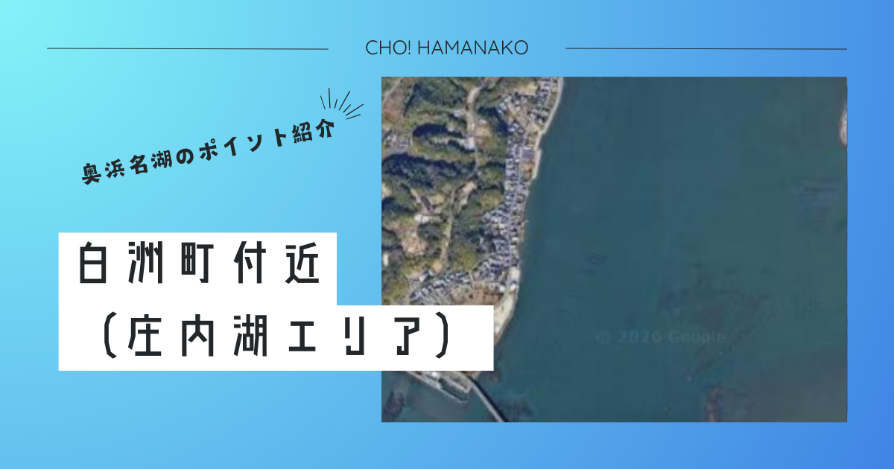

import Map from "@components/Map.astro";
import GMapButton from "@components/GMapButton.astro";
import BlogCard from "@components/BlogCard.astro";
import Callout from "@components/Callout.astro";

「釣！浜名湖」へようこそ！

今回フォーカスを当てる <strong>「白洲（しらす）町付近ボートエリア」</strong> は、浜名湖全域、ひいては全国のルアーアングラーが憧れる <strong>「チヌトップ（クロダイのトップウォーターゲーム）の聖地」</strong> です。

このエリアの最大の特徴は、沿岸ギリギリまで迫る切り立った崖、深いアシ原、そして民家の庭先といった地理的条件により、 <strong>「陸っぱりアングラーが物理的に立ち入れない」</strong> という点にあります。この強力なアクセスフィルターが、日中でも魚たちの警戒心を極限まで下げ、ルアーに対して素直かつ獰猛に反応する「秘密の楽園」を今日まで守り抜いてきました。

ボートを出し、鏡のような静水域に漕ぎ出した者だけが味わえる、庄内湖の「真のポテンシャル」を3000文字超の特大ボリュームで徹底解剖します。

---

## 🧭 ポイント概要：なぜここは「禁断の聖域」と呼ばれるのか？

白洲エリアは、奥浜名湖の東側に深く入り込んだ「庄内湖」の南東岸に位置します。

### ① 「物理的ロック」がもたらす低プレッシャー
地図上で見ると広大な沿岸ラインがありますが、そのほとんどが生活道路の行き止まりや、私有地、あるいはエントリー不能な断崖絶壁です。これにより、 <strong>「岸から一歩も竿を出せない」</strong> という極めて特殊な状況が生まれています。
- <strong>恩恵</strong>：一般的なポイントではプレッシャーで口を使わない大型のクロダイも、ここでは白昼堂々、水面を意識してベイトを待ち構えています。

### ② 出航拠点とアクセス：事前の準備が全て
- <strong>ボートエントリー</strong>： <strong>「はなぞのボート」</strong>（和地）からの北上、あるいは <strong>「フィッシング沖」</strong>（村櫛）からの東進がメインルートとなります。
- <strong>補給の掟</strong>：一度湖上に出れば、コンビニ一軒、自販機一台ありません。 <strong>ファミリーマート 浜松庄和町店</strong> などで、一日の食料と「多すぎるほどの飲料水（特に夏場は生命維持に関わります）」を完璧に準備してください。

---

## 🌊 水中構造と「白洲攻略」の鍵：黄金のシャローを制す

白洲を制するためには、目に見える風景の裏にある「水中の変化」を読み抜く必要があります。

### 1. どこまでも広がる「水深50cmの戦場」
白洲の真骨頂は、岸から数百メートル沖まで続く、 <strong>水深0.5m〜1.5mの広大なシャローフラット</strong> です。
- <strong>底質</strong>：砂地に泥が混じり、所々に「カキ殻（シェルベッド）」が点在。
- <strong>キモ</strong>：チヌはこれらのカキ殻の周りに集まるエビやカニを偏食しています。ルアーをカキ殻の塊の「キワ」を通すことで、爆発的なバイトを誘発できます。

### 2. ステルス（隠密）性が釣果の8割を決める
白洲は非常に水が澄むことが多く、地形も浅いため、 <strong>「船の気配」</strong> に魚が極めて敏感です。
- <strong>テクニック</strong>：ポイントの20m手前でエンジンを切り、エレキ（電動モーター）での微速接近、あるいは風に流して「静かに」撃ち込むのが鉄則。
- <strong>座礁注意</strong>：あまりに浅いため、船外機のペラをカキ殻や岩で破損させるトラブルが多発しています。偏光グラスで底を常に監視し、水深の変化に細心の注意を払ってください。

---

## 🎣 ターゲット別・必勝タクティクス：白洲の四季を撃つ

### 【☀️ 夏：6月〜9月】クロダイ・キビレ：トップウォーターの爆撃
白洲が「聖地」と呼ばれる理由。それが夏のチヌトップです。
- <strong>タクティクス</strong>：朝マズメのベタ凪を、 <strong>ペンシルベイト</strong> でドッグウォークさせます。
- <strong>ヒットの瞬間</strong>：背びれを出してルアーを猛追する <strong>「チェイス」</strong> の興奮、そして静寂を切り裂く「バフッ！」という吸い込み音。一度味わえば、もう他の釣りには戻れません。
- <strong>おすすめルアー</strong>： <strong>メガバス DOG-X Jr. Coayu</strong> や <strong>ジップベイツ フェイキードッグ</strong> など、一口サイズの移動距離を抑えたモデルが白洲のチヌには特効薬です。

### 【🍂 秋：10月〜12月】シーバス・マゴチ：落ちハゼを巡る攻防
水温が下がり始めると、ハゼを求めて大型のシーバスがシャローに差してきます。
- <strong>タクティクス</strong>：バイブレーション（ <strong>レンジバイブ</strong> 等）のリフト＆フォール。底を叩きすぎるとカキ殻で根掛かりするため、底から5cm上をトレースする精密な操作が求められます。

---

## ⚠️ 【極めて重要】庄内湖・白洲の「鉄の掟」と「死の危険」

この美しいフィールドを未来に残し、かつ生きて帰るために以下の3点を <strong>心に刻んで</strong> ください。

> [!CAUTION]
> <strong>【最優先】アカエイの「超」高密度地帯 ＝ エイガードは必須！</strong>
> 白洲のシャローは、 <strong>「浜名湖で最もアカエイの遭遇率が高い場所」</strong> の一つです。
> - 万が一、ボートから降りてウェーディング（ボートウェーディング）を行う際は、絶対に足を地面から離さない <strong>「すり足（シャッフル歩行）」</strong> を徹底してください。
> - エイの毒棘（とげ）はウェーダーを貫通します。 <strong>エイガード（プロテクター）</strong> の着用を強く推奨します。刺されたら激痛と痺れで動けなくなり、湖上では死活問題です。

> [!IMPORTANT]
> <strong>【住民への配慮】崖の上の「視線」を意識せよ</strong>
> 庄内湖の沿岸は、地元の皆様の静かな生活の場です。
> - <strong>民家の窓が見える範囲でのキャスティング、早朝の空ぶかし、大声での会話。</strong> これらは全て、釣り禁止エリア拡大の引き金となります。
> - 「お邪魔している」という謙虚な気持ちを持ち、マフラー音の静かな操船を心がけてください。

> [!WARNING]
> <strong>【漁業施設】カキ棚へのキャスティングは厳禁</strong>
> 庄内湖は「牡蠣」の産地です。杭や棚にルアーを引っ掛けることは、漁具の損傷に繋がります。
> - 自分のルアーが届かない距離（最低20m以上）を保ってアプローチしてください。漁船が近づいたら、釣りを中断して速やかに航路を譲りましょう。

---

## 🚀 まとめ：白洲の湖上に、自分だけの「答え」を探して

白洲町付近ボートエリアでの釣りは、ただの「レジャー」を超えた、知略と沈黙、そして爆発的な一瞬を競う <strong>「最高峰のゲームフィッシング」</strong> です。

- <strong>低プレッシャーが生む爆釣劇</strong>
- <strong>サイトフィッシングの極致</strong>
- <strong>自然と共生する喜び</strong>

ルールを守り、安全装備を完璧に整えた者だけが、白洲の女神に微笑まれます。今年の夏、奥浜名湖の深部、あの「静かなるシャロー」で、生涯忘れられない一本を手にしてください！

---

<BlogCard slug="murakushi-fishing-port" />
ここ白洲へのアクセス拠点となる「村櫛エリア」の攻略ガイドはこちら。

<BlogCard slug="waji-boat" />
対岸に位置する「和地ボートエリア」とのハシゴ釣行が、白洲攻略の黄金ルートです。
