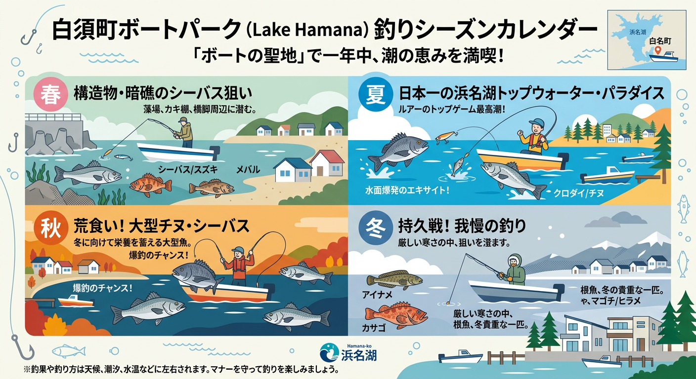

import Map from "@components/Map.astro";
import GMapButton from "@components/GMapButton.astro";
import TackleCard from "@components/TackleCard.astro";

『釣！浜名湖』をご覧いただきありがとうございます！

今回ご紹介する **「白洲（しらす）町付近ボートエリア」** は、奥浜名湖・庄内湖の中でも屈指のチーニング（チヌ・ルアーフィッシング）の聖地です！

沿岸ギリギリまで民家が建ち並んでいるため、陸っぱりアングラーが少なく、魚へのプレッシャーが極めて低いのが最大の特徴です。

<Map lat={34.743023} lng={137.627462} name="白洲町ボートエリア" />

## 白洲エリアの基本情報

<GMapButton url="https://www.google.com/maps/search/?api=1&query=34.743023,137.627462" />

*   **ポイント名**：白洲町付近ボートエリア
*   **所在地**：静岡県浜松市中央区白洲町
*   **駐車場**：利用するレンタルボート店やマリーナの駐車場をご利用ください。
*   **近くの釣具店**：はなぞの釣具店

### ポイントの特徴

**1. 手つかずのシャローゲーム**
陸からのアクセスが制限されているからこそ、ボートで自在に沿岸部を探れるアングラーにとっては「楽園」です。水深1m前後の浅瀬でチヌがベイトを追う姿があちこちで見られます。

**2. シャロートップの王道エリア**
夏の全盛期にはトップウォータールアーが非常に有効です。水しぶきを立ててルアーを追ってくるチヌやシーバスの迫力あるシーンが楽しめます。

**3. スレた時のMDミノー**
基本はトップやボトムワインドで攻めますが、魚の追いが見られない時は、ミディアムディープ（MD）ミノーをジャークさせてリアクションで食わせる戦略が非常に効果的です。

### 🐟️シーズン別攻略ガイド

*   **🌸 春（4月〜6月）**：シーバス、キビレ
    *   **【攻略】** 水中の沈み杭や地形変化を丁寧に。
*   **☀️ 夏（7月〜9月）**：クロダイ、キビレ（トップ全盛期）
    *   **【攻略】** 白洲の最も熱い時期！プレッシャーの少ないシャローで、サイトフィッシングの醍醐味を味わえます。

<TackleCard id="kibire/ima-chappy-80" />
<TackleCard id="kurodai/shimano-bremia-risewalk-65f" />

*   **🍂 秋（10月〜11月）**：ランカークロダイ、シーバス
    *   **【攻略】** 荒食いのシーズン。大型個体がシャローを回遊します。

<TackleCard id="kibire/keitech-crazy-flapper-2-8" />

## おすすめタックルと釣り方

*   **対象魚**：クロダイ、キビレ、シーバス
*   **釣り方**：ボートルアー（トップウォーター、ボトムワインド、MDミノー）

ボート釣りのため、取り回しの良い7ft前後のボートシーバス・チニングロッドがベストです。

<TackleCard id="kibire/shimano-bremia-bb-s78ml" />
<TackleCard id="kurodai/daiwa-silver-wolf-air-76ml-s-q" />

## まとめ：ボートでしか味わえない庄内湖のポテンシャル

白洲町エリアは「陸から釣りができない」ことが最大の武器となっているエリアです。ボートを借りて、静かな湖面に響くドラグ音を楽しみながら、庄内湖の豊かなポテンシャルを独り占めしてみてください！

> [!IMPORTANT]
> **安全のために：ボート操行の注意点**  
> 
> 庄内湖エリアは養殖棚や沈み杭が多く点在しています。特に雨後は水中に隠れた障害物が見えにくくなるため、慣れないうちは慎重に操船しましょう。
