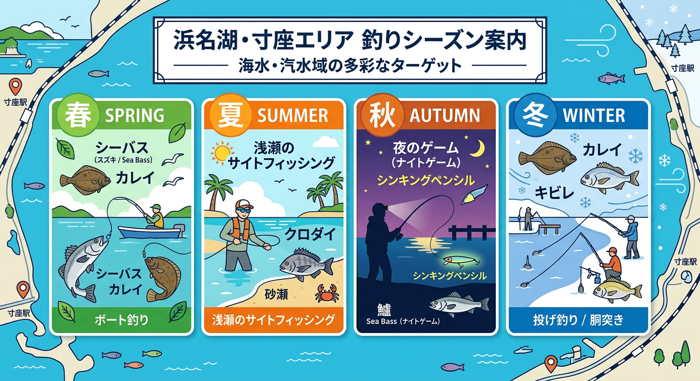

import Map from "@components/Map.astro";
import GMapButton from "@components/GMapButton.astro";
import TackleCard from "@components/TackleCard.astro";

『釣！浜名湖』をご覧いただきありがとうございます！

今回は、奥浜名湖の名スポット、 **「寸座（すんざ）」** エリアをご紹介します！

寸座は「浜名湖SA」の東側に位置し、急深な地形で知られるルアーマンに人気のポイントです。特に潮が引いた時にだけ現れる「砂州」での釣りは、他では味わえない独特の魅力があります。

<Map lat={34.790544} lng={137.615169} name="寸座（マリーナ・砂州）" />

## 寸座の基本情報

<GMapButton url="https://maps.app.goo.gl/RW1Jc5RBP3AwinNZ6" />

*   **ポイント名**：寸座（すんざ）
*   **所在地**：静岡県浜松市浜名区細江町気賀
*   **近くの釣具店**：植むら釣具店
*   **近くのコンビニ**：ファミリーマート細江西気賀店

### ポイントの特徴

**1. 急深な地形**
ボートの往来が多いため、岸から少し投げただけでも水深がズドンと深いのが特徴。夜のシーバス回遊も期待大です。

**2. 砂州でのサイトフィッシング**
干潮時に現れる砂州は根掛かりが少なく、トップウォーターでクロダイやキビレを狙う「サイトフィッシング」が熱いスポットです。

### 🐟️シーズン別攻略ガイド

*   **🌸 春（4月〜6月）**：シーバス、カレイ
    *   **【攻略】** 産卵から回復したシーバスが回遊。

<TackleCard id="seabass/shimano-exsence-silent-assassin-99f" />

*   **☀️ 夏（7月〜9月）**：クロダイ、キビレ、マゴチ
    *   **【攻略】** 砂州でのサイトフィッシングが本番！トップウォーターゲームを存分に。

<TackleCard id="kibire/ima-chappy-80" />
<TackleCard id="kurodai/shimano-bremia-risewalk-65f" />

*   **🍂 秋（10月〜11月）**：シーバス、キビレ、マゴチ
    *   **【攻略】** 夜はシンキングペンシル等で水面直下を探り歩くのが釣果への近道です。

<TackleCard id="flatfish/keitech-easy-shiner-4-gold-flash-minnow" />

*   **❄️ 冬（12月〜3月）**：カレイ
    *   **【攻略】** 岸からは厳しい時期ですが、ボートがあれば大型の一発大物を狙えるポテンシャルがあります。

<TackleCard id="karei/daiwa-prime-surf-t25-405-w" />

## 周辺の観光情報

### 天浜線「寸座駅」
ホームの目の前まで湖面が迫る絶景駅。寸座峠から見下ろす鉄道と湖が調和した景色は、フォトスポットとして有名です。

<TackleCard id="travel/rakuten-travel-stay" />

## まとめ：奥浜名湖の攻略拠点・寸座

寸座は、砂州のシャローからマリーナ前のディープまで、ダイナミックな釣りが楽しめる場所です。マナーを守って、スレていない大物を狙い撃ちしてください！

> [!WARNING]
> **最後にお願い！**
> 
> ゴミは必ず持ち帰りましょう。近隣のマリーナや住民の方々の迷惑にならないよう、特に駐車マナーには十分注意して楽しみましょう！
