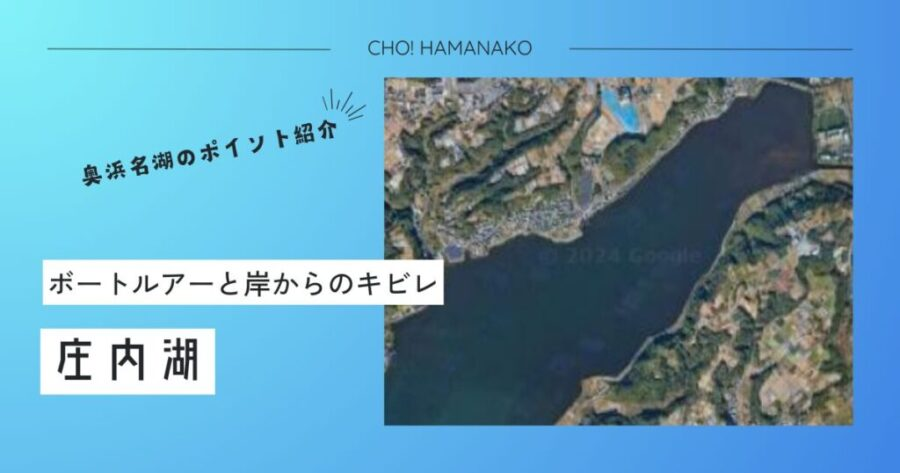

import Map from "@components/Map.astro";
import MapArea from "@components/MapArea.astro";
import GMapButton from "@components/GMapButton.astro";
import BlogCard from "@components/BlogCard.astro";
import Callout from "@components/Callout.astro";

「釣！浜名湖」へようこそ！

奥浜名湖の東側に大きく、そして深く入り込んだ <strong>「庄内湖（しょうないこ）エリア」</strong> は、浜名湖の中でも特に地形が複雑で、どこまでも続くような広大なシャロー（浅瀬）が広がる唯一無二のフィールドです。

かつては「陸の孤島」と呼ばれ、そのアクセスの難しさから地元の釣り人だけの秘密基地でしたが、近年、ボートフィッシングにおける <strong>「世界屈指のチヌトップ・フィールド」</strong> としてその名は全国、そして世界へと轟きました。鏡のような静水域で、真っ黒なクロダイが水面を割ってルアーを猛追する光景は、庄内湖でしか味わえない至高のエンターテインメントです。

エリア全体の特性から、点在する各重要スポットの核心部まで、3000文字超の特大ボリュームで庄内湖の深淵を徹底的に解明します。

---

## 🧭 庄内湖エリアの地理的特徴：なぜここは「特別」なのか？

庄内湖を攻略するために、まずはこのエリアの「性格」と「物理的構造」を理解することが不可欠です。

### ① 「奥の奥」が生み出す、驚異の静穏と「濁り」
庄内湖は浜名湖の最深部に位置し、周囲を低い山々に囲まれているため、本湖（表浜名湖）のような強い潮流や激しい波がほとんど入り込みません。
- <strong>メリット</strong>：小型ボートやカヤック、フローターでも極めて安全に釣りができる「静かなる湖」。
- <strong>水質の特性</strong>：水が滞留しやすく、有機物が豊富。プランクトンが多いため常に「適度な濁り」があり、これが魚の警戒心を解く一因となっています。ただし、水温が急上昇する夏場や、大雨後の強烈な赤茶色の濁りには注意が必要です。

### ② チヌとエサたちの「一大ナーサリー（保育場）」
広大な干潟、広がるアシ原、 Alexand無数の「カキ棚（養殖施設）」。これらが合わさり、ハゼ、テッポウエビ、カニなどのベイトフィッシュにとって最高の繁殖地となっています。
- <strong>生態系</strong>：夏には、これらの豊富なエサを求めて、外海や本湖から大型の <strong>クロダイ・キビレ</strong> が「捕食回遊」のために庄内湖へと押し寄せます。まさに魚たちの巨大なレストランです。

### ③ 物理的なプレッシャーの「自動フィルター」
沿岸部の多くが民家の庭先、切り立った崖、あるいは足を踏み入れられない深いアシ原に覆われています。そのため、陸っぱりの釣り人が物理的にアクセスできる場所が非常に限られており、ボートやウェーディングでしか辿り着けない <strong>「サンクチュアリ（聖域）」</strong> が数多く残っています。

---

## 🗺️ 庄内湖の主要攻略ポイント・ネットワーク

広大な庄内湖内に点在する、厳選された攻略拠点を網羅的に確認しましょう。各ポイント名は、詳細解説記事へのリンクとなっています。

<MapArea 
  lat={34.745} 
  lng={137.64} 
  zoom={12}
  points={[
    { name: "平松町付近", lat: 34.754378, lng: 137.638226, url: "/blog/points/oku/hiramatsu", summary: "ハゼ釣りの絶対的聖地。ファミリーからベテランまで。" },
    { name: "ホトニクス下(マイマイ)", lat: 34.776214, lng: 137.626361, url: "/blog/points/oku/photonics-under", summary: "水深7m超の急深ブレイクが潜む大型キビレの穴場。" },
    { name: "白洲町ボートエリア", lat: 34.743023, lng: 137.627462, url: "/blog/points/oku/shiras-boat", summary: "チヌトップゲームを語る上で欠かせない最重要地。" },
    { name: "佐浜・白山周辺", lat: 34.747526, lng: 137.639386, url: "/blog/points/oku/sahama-hakusan", summary: "複雑な底質と流れが交差する玄人好みのポイント。" },
    { name: "和地ボートエリア", lat: 34.759297, lng: 137.648089, url: "/blog/points/oku/waji-boat", summary: "ボートルアー・チニングの超定番。牡蠣棚周辺を狙う。" },
    { name: "伊左地川河口", lat: 34.738558, lng: 137.641104, url: "/blog/points/oku/isajigawa", summary: "小河川の流入がキーワード。静かに釣れる癒やしの穴場。" },
    { name: "古人見ボートエリア", lat: 34.732697, lng: 137.634688, url: "/blog/points/oku/kohitomi-boat", summary: "サイトフィッシングに最適。砂地のフラット攻略。" },
    { name: "協和町ボートエリア", lat: 34.735418, lng: 137.612734, url: "/blog/points/oku/kyowa-boat", summary: "広大なシャローを自由に撃てるボートゲームの真髄。" }
  ]}
/>

---

## 📍 スタイル別・庄内湖の歩き方ガイド

### 1. 陸っぱり（丘っぱり）メイン：足場と実績を重視
*   <strong>[平松町付近（児童遊園地周辺）](/blog/points/oku/hiramatsu)</strong>：庄内湖で最も公園整備が進み、アクセスが良い場所。秋のハゼ釣りシーズンは、のべ竿一本で「束釣り（100匹超え）」が期待できる、ファミリーの最強スポットです。
*   <strong>[伊左地川河口](/blog/points/oku/isajigawa)</strong>：河川の流れ込みによる「汽水要素」が強い場所。雨後のニゴリが入った瞬間のキビレの爆発力は、このエリア随一です。

### 2. ボート・ウェーディング：極限のシャロー体験
*   <strong>[ホトニクス下（マイマイ）](/blog/points/oku/photonics-under)</strong>：岸からわずか数メートルで水深がガクンと深くなる特殊ポイント。ブッコミ釣りでの大型キビレ（45cm超）狙いに通い詰めるベテランが絶えません。
*   <strong>[白洲町・和地エリア](/blog/points/oku/shiras-boat)</strong>： <strong>「カキ棚（牡蠣の養殖施設）」</strong> が密集するエリア。棚のキワをタイトに攻めるキャスティング精度が求められますが、その先には「年無し」のクロダイが待っています。

---

## 🎣 庄内湖・四季のタクティカル・カレンダー

- <strong>🌸 春（3月〜5月）</strong>： <strong>シーバス（バチ抜け・稚アユ遡上）</strong>。伊左地川や花川などの「川筋」をキーワードに、繊細なプラグ操作で春の荒食い個体を狙います。
- <strong>☀️ 夏（6月〜9月）</strong>： <strong>チヌトップ（クロダイ・キビレ）</strong>。庄内湖が最も熱くなる「本命」シーズン。朝凪の湖面をペンシルベイト（ <strong>フェイキードッグ</strong> 等）で切り裂き、水柱を上げる快感は格別です。
- <strong>🍂 秋（10月〜12月）</strong>： <strong>ハゼ・シーバス・マゴチ</strong>。一年で最も魚種が豊かになる時期。落ちハゼを狙うブッコミ釣りの外道として、巨大な「カンダイ」やキビレがヒットし、仕掛けをぶち切られるのも庄内湖の風物詩です。

---

## ⚠️ 【最重要警告】庄内湖エリアの「鉄の掟」

このエリア特有の危険と、地域社会との共生ルールを <strong>絶対遵守</strong> してください。

> [!CAUTION]
> <strong>【命に関わる】アカエイの高密度地帯と「すり足」の徹底</strong>
> 泥底が多く、水温が上がりやすい庄内湖は、 <strong>アカエイの生息密度が浜名湖で最も高い（ワースト1）</strong> エリアです。
> - ウェーディング（水に入る）の際は絶対に足を地面から上げないこと。 <strong>「シャッフル歩行（すり足）」</strong> を一歩でも忘れた瞬間、猛毒のトゲの洗礼を受けることになります。
> - <strong>エイガード</strong> の着用を強く推奨。不幸にも刺された場合は、即座に温水で洗浄しながら病院へ急行してください。

> [!WARNING]
> <strong>漁業施設（カキ棚・ノリ網）へのリスペクト</strong>
> 庄内湖は地元の漁業者にとって生活を支える <strong>「大切な仕事場」</strong> です。
> - 杭やネットにルアーや針を引っ掛けることは、施設の破壊だけでなく、大きな損害を与えます。
> - 万一引っ掛けた場合は無理に引っ張らず、施設を傷めない最善の措置をとること。
> - 操業中の漁船が近づいたら、速やかに道を譲り、笑顔で挨拶をかわしましょう。

---

## 🚀 まとめ：庄内湖の「深み」にどっぷりと浸かる

庄内湖エリアでの釣りは、ただ魚を獲るだけではない、奥浜名湖の豊かな生態系と真正面から向き合う、極めてエキサイティングな探検です。

- <strong>ハゼ釣り</strong> から始まるファミリーの思い出。
- <strong>世界レベルのトップゲーム</strong> で己の腕を試す興興。
- <strong>複雑な地形</strong> を読み解き、一匹の価値を高める喜び。

ルールを守り、安全第一。自然への敬意と釣り人としての高い矜持（プライド）を忘れずに。今年のシーズン、奥浜名湖の核心部「庄内湖」で、あなたの釣り人生に刻まれる最高のドラマを描いてください！

---

### 🎓 さらに知識を深める：エキスパート専用ガイド

より専門的なボートタクティクスや、ランカーシーバスに特化した攻略法を知りたい方は、こちらの深掘り記事もあわせてご覧ください。

<BlogCard slug="boat-seabass-fukabori" />
奥浜名湖のボートシーバスを「構造物（ストラクチャー）撃ち」で攻略するための専門タクティクス解説。

<BlogCard slug="points/fukabori/chining-fukabori" />
庄内湖の広大なシャローでのチヌトップ攻略。キビレ・クロダイをサイトで仕留めるためのルアーセレクト。

<BlogCard slug="bachinuke-fukabori" />
奥浜名湖の春、静かな庄内湖の鏡面を切り裂く波紋。バチ抜けパターンの最前線を読み解く。

<BlogCard slug="wading-seabass-fukabori" />
広大な庄内湖シャローを安全に歩き抜き、潜むシーバスと対峙するためのタクティクス。

---

<BlogCard slug="isajigawa" />
<BlogCard slug="photonics-under" />
<BlogCard slug="hiramatsu" />
