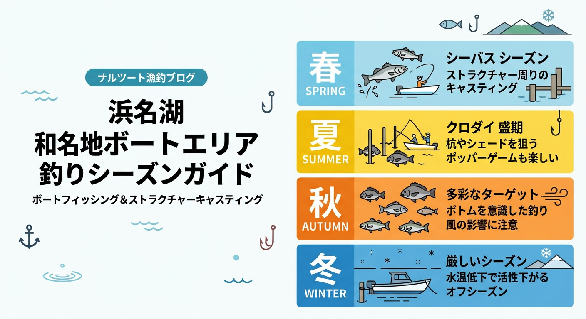

import Map from "@components/Map.astro";
import GMapButton from "@components/GMapButton.astro";

『釣！浜名湖』をご覧いただきありがとうございます！

今回は、庄内湖の最奥、まさに「どん詰まり」のポテンシャルを秘めた **「和地（わじ）ボートエリア」** をご紹介します！

和地エリアは、陸からのエントリーが極めて難しいため、ボートアングラーにとっては戦略を組み立てる楽しさが凝縮された、庄内湖でも指折りのテクニカルなポイントなんですよ！

<Map lat={34.759297} lng={137.648089} name="和地ボートエリア" />

## 和地エリアの基本情報

<GMapButton url="https://www.google.com/maps/search/?api=1&query=34.759297,137.648089" />

*   **ポイント名**：和地ボートエリア
*   **所在地**：静岡県浜松市中央区和地町
*   **アクセス**：陸からの釣りはほぼ不可能。基本はボート推奨ポイント。
*   **駐車場**：利用するレンタルボート店やマリーナの駐車場をご利用ください。
*   **近くの釣具店**：はなぞの釣具店
*   **近くのコンビニ**：ファミリーマート 浜松和地町西店

和地周辺は、湾の中央部に広がる養殖棚や無数に乱立する沈み杭など、ルアーターゲットとなる魚が居着くストラクチャー（障害物）が非常に豊富なのが特徴です。

### ポイントの特徴

**1. シーバスの定番エリア**
浜名湖最大のシーバストーナメント（BST）などでも頻繁に登場する超定番ポイントです。大型は少ないものの、アベレージ40cm前後の数釣りがコンスタントに期待できます。

**2. シャローとディープの戦略性**
沿岸に近いシャロー帯（浅瀬）ではトップウォーターでチヌ（クロダイ・キビレ）を狙い、沈み杭などの深みに差し掛かったらシーバス狙いに切り替えるといった、メリハリのある釣りが楽しめます。

**3. ストラクチャー撃ちの醍醐味**
沈み杭の根元ピンスポットにルアーを送り込み、リアクションで魚を引き出すテクニカルな展開はこのエリアならでは。夏のシャローではチヌ系がメインとなり、わずかな水温差や潮の変化が勝負を分けます。

> [!TIP]
> **杭周りのシーバス**  
> 夏の猛暑時でも、沈み杭が作るわずかな日陰（シェード）にはシーバスが潜んでいます。ボーターの方は、丁寧なアプローチでこれらの隠れ場所を攻めてみましょう。

### 🐟️シーズン別攻略ガイド

*   **🌸 春（4月〜6月）**：シーバス、キビレ
    *   **【攻略】** ベイトを追い、奥まった和地エリアまで良型の魚が入ってきます。
*   **☀️ 夏（7月〜9月）**：クロダイ、キビレ、セイゴ
    *   **【攻略】** 夏のチヌトップ！杭や棚が作るわずかな「日陰（シェード）」を丁寧に狙いましょう。
*   **🍂 秋（10月〜11月）**：シーバス、クロダイ、マゴチ
    *   **【攻略】** 活性が最も高まる時期。ボトムワインドやバイブレーションで広範囲を探るのが吉。
*   **❄️ 冬（12月〜3月）**：シーバス、キビレ
    *   **【攻略】** 居着きの魚がメイン。スローな釣りと、少しでも水温が高い場所（深場）を探すのがコツです。

## おすすめタックルと釣り方

*   **対象魚**：シーバス、クロダイ、キビレ
*   **釣り方**：ボートルアー（トップウォーター、ボトムワインド、バイブレーション）
*   **おすすめ装備**：杭を回避するための正確なキャスト技術

ボートでの精密なキャストが求められるため、アキュラシー性能（精度）に優れたライト〜ミディアムアクションのロッドがお勧めです。

## 周辺の観光情報

和地エリアは、ボート釣りの拠点としてだけでなく、おとぎ話のような世界観を持つ観光名所や、こだわりのカフェが集まる魅力的な場所です。

### 1. ぬくもりの森（おとぎ話の世界）

建築家・佐々木茂良氏が築き上げた、独特な建物が立ち並ぶ **「ぬくもりの森」** は、このエリア最大の観光スポットです。

一歩足を踏み入れれば、まるで中世ヨーロッパの村に迷い込んだような非日常的な空間が広がっています。

村内には雑貨店や「カフェ カシュカシュ」などがあり、釣りの合間や帰りにゆっくりと散策を楽しむのがおすすめですよ。

### 2. 和地のこだわりカフェ探訪

和地町周辺には、静かに美味しいコーヒーを楽しめる隠れ家的なカフェが点在しています。

週末を中心に営業している **「Cafe R65.Factory」** や、自家焙煎の香りが漂う **「Coffee BlackBird」** など、個性豊かなお店が揃っています。

早朝の釣りで冷えた体を温めたり、釣果について語り合ったりする休憩ポイントとして、ぜひ立ち寄ってみてください。

## まとめ：庄内湖ボートゲームの真骨頂

和路エリアは、広大な浜名湖の中でも「ポイントが絞り込みやすい」という利点があります。
沈み杭や養殖棚といった目に見える障害物を一つ一つ丁寧に攻略していく楽しさは、まさにルアーフィッシングの醍醐味そのもの。

ボートを走らせ、庄内湖の最深部で自分だけの攻略法を見つけてみてください！

> [!WARNING]
> **最後にお願い！**
> 
> 養殖棚の近くを通る際は、波を立てないようスロー走行を心がけましょう。養殖業者の方々の迷惑にならないよう、マナーを守ってスマートなボートゲームを楽しみましょう！
