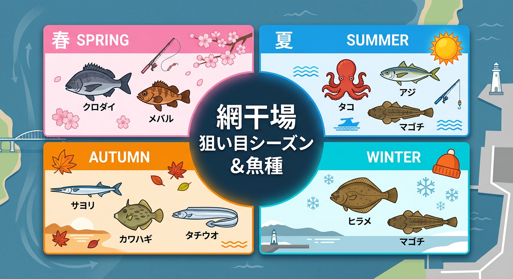

import Map from "@components/Map.astro";
import GMapButton from "@components/GMapButton.astro";

「釣！浜名湖」をご覧いただきありがとうございます！

本記事では、あらゆる釣り方で楽しめる **網干場（あみほしば）** をご紹介します。

表浜名湖でも屈指の人気を誇るポイントで、多彩な魚種と出会えるポテンシャルを秘めています。広々とした堤防で足場も良いため、ファミリー層からベテランまで安心して釣りを楽しめるのが魅力です。

## 網干場（舞阪漁港）の基本情報

<Map lat={34.6803531154909} lng={137.60332807485867} name="網干場（舞阪漁港）" />

<GMapButton url="https://maps.app.goo.gl/9yGgqP23p8n53GvH6" />

*   **ポイント名** : 網干場（あみほしば）
*   **所在地** : 静岡県浜松市中央区舞阪町舞阪
*   **駐車場** : 有料（舞阪表浜駐車場 1回410円）。約400台収容可能。
*   **トイレ** : 駐車場および周辺にあり。
*   **近くの釣具店** : あけぼの釣具店、弁天島釣りセンター
*   **設備** : 夜間照明あり。

> [!IMPORTANT]
> **漁業関係者の作業優先！**
> 網干場はその名の通り、漁師さんが網を干したり、漁船の準備をしたりする大切な作業場です。一般車両の乗り入れは厳禁（不法侵入）であり、作業の邪魔にならないよう、釣り座を構える際も十分に配慮しましょう。

## 網干場（舞阪漁港）の特徴と攻略ポイント

網干場は、堤防沿いに広く釣り座を構えることができます。

### 1. 豊富な沈み石（ヘチ際）
足元から約5m先までは根固め石（沈み石）が入っています。ここがカサゴ、メバル、そしてクロダイなどの絶好の居付き場所となっています。

### 2. 沖に広がる砂地とミオ筋
沈み石の先は砂地になっており、シロギスやカレイ、さらには秋のタコ狙いのメインフィールドとなります。中央付近の少し先には「ミオ筋（航路）」があり、そこを狙って遠投するのが釣果の鍵です。

### 3. 多彩なターゲット
サビキ釣りでアジ・サバを狙い、それを泳がせてマゴチやヒラメを狙うなど、1つの場所で複数のアプローチが可能です。

## 網干場（舞阪漁港）の狙い目シーズンと魚種

### 狙い目のシーズン

*   **クロダイ・キビレ** : オールシーズン（特に4月〜11月）
*   **アジ・サバ・イワシ** : 6月〜11月
*   **タコ** : 6月〜8月
*   **シロギス** : 5月〜10月

### シーズンごとに釣れやすい魚

*   **春：クロダイ、メバル、カサゴ**
    *   3月の「乗っ込み」シーズン。大型クロダイを前打ちや電気ウキで狙う人が増えます。
*   **夏：タコ、アジ、イワシ、サバ、クロダイ、マゴチ**
    *   浜名湖の夏の風物詩、タコ釣りの人気ポイント。サビキ釣りも本格化し、ファミリーで賑わいます。
*   **秋：アジ、サバ、サヨリ、カワハギ、シロギス、タチウオ**
    *   魚種が最も豊富なベストシーズン。夜はタチウオの回遊もあり、一日中楽しめます。
*   **冬：カレイ、ヒラメ、根魚**
    *   北西風が強い日は厳しいですが、冷え込んだ日は投げ釣りでのカレイ、夜のメバリングが期待できます。

### ✨ポイントの補足

*   **潮の流れ**: 今切口に近い側ほど流れが速くなります。初心者の方は少し内側の穏やかな場所から始めるのがおすすめです。
*   **マナー厳守**: 網を干している場所の近くでは絶対に釣りをしないようにしましょう。

## エサで釣れる魚とおすすめタックル

*   **対象魚** : クロダイ、アジ、サバ、シロギス、カレイ
*   **おすすめエサ** : カニ、アミエビ、石ゴカイ、青イソメ
*   **おすすめタックル** : 2.7m〜3.6m の万能竿、または 5.3m の磯竿（前打ち・ウキ釣り）

サビキ釣りならコンパクトロッドで十分ですが、クロダイを本格的に狙うなら沈み石の先を攻められる長い磯竿が有利です。

## ルアーで釣れる魚とおすすめタックル

*   **対象魚** : シーバス、アジ、メバル、マゴチ、ヒラメ
*   **おすすめルアー** : シンキングペンシル、メタルバイブ、ワーム（ジグサビキも有効）
*   **おすすめタックル** : 8ft〜9ft MLクラスのシーバスロッド

ライトゲームなら1.5g前後のジグヘッドで沈み石の際をタイトに通すのが効果的。シーバス狙いならミオ筋周辺をバイブレーションで広く探ってみましょう。

## 網干場（舞阪漁港）の周辺観光情報

### 舞阪漁港「えんばい朝市」
例年、初夏に開催される人気の朝市。生しらすの販売など、港町ならでの活気を体験できます。

### 魚あら（うおあら）
舞阪漁港のすぐ目の前にある老舗。絶品の天丼や活き魚料理が楽しめ、アングラーにも人気のランチスポットです。

## まとめ：あらゆる釣り人を包み込む舞阪のメインフィールド

網干場は、その広さと魚影の濃さから、浜名湖の釣りの奥深さを体験するのに欠かせない場所です。

> [!IMPORTANT]
> 作業中の漁師さんへの挨拶を忘れずに。また、ゴミのポイ捨ては厳禁です。釣り場を美しく保つことが、いつまでもここで釣りを楽しめる環境を守ることに繋がります。

ルールとマナーをしっかり守り、舞阪港での楽しい釣り体験をしてみてください！
