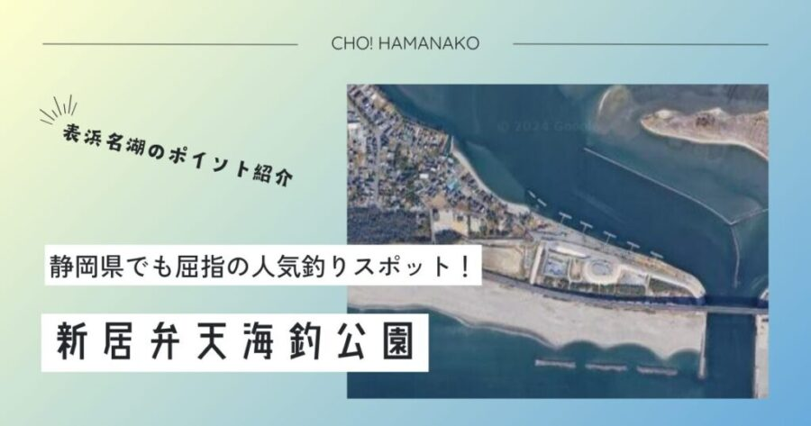

import Map from "@components/Map.astro";
import GMapButton from "@components/GMapButton.astro";
import BlogCard from "@components/BlogCard.astro";
import Callout from "@components/Callout.astro";

「釣！浜名湖」へようこそ！

今回ご紹介するのは、浜名湖で最も有名で、最も多くの魚が上がり、そして最も家族連れに優しい最強の釣りスポット <strong>「新居弁天海釣公園（あらいべんてんうみづりこうえん）」</strong> です。

今切口（いまぎりぐち）のすぐ内側に位置するこの公園は、太平洋から浜名湖へ入り込む魚たちの <strong>「メインエントランス」</strong> 。5本の巨大なT字型堤防が突き出し、一年中、絶え間なく魚が供給され続けます。「サビキを落とせばアジが鈴なりになり、足元の石積みを探れば高級魚キジハタが顔を出す」――そんな夢のようなフィールドを3000文字超で徹底攻略。

初心者からエキスパートまで、ここをホームグラウンドにするための <strong>「T字堤防セレクト術」</strong> と <strong>「激流攻略の奥義」</strong> をすべて公開します！

---

## 🧭 ポイント概要：5本のT字堤防をどう使い分けるか？

新居弁天海釣公園の最大の特徴は、岸壁から突き出した <strong>「5本のT字型堤防」</strong> です。実はこれ、どこでも同じではありません。

### ① 【Ｔ―１〜Ｔ―２】ファミリー＆ウキ釣り重視
今切口から最も離れた（北側）エリアです。
- <strong>特徴</strong>：潮流が比較的緩やかで、小さなお子様連れでも仕掛けが流されにくく、 <strong>サビキ釣り</strong> の入門に最適です。
- <strong>ターゲット</strong>：アジ、イワシ、サヨリ。秋には良型ハゼも混じります。

### ② 【Ｔ―３】不動の人気「ゴールデン・ミドル」
公園の中央に位置するＴ―３は、常に多くのアングラーで賑わう <strong>一番人気</strong> です。
- <strong>特徴</strong>：潮流と地形のバランスが良く、回遊魚から居付きの根魚まで魚影の濃さが突出しています。
- <strong>ターゲット</strong>：アジ、サバに加え、ヘチ釣りでの <strong>大型クロダイ</strong> の実績も抜群です。

### ③ 【Ｔ―４〜Ｔ―５】ショアジギング＆激流攻略
今切口に最も近い（南側）エリアです。
- <strong>特徴</strong>：川のような <strong>「激流」</strong> が発生します。潮の状態によっては15号以上の重りでも止まらないことがありますが、その分、外海から入ってきたばかりの <strong>青物（ブリ・サワラ・カンパチ）</strong> が最初に接触するポイントです。
- <strong>ターゲット</strong>：ショゴ（カンパチ）、ワラサ、メーター超えのシーバス。

---

## 🌊 水中構造と必勝の「潮止まり」戦略

海釣公園のボトムは変化に富んでいます。堤防の周囲には <strong>「基礎石」</strong> や <strong>「消波ブロック」</strong> が沈んでおり、これが魚たちの絶好の隠れ家となっています。

### 「激流」をどう味方につけるか？
表浜名湖の潮汐は凄まじく、下げ潮時は仕掛けが真横に流されることも珍しくありません。
- <strong>奥義「潮止まりの前後1時間」</strong>：初心者の方は、満潮・干潮の <strong>「潮止まり」</strong> を狙って釣行を計画してください。このタイミングこそ、最も活発に魚が捕食し、仕掛けも安定するサービスタイムです。
- <strong>重りの選択</strong>：サビキ釣りでも <strong>10号強（できれば15号）</strong> の重りを用意しておくのが、このポイントでのマナーであり、釣るための最低条件です。

---

## 🎣 ターゲット別・シーズン攻略ガイド

### 【☀️ 夏：7月〜9月】サビキ＆マダコの豪華二本立て
- <strong>サビキ</strong>： <strong>「アジ・イワシ・サバ」</strong> が回遊します。売店 <strong>「大橋屋つり具店」</strong> で購入できる集魚剤を混ぜたコマセを撒けば、足元に銀色の魚群が湧き上がります。
  <BlogCard slug="sabiki-guide" />
- <strong>マダコ</strong>：堤防のキワ（壁際）を <strong>タコエギ</strong> で探るのが新居弁天の夏の風物詩。1kgを超える大物も期待できます。
  <BlogCard slug="tako-beginner" />

### 【🍂 秋：10月〜12月】ジャンボサヨリと泳がせ釣り
- <strong>サヨリ</strong>：水面をピチャピチャと跳ねるサヨリは、 <strong>シモリウキ仕掛け</strong> で狙います。
- <strong>泳がせ釣り</strong>：釣った小アジをエサに、底付近を狙うと <strong>「ヒラメ」や「マゴチ」</strong> が食らいつきます。Ｔ―５堤防付近での実績が高いです。

### 【🏆 年中】クロダイ：Ｔ字堤防の「主」を獲る
- <strong>タクティクス</strong>： <strong>「前打ち（落とし込み）」</strong> で堤防のスリットや基礎石の周りを攻めます。今切口へ出入りする「年無し（50cm超）」のクロダイや、引きが強烈な <strong>マダイ</strong> がヒットすることも！
  <BlogCard slug="kurodai" />

---

## ⚠️ 【最重要】安全管理と「毒魚」への厳戒態勢

海釣公園は柵があり安全ですが、水中には危険も潜んでいます。

> [!CAUTION]
> <strong>【毒魚警告】アイゴとゴンズイにご用心！</strong>
> サビキ釣りの定番外道として <strong>アイゴ（バリ）</strong> 、夜釣りでは <strong>ゴンズイ</strong> が高確率で釣れます。
> - <strong>「絶対に素手で触らない」</strong> ：背ビレなどに猛毒のトゲがあり、刺されると激痛で動けなくなります。必ず <strong>魚バサミとペンチ</strong> を用意し、棘に触れないよう対処してください。万が一刺されたら、お湯で患部を温めるのが応急処置です（その後すぐ病院へ）。

> [!IMPORTANT]
> <strong>【装備】ライフジャケットの必要性</strong>
> 柵があるとはいえ、ここは「落ちたら助からない激流」の今切口至近です。
> - <strong>お子様には必ずライフジャケット</strong> を着用させてください。また、強風時は帽子などが飛んでいかないよう注意が必要です。

---

<Callout type="warning" title="エキスパート専用：深掘り攻略">
新居弁天の各T字堤防、さらにミクロな「海底の掘れ」や、激流を制するための独自の攻略情報は、こちらの深掘り記事で。
<BlogCard slug="imagire-area-fukabori" />
</Callout>

<Callout type="danger" title="浜名湖の危険生物：アカエイ">
海釣公園周辺の浅瀬で釣りをしたり、落とし物を拾うために水辺に近づく際は <strong>アカエイ</strong> に厳重注意してください。尾の付け根にある毒棘は非常に強力です。移動の際は必ず <strong>「すり足（エイガード歩行）」</strong> を徹底しましょう。
</Callout>

<Callout type="important" title="駐車場・清掃マナー">
新居弁天海釣公園は <strong>30分を超えると有料</strong> です。路上駐車は緊急車両の妨げになり、釣り場閉鎖に直結するため絶対に厳禁。また、サビキで汚れた足元はバケツの水できれいに洗い流してから帰りましょう。
</Callout>

---

<BlogCard slug="tako-fukabori" />
海釣公園の主役、マダコ。「足元のマンション」を効率よく叩くための最新タコエギ攻略ガイド。

<BlogCard slug="mejina-fukabori" />
海釣公園のT字堤先端で狙うメジナ。激流の中の「コマセワーク」と「同調」のテクニック解説。

<BlogCard slug="points/fukabori/eging-fukabori" />
新居弁天エリアのコウイカ・アオリイカ攻略。激流の合流点を狙うためのエギ選択とアクション。

<BlogCard slug="ajing-fukabori" />
海釣公園の常夜灯下で繰り広げる繊細なアジング。アジ・メバル・カサゴのナイトゲーム完全解説。

<BlogCard slug="points/fukabori/magochi-fukabori" />
駐車場裏の砂地を回遊するマゴチを「ボトムワインド」で直撃。反射で口を使わせるルアーメソッド。

<BlogCard slug="points/fukabori/sayori-fukabori" />
冬の人気ターゲット、大型サヨリ。Ｔ字堤から沖の潮目を狙うための遠投カゴ釣り攻略。

<BlogCard slug="seabass-season-fukabori" />
浜名湖随一の潮通しを誇る「今切口」至近。シーズンやベイトに合わせたシーバスの回遊パターンを読み解く。

---

## 🚀 まとめ：浜名湖のすべてが詰まった「釣行の拠点」

新居弁天海釣公園は、設備の充実度、魚影の濃さ、景観の美しさ、どれをとっても浜名湖で <strong>NO.1</strong> のポイントです。

- <strong>「手ぶら」</strong> でも楽しめるレンタルと売店完備。
- <strong>「5本のT字堤防」</strong> が生む多彩な戦略。
- <strong>「家族の笑顔」</strong> と <strong>「爆釣の期待感」</strong> の両立。

マナーを守り、使い終わった釣り座は水で流して綺麗に。浜名湖の豊かな海を守りながら、この最高のフィールドであなただけの思い出を作ってください！

---

<BlogCard slug="bentenjimakaihinkouen" />
対岸の「弁天島」。より「映える」ロケーションで、のんびりと釣りを楽しむならこちら。

<BlogCard slug="imagire-area-fukabori" />
本記事で解説した新居弁天や舞阪堤を含む「今切口エリア」の海底急所・潮流攻略ガイド。

---
