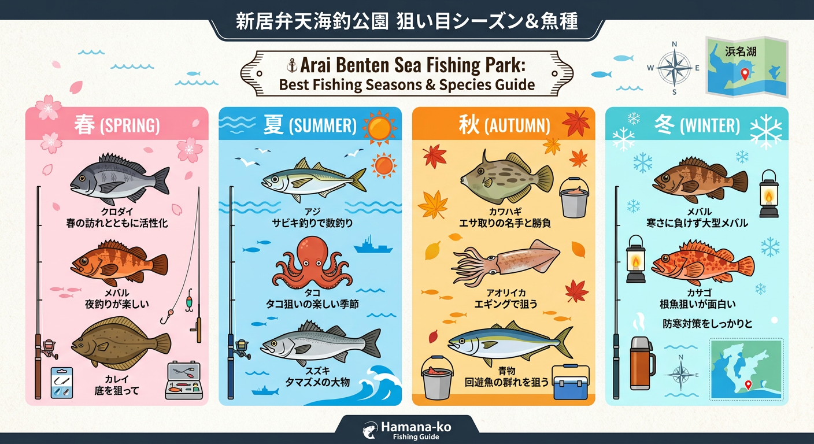

import Map from "@components/Map.astro";
import GMapButton from "@components/GMapButton.astro";
import TackleCard from "@components/TackleCard.astro";

「釣！浜名湖」をご覧いただきありがとうございます！

本記事では、浜名湖で最も人気のある **新居弁天海釣公園** をご紹介します。

初心者向けのサビキ釣りから、ベテラン勢が競い合うクロダイの前打ちまで、あらゆるレベルの釣り人が集まる「浜名湖の聖地」とも言えるポイントです。

<Map lat={34.682114} lng={137.589907} name="新居弁天海釣公園" />

<GMapButton url="https://maps.app.goo.gl/9RzT6cZ1uQW6K35B6" />

*   **ポイント名** : 新居弁天海釣公園
*   **所在地** : 静岡県湖西市新居町新居
*   **駐車場** : 有料（1回400円）。30 分以内の出庫は無料。
*   **トイレ** : 公園内に完備
*   **設備** : 売店あり、釣り具レンタル可能

> [!TIP]
> 園内には売店があり、仕掛けの予備やエサを現地調達できるほか、釣り具のレンタルも可能です。手ぶらで訪れても釣りが楽しめる、浜名湖で唯一の至れり尽くせりなポイントです。

## 新居弁天海釣公園の特徴と攻略ポイント

海釣公園内は、主に 3 つのエリアに分かれています。

### 1. T字堤（メインエリア）
駐車場からすぐ。足元に仕掛けを落とすだけでアジ、イワシ、サバが狙えます。柵がしっかりしているため、小さなお子様連れでも安心です。

### 2. 中間エリア（沈み石エリア）
岸壁から約15m先まで沈み石が入っています。クロダイやメジナのストック量が多く、カワハギなども期待できるポイントです。

### 3. 大曲り（今切口寄り）
激流が通り抜ける最難関。大型のクロダイやシーバス、夏の青物（ブリ・カンパチの子）など、パワーのある魚が回遊してきます。

### 🐟️シーズン別攻略ガイド

*   **🌸 春（3月〜6月）**：クロダイ、メジナ、メバル、ヒラメ
    *   **【攻略】** 3月〜4月のクロダイは「乗っ込み」の期待大。岸壁際の「前打ち」で大物を狙いましょう。

<TackleCard id="common/shimano-lure-tackle-set" />

*   **☀️ 夏（7月〜9月）**：アジ、サバ、タコ、クロダイ
    *   **【攻略】** T字堤でのサビキ釣りが主役！タコエギで足元や沈み石の周りを探るのも面白いです。

<TackleCard id="aji-saba-sappa/sabiki-starter-set" />
<TackleCard id="tako/dragon-octopus-tap" />

*   **🍂 秋（10月〜11月）**：カワハギ、サヨリ、青物
    *   **【攻略】** カワハギの魚影が非常に濃いのが特徴。専用の仕掛けで「エサ取り名人」との駆け引きを楽しみましょう。

<TackleCard id="kawahagi/sasame-k-902-nage-kawahagi" />

*   **❄️ 冬（12月〜2月）**：メバル、カサゴ、クロダイ
    *   **【攻略】** 夜の電気ウキ釣りや、ワームでのメバリングが中心となります。

<TackleCard id="mebaru-kasago/23-gekkabijin-lt2000s-p" />

## おすすめタックルと釣り場周辺

激流対策として、重めのオモリ（サビキなら8号〜12号程度）を用意しておくと安心です。また、夜釣りにはヘッドライトが必須です。

<TackleCard id="common/gentos-headlight-cb-300d" />

## 周辺の観光情報

### 海湖館（かいこかん）
うなぎのつかみ取り体験や、冬場の「牡蠣小屋」などで有名な体験型施設。公園のすぐ隣にあります。

<TackleCard id="travel/rakuten-travel-stay" />

## まとめ：家族で楽しめる浜名湖エリアNo.1の万能スポット

設備・魚影・アクセスの三拍子揃った新居弁天海釣公園。ルールを守って、楽しい一日を過ごしてください！

> [!IMPORTANT]
> **釣り場を守るために**
> 
> コマセで汚れた岸壁は必ず水で流しましょう。ゴミの持ち帰りも徹底をお願いします。
