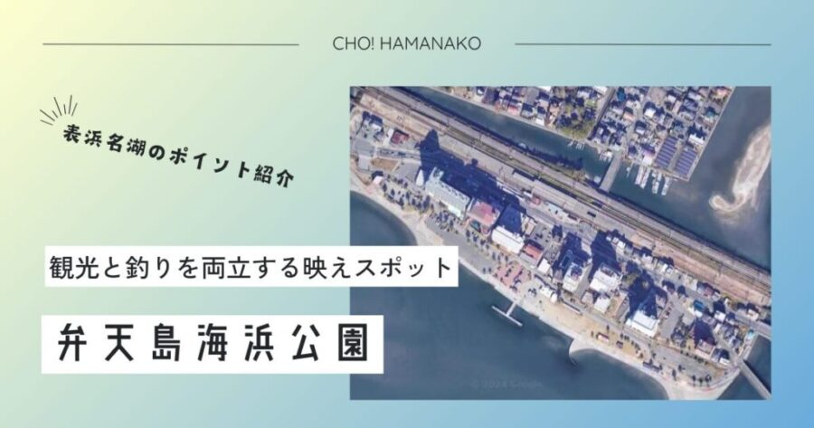

import Map from "@components/Map.astro";
import GMapButton from "@components/GMapButton.astro";
import BlogCard from "@components/BlogCard.astro";
import Callout from "@components/Callout.astro";

「釣！浜名湖」へようこそ！

今回ご紹介するのは、浜名湖で最も有名で、最もフォトジェニックな釣り場 <strong>「弁天島海浜公園（べんてんじまかいひんこうえん）」</strong> です。

目の前にそびえ立つ巨大な <strong>「赤鳥居」</strong> 、その背後に広がる青い湖面と <strong>浜名湖大橋</strong> ――。ここは釣り場であると同時に、年間通して多くの観光客が訪れる、浜名湖屈指の景勝地です。しかし、その華やかさの裏で、ここは豊かな潮流がぶつかり合う <strong>「魚たちの交差点」</strong> でもあります。特に夏から秋にかけては、ファミリーフィッシングの定番であるハゼやアジ、そして強烈な引きを楽しめる「チンタ（クロダイの幼魚）」が乱舞する爆釣スポットへと変貌します。

3000文字超の圧倒的ボリュームで、観光フィッシングの最高峰「弁天島」を120%楽しむための <strong>「攻略ルート」</strong> と <strong>「リゾート・エチケット」</strong> を完全解説します。

<Callout type="warning" title="エキスパート専用：深掘り攻略">
赤鳥居裏の「垂直ドロップオフ」や、橋脚周辺の激流をピンポイントで射抜く高度な地形攻略は、こちらの深掘り記事で。
<BlogCard slug="mio-suji-area-fukabori" />
</Callout>

---

## 🧭 ポイント概要：駅から徒歩3分！究極の「駅チカ釣行」

弁天島海浜公園が他のポイントと決定的に違うのは、その <strong>「アクセスの良さ」</strong> です。

### ① JR弁天島駅から徒歩圏内
JR東海道線 <strong>「弁天島駅」</strong> を降りて、地下道をくぐれば目の前が釣り場です。
- <strong>メリット</strong>：車を持たない学生アングラーや、「釣りの後にすぐビールを飲みたい！」という電車釣行派にとって、これ以上の聖地はありません。

### ② 万全の観光インフラ
- <strong>駐車場</strong>：約400台収容の巨大な <strong>弁天島海浜公園駐車場</strong> を完備（1回410円）。
- <strong>トイレ・売店</strong>：公園内に清掃の行き届いたトイレがあり、女性や小さなお子様でも安心です。
- <strong>足湯</strong>：釣りに疲れたら、公園内の <strong>「弁天島温泉・足湯」</strong> （季節限定）で冷えた足を温めることもできます。

### ③ 補給拠点「弁天島釣りセンター」
公園から徒歩5分の場所に老舗の <strong>「弁天島釣りセンター」</strong> があります。
- <strong>特徴</strong>：その日のアタリ仕掛けやエサの状態、最新の釣果情報を教えてもらえるほか、レンタル竿の相談も可能です。

---

## 🌊 水中地形と戦略：穏やかなテラスの下の「激流」

弁天島海浜公園の釣り場は、全域が舗装された石畳（テラス）になっています。

### ポイントの特徴：砂地と基礎石のコントラスト
護岸のすぐ足元には、堤防を支える <strong>「基礎石」</strong> が沈んでいます。
- <strong>居付きの魚</strong>：この石の隙間に、 <strong>カサゴ、メバル、マダコ</strong> が潜んでいます。
- <strong>広大な砂地</strong>：石畳から5m以上先は、綺麗な砂地が広がっています。ここが <strong>ハゼ、シロギス、カレイ</strong> のマイホームです。

### 要注意：見かけによらない「強い潮流」
赤鳥居がある「イカリ棚（浅瀬）」の周囲は、満ち引きの際、今切口からの潮がダイレクトに当たります。
- <strong>攻略のコツ</strong>： <strong>「15号以上の重り」</strong> を用意してください。軽い重りだと潮に流され、隣のアングラーとオマツリ（糸絡み）する原因になります。潮流の緩む「潮止まり」を狙うのが、スマートな弁天島スタイルです。

---

## 🎣 ターゲット別・シーズン攻略ガイド

### 【☀️ 夏：6月〜8月】チンタ（クロダイの幼魚）＆マダコ
- <strong>チンタ</strong>：手のひらサイズのクロダイ（チンタ）が入れ食いになります。 <strong>「ウキ釣り」や「ダンゴ釣り」</strong> で狙うのが定番ですが、小さくてもクロダイ譲りの鋭い引きは格別です。
  <BlogCard slug="kurodai-beginner" />
- <strong>マダコ</strong>：護岸の基礎石の継ぎ目を、 <strong>「タコエギ」</strong> でトントンと探り歩きましょう。
  <BlogCard slug="tako-beginner" />

### 【🍂 秋：9月〜11月】ハゼ祭り＆ジャンボサヨリ
- <strong>ハゼ</strong>： <strong>「チョイ投げ」や「ハゼクランク（ルアー）」</strong> で数釣りが楽しめます。特に上げ潮に乗って浅場に差してくるハゼは型が良いです。
  <BlogCard slug="haze-beginner" />
- <strong>サヨリ</strong>：水面がざわついていたら <strong>シモリウキ仕掛け</strong> の出番。繊細なアタリを掛ける楽しみがあります。
  <BlogCard slug="sayori-beginner-guide" />

---

## ⚠️ 【最重要】観光地としてのマナーと安全管理

弁天島はアングラーだけのものではありません。そこには必ず <strong>「観光客」</strong> がいます。

> [!CAUTION]
> <strong>【釣り場消滅の危機】後方確認を100%徹底</strong>
> 公園の遊歩道は、 <strong>犬の散歩、観光客、写真撮影をする方</strong> が頻繁に通ります。
> - <strong>「キャスト（投げる）前」には必ず360度の安全確認</strong> をしてください。
> - <strong>「三脚や道具の広げすぎ」</strong> は歩行者の妨げになります。通路は必ず空け、コンパクトな装備を心がけましょう。

> [!IMPORTANT]
> <strong>【夏期の海水浴エリア】境界線を守る</strong>
> 7月〜8月の特定期間、公園の一部が <strong>「海水浴場」</strong> になります。
> - 海水浴エリア、および泳いでいる人がいる場所での釣りは <strong>「絶対禁止」</strong> です。指定されたエリア外での釣行を徹底してください。

<Callout type="danger" title="浜名湖の危険生物：アカエイ">
弁天島の砂浜エリアや浅瀬で立ち込み（ウェーディング）をする際は <strong>アカエイ</strong> に厳重注意してください。移動時は必ず <strong>「すり足（エイガード歩行）」</strong> を行い、砂底のエイを追い散らしながら進みましょう。
</Callout>

<Callout type="important" title="駐車場・清掃マナー">
弁天島海浜公園駐車場は <strong>1回410円</strong> です。路上駐車は観光客や近隣住民の多大な迷惑となり、釣り禁止を招くため絶対に厳禁。また、サビキで汚れた足元はバケツの水できれいに洗い流して帰りましょう。
</Callout>

---

## 🚀 まとめ：赤鳥居の加護を受け、リゾート気分で糸を垂らす

弁天島海浜公園は、 <strong>「利便性・景観・実力」</strong> の三拍子が揃った、浜名湖を象徴するポイントです。

- <strong>「電車でも行ける」</strong> 究極の手軽さ。
- <strong>「赤鳥居」</strong> をバックにした最高のロケーション。
- <strong>「ハゼからクロダイまで」</strong> 尽きることのないターゲット。

マナーを守り、周囲への感謝を忘れずに。釣果だけでなく、弁天島という場所そのものを愉しむ余裕こそが、このポイントでの「最高のご褒美」です。

歴史あるこの島で、あなただけの「リゾート・フィッシング」を完成させてください！

---

<BlogCard slug="araibenten-umiduripark" />
対岸の「新居弁天」。より「本格的な激流」で青物や大物を狙うなら、こちらとのハシゴが定石。

<BlogCard slug="points/fukabori/magochi-fukabori" />
弁天島の足元に潜むマゴチ。航路（ミオ筋）のカケアガリをリアクションワインドで攻める専門メソッド。

<BlogCard slug="mio-suji-area-fukabori" />
本記事で解説した弁天島やサクラマルの核心部「ミオ筋（航路）」の地形攻略ガイド。

