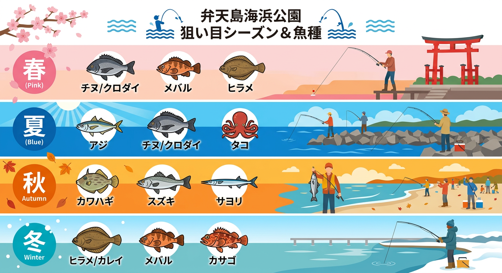

import Map from "@components/Map.astro";
import GMapButton from "@components/GMapButton.astro";

「釣！浜名湖」をご覧いただきありがとうございます！

本記事では、浜名湖の観光名所として名高い **弁天島海浜公園** の釣りポイントをご紹介します。

巨大な「赤鳥居」を目の前に、開放感あふれるロケーションで釣りを楽しめるのが最大の特徴です。駅から近く、周辺に飲食店やショップも多いため、手軽に釣りを始めたい初心者の方やご家族連れに最もおすすめしたいポイントの一つです。

## 弁天島海浜公園の基本情報

<Map lat={34.68898} lng={137.60266} name="弁天島海浜公園" />

<GMapButton url="https://maps.app.goo.gl/kfCpzUqF6WaB9N2o7" />

*   **ポイント名** : 弁天島海浜公園（べんてんじまかいひんこうえん）
*   **所在地** : 静岡県浜松市中央区舞阪町弁天島3775-2
*   **駐車場** : 有料（1回410円）。
*   **トイレ** : 公園内に完備（非常に綺麗です）。
*   **近くの釣具店** : 弁天島釣りセンター（公園入口すぐ）

> [!TIP]
> 公園内には足湯（期間限定）やカフェ、売店があり、釣りの合間にリラックスできる設備が充実しています。デートや観光ついでに少しだけ竿を出すのにも最適です。

## 弁天島海浜公園の特徴と攻略ポイント

公園の南側一帯が広大な護岸テラスになっており、どこでも竿を出すことができます。

### 1. 安全な足場と柵
広々とした石畳のテラスになっており、足場は非常に安定しています。水面との距離も近く、初心者の方でも扱いやすい釣り場です。

### 2. 潮の流れの理解
弁天島エリアは潮流が非常に強くなることで知られています。特に「下げ潮」の際は、今切口に向かって川のような流れが発生することも。重めのオモリを用意するか、流れが緩むタイミング（潮止まり）を狙うのがコツです。

### 3. 沈み根と砂地の混在
足元には沈み石が多く、カサゴやクロダイが居付いています。少し遠投すれば砂地が広がっており、シロギスやカレイを狙うことができます。

## 弁天島海浜公園の狙い目シーズンと魚種

### 狙い目のシーズン

*   **クロダイ（チンタ）・キビレ** : 6月〜11月
*   **アジ・サバ・サッパ** : 6月〜10月
*   **シロギス・ハゼ** : 6月〜10月
*   **タコ** : 7月〜8月

### シーズンごとに釣れやすい魚

*   **春：クロダイ、根魚**
    *   3月から4月の戻りガレイや、夜の電気ウキでのクロダイ狙いが始まります。
*   **夏：アジ、サバ、サッパ、チンタ、タコ**
    *   サビキ釣りの最盛期。夕まずめにはアジの回遊が期待できます。また、赤鳥居周辺でのタコ釣りも人気です。
*   **秋：カワハギ、シーバス、キビレ、サヨリ**
    *   最も多くの魚種が狙える時期。投げ釣りでのカワハギ、夜のルアーでのシーバス狙いが盛り上がります。
*   **冬：カレイ、メバル、カサゴ**
    *   北風を背に受ける形になるため、冬場でも比較的釣りがしやすいのがメリット。じっくりブッコミでカレイを狙いましょう。

### ✨ポイントの補足

*   **赤鳥居周辺**: 鳥居の近くは根掛かりが多いですが、その分魚影も濃いエリアです。
*   **夏の遊泳エリア**: 夏季は一部エリアが海水浴場となるため、釣り禁止区域の設定に注意してください。

## エサで釣れる魚とおすすめタックル

*   **対象魚** : アジ、サバ、サッパ、シロギス、クロダイ
*   **おすすめエサ** : アミエビ、石ゴカイ、オキアミ、カラス貝
*   **おすすめタックル** : 2.4m〜3.0m のコンパクトロッドまたは投げ竿

サビキ釣りなら、潮流に負けないよう8号〜12号程度の少し重めのカゴを使うのがおすすめです。投げ釣りでも、流されない程度の重さを選びましょう。

## ルアーで釣れる魚とおすすめタックル

*   **対象魚** : シーバス、クロダイ、アジ、メバル
*   **おすすめルアー** : シンキングペンシル、バイブレーション、ワーム
*   **おすすめタックル** : 8ft 前後のルアーロッド（MLクラス）

夜間の照明周りでのライトゲームが非常に楽しいポイントです。シンキングペンシルを流れに乗せて流す「ドリフト」釣法で、明暗の境目を狙ってみましょう。

## 弁天島海浜公園の周辺観光情報

### 赤鳥居（舞阪表浜）
干潮時には歩いて渡れるほど浅くなることもある、浜名湖のランドマーク。夕暮れ時のシルエットは絶景です。

### 弁天島温泉
駅周辺には日帰り入浴可能な旅館が点在しており、釣りの後に贅沢な癒やしを味わえます。

## まとめ：絶景の中で楽しむ、浜名湖フィッシングの入門地点

弁天島海浜公園は、釣果だけでなく「浜名湖の雰囲気」を存分に味わえる特別な場所です。

> [!IMPORTANT]
> 観光客も非常に多いため、キャスト（投げる）の際は後方の安全確認を徹底しましょう。また、美しい公園を守るため、ゴミの持ち帰りは絶対です。

ルールとマナーをしっかり守り、赤鳥居の下でのんびりと釣りを楽しんでみてください！
