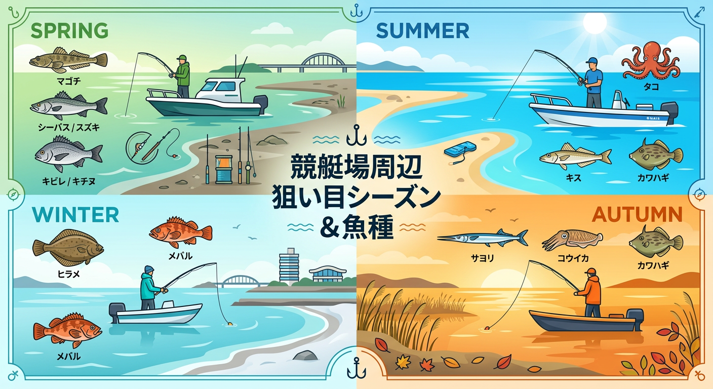

import Map from "@components/Map.astro";
import GMapButton from "@components/GMapButton.astro";

「釣！浜名湖」をご覧いただきありがとうございます！

本記事では、陸からはなかなか攻めきれない穴場、**ボートレース浜名湖（浜名湖競艇場）周辺** のポイントをご紹介します。

ここは陸釣りが制限されている場所が多く、ボート釣りがメインとなるエリアです。その分、魚の警戒心が低く、季節ごとの好ターゲットが高密度で棲息しています。ボートならではの機動力を活かした攻略法を解説します。

## ボートレース浜名湖周辺の基本情報

<Map lat={34.701099} lng={137.57467} name="ボートレース浜名湖周辺" />

<GMapButton url="https://maps.app.goo.gl/jLzPay77kP4p61H" />

*   **ポイント名** : ボートレース浜名湖（浜名湖競艇場）周辺
*   **所在地** : 静岡県湖西市新居町中之郷
*   **エントリー方法** : 周辺はマリーナや私有地が多く陸からの立ち入りは困難。**レンタルボート等でのエントリー** が前提です。
*   **駐車場** : 利用するマリーナの駐車場を使用。
*   **近くの釣具店** : フィッシング沖、はしくに、ボートクラブカナル

> [!WARNING]
> **競艇開催中の注意！**
> 競艇のレース開催中は、競艇場付近の水域に進入禁止エリアが設定されます。警備艇の指示やブイの設置に注意し、ルールを厳守しましょう。また、競技の妨げになる行為は絶対に避けてください。

## ボートレース浜名湖周辺の特徴と攻略ポイント

競艇場付近には広大な砂地と緩やかな駆け上がりが広がっており、絶好の停泊ポイントとなっています。

### 1. 砂地・泥底エリア（マゴチ・キスの宝庫）
水深1.5m〜3m程度の広大なシャローエリア（浅瀬）が続きます。シロギスやカワハギの密度が濃く、それらを捕食する大型のマゴチも非常に多いエリアです。

### 2. サヨリの回遊ルート
夏から秋にかけて、表層を回遊するサヨリの大群が入ってきます。ボートを固定してコマセを撒けば、数釣りを堪能できます。

### 3. 航路付近の「カケアガリ」
競艇場の北東側には大きな航路が通っています。この航路の縁にある「カケアガリ（段差）」には魚が集中しますが、船舶の往来が激しいため、航路内での停泊は厳禁です。

## ボートレース浜名湖周辺の狙い目シーズンと魚種

### 狙い目のシーズン

*   **サヨリ・キス・カワハギ** : 7月〜11月
*   **マゴチ・キビレ** : 4月〜10月
*   **カレイ** : 11月〜2月
*   **タコ** : 6月〜7月

### シーズンごとに釣れやすい魚

*   **春：マゴチ、シーバス、キビレ**
    *   3月頃から水温が上がり、ボトム（底）でのマゴチ狙いが本格化します。
*   **夏：タコ、シロギス、カワハギ、マゴチ**
    *   浜名湖のボート釣りの風物詩「タコ釣り」が盛んに。サビキでのアジ・サバも混じります。
*   **秋：サヨリ、カワハギ、シロギス、マゴチ、コウイカ**
    *   一年で最も賑やかなシーズン。特にサヨリの大群が入ると、ボート周辺が波立つほどの釣果になることも。
*   **冬：カレイ、根魚**
    *   風を避けられるワンド内で、カレイをじっくり待つ釣りが主体となります。

### ✨ポイントの補足

*   **アンカリング**: 潮の流れや風の影響を受けやすいため、アンカーはしっかり効かせましょう。
*   **周囲の距離**: ボート同士のオマツリを避けるため、他の船とは十分な距離を保って停泊するのがマナーです。

## エサで釣れる魚とおすすめタックル

*   **対象魚** : シロギス、カワハギ、サヨリ
*   **おすすめエサ** : 青ジャムシ、アサリ、アミエビ
*   **おすすめタックル** : 1.8m〜2.4m のボート竿（オモリ 10〜15 号）

ボートなら短い竿の方が扱いやすく、感度も良くなります。サヨリ狙いなら専用の「シモリ浮き仕掛け」を用意しましょう。

## ルアーで釣れる魚とおすすめタックル

*   **対象魚** : マゴチ、シーバス
*   **おすすめルアー** : ジグヘッドワーム（ボトムワインド）、バイブレーション
*   **おすすめタックル** : 7ft 前後のボートシーバスロッド

マゴチ狙いなら **「ボトムワインド」** が圧倒的に有効。また、広範囲を素早く探るためにバイブレーションを投げるのも一つの手です。

## 浜名湖のレンタルボート・ガイド情報

ボートを持っていない方でも、周辺には信頼できるマリーナが多くあります。

*   **フィッシング沖**: 親切なガイドと豊富なレンタル艇があります。
*   **はしくに**: 設備が整っており、初心者へのアドバイスも丁寧です。
*   **ボートクラブカナル**: スタイリッシュなボートが多く、釣りとクルージングを同時に楽しめます。

## まとめ：ボート釣りの醍醐味を凝縮した穴場エリア

ボートレース浜名湖周辺は、陸からのプレッシャーが少ない分、魚の反応が素直で「釣りの楽しさ」を再確認できる場所です。

> [!IMPORTANT]
> 船舶同士の交通ルールを遵守し、特に航路を妨げないよう注意しましょう。また、海上のゴミ拾いにも積極的に協力し、美しい浜名湖を守りましょう。

ルールとマナーをしっかり守り、爽快なボートフィッシングを体験してみてください！
