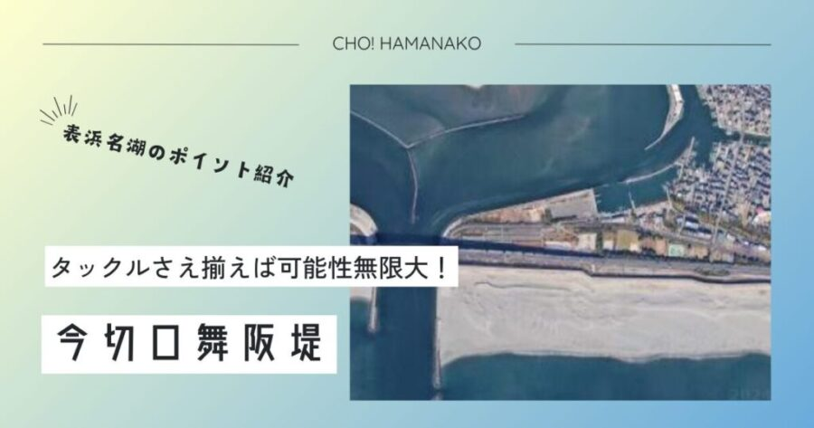

import Map from "@components/Map.astro";
import GMapButton from "@components/GMapButton.astro";
import BlogCard from "@components/BlogCard.astro";
import Callout from "@components/Callout.astro";

「釣！浜名湖」へようこそ！

今回ご紹介するのは、浜名湖全域の中でも <strong>「最終到達点」</strong> とも言うべき最難関ポイント、 <strong>「今切口舞阪堤（いまぎりぐちまいさかてい）」</strong> です。

ここは、浜名湖と遠州灘（太平洋）がわずか200メートルほどの幅で繋がる「喉元」にあたります。潮汐による大量の海水が入れ替わる際、その流速は <strong>川を凌駕する「激流」</strong> と化し、巨大な渦を巻き起こします。その厳しい環境こそが、外海からのモンスターフィッシュを呼び寄せ、アングラーに <strong>「一生に一度の出会い」</strong> を提供してくれるのです。

しかし、同時にここは浜名湖で最も <strong>「死に近い場所」</strong> でもあります。安易な気持ちでのエントリーは文字通りの「自殺行為」。3000文字超の圧倒的ボリュームで、この聖地へ挑むための <strong>「覚悟・装備・テクニック」</strong> を徹底解剖します。

<Callout type="warning" title="エキスパート専用：深掘り攻略">
舞阪堤の「特定のピン」や「底質」まで踏み込んだ超マニアックな攻略情報は、こちらの深掘り記事で解説しています。
<BlogCard slug="imagire-area-fukabori" />
</Callout>

---

## 🧭 ポイント概要：龍の喉元「今切口」の東壁

舞阪堤は、今切口の東側（中央区側）に位置する巨大な防波堤です。

### ① 上級者専用ステージ「ヨーカン」
舞阪堤のメインフィールドは、長方形の巨大テトラが整然と積まれた通称 <strong>「ヨーカン（羊羹）」</strong> エリアです。
- <strong>特徴</strong>：テトラ一文字が巨大で、足場が悪いうえに隙間が非常に深く、滑落すれば自力脱出はほぼ不可能です。
- <strong>水深</strong>：足元から一気に <strong>6m〜10m以上</strong> まで落ち込みます。この深さが、真鯛やブリといった完全な外洋魚の回遊を可能にしています。

### ② 駐車場・アクセスの「鉄の掟」
- <strong>舞阪表浜駐車場</strong>：堤防付け根に位置。1回410円。
- <strong>注意点</strong>：夜間や早朝も利用可能ですが、駐車場からテトラ帯まではかなりの距離を歩きます。 <strong>「背負子（しょいこ）」</strong> やキャリーカート（舗装部分まで）の活用が推奨されます。

---

## 🌊 激流を制する：今切口の「特殊な潮流」を読む

舞阪堤で釣果を上げるためには、魚を釣る前に <strong>「潮」</strong> を釣る必要があります。

### タイダルボア（潮の壁）
上げ潮（満潮に向かう潮）の際、外海から押し寄せる海水が今切口に収束し、目に見えるほどの <strong>「段差（潮の壁）」</strong> を作ることがあります。
- <strong>戦略</strong>：この「潮のヨレ」や「反転流」にベイト（小魚）が溜まります。ルアーマンはこのヨレをピンポイントで通せるかどうかが、0か100かの分かれ道となります。

### ヨーカンの「スリット」攻略
テトラ同士の隙間には、激流に耐えきれないカニや小魚が避難しています。
- <strong>前打ちの極意</strong>： <strong>「カニ」や「カラス貝」</strong> をエサに、 <strong>5m以上の極長竿</strong> でテトラの際ギリギリに仕掛けを落とし込む <strong>「前打ち」</strong> 。ここで上がるクロダイは「年無し（50cm超）」の常連です。

---

## 🎣 ターゲット別・「聖地」の攻略タクティクス

### 【🏆 年中】モンスターシーバス：落ちアユからコノシロまで
今切口を通過して浜名湖へ入る、あるいは海へ帰るシーバスを待ち伏せます。
- <strong>タクティクス</strong>： <strong>30g〜40gのヘビーウェイトルアー</strong> が必須。激流に負けずレンジ（水深）をキープできるバイブレーションや、大型ミノーを「ドリフト（流す）」させて、闇の中でバイトを誘います。

### 【☀️ 夏〜🍂 秋】ショアジギング：回遊魚の「爆撃戦」
ブリ（イナダ・ワラサ）、サワラ、カンパチ（ショゴ）が最短距離で回遊します。
- <strong>タクティクス</strong>： <strong>40g〜60gのメタルジグ</strong> をフルキャスト。遠州灘を背負ったこの場所でのヒットは、他のどのポイントよりも強烈な「重み」を伴います。

### 【❄️ 冬：12月〜3月】穴釣りの「深淵」
寒風吹き荒ぶ冬、ヨーカンの隙間に <strong>「ブラクリ」</strong> を落とします。
- <strong>ターゲット</strong>： <strong>カサゴ（ガシラ）、メバル、アイナメ</strong> 。今切口の栄養豊富な水を吸った根魚は、驚くほど太っており、味も絶品です。

---

## ⚠️ 【最重要】命を守る「舞阪堤・十戒」

舞阪堤での事故は、即「水死」に直結します。以下の装備・マナーがない者は、エントリーする資格がありません。

> [!CAUTION]
> <strong>【絶対遵守】究極の安全プロトコル</strong>
> 1. <strong>「フローティングベスト」</strong> は膨張式ではなく <strong>「固定式（浮力体入り）」</strong> を強く推奨。テトラでの接触による破損を防ぐため。
> 2. <strong>「フェルトスパイク／スパイクシューズ」</strong> 必須。濡れたテトラは氷のように滑ります。
> 3. <strong>「単独行の禁止」</strong> 。滑落時、誰にも気づかれずに消えていくアングラーが後を絶ちません。
> 4. <strong>「夜間の高輝度ヘッドライト」</strong> 。200ルーメン以上の予備付きを持参。
> 5. <strong>「無理な回収はしない」</strong> 。ルアーがテトラに掛かっても、絶対に身を乗り出さないこと。

---

## 🚀 まとめ：浜名湖の「真実」を知るために

今切口舞阪堤は、単に魚を釣る場所ではなく、 <strong>「自分自身の技術と覚悟」</strong> を試す場所です。

- <strong>「激流」</strong> を読み解く知性。
- <strong>「巨大テトラ」</strong> を歩き抜く体力。
- <strong>「万全の装備」</strong> を整える理路。

すべてが揃った時、今切口はあなたに <strong>「浜名湖の真の王者」</strong> を引き合わせてくれるでしょう。

ルールを守り、臆病なほどの慎重さを持ち、浜名湖最強の聖地へ挑んでください！

---

<BlogCard slug="seabass-season-fukabori" />
全シーバスの「検問所」。今切口での乗っ込み・落ちシーズンの回遊ルート完全予測。

<BlogCard slug="lunker-seabass-fukabori" />
「ヨーカン」周辺の激流と底を攻略し、80cmを超えるランカーシーバスを引きずり出すための精鋭ガイド。

<BlogCard slug="mejina-fukabori" />
冬の「寒グレ」攻略。舞阪堤のテトラキワに潜む良型メジナを仕留めるためのウキフカセ真髄。

<BlogCard slug="points/fukabori/eging-fukabori" />
舞阪堤の激流ドリフト術。アオリイカを「抱かせる」ためのエギの沈め方と仮面シンカー調整法。

<BlogCard slug="ajing-fukabori" />
舞阪港周辺の常夜灯下から今切口の明暗。アジングで繊細に掛ける、ナイトライトゲームの極北。

<BlogCard slug="points/fukabori/magochi-fukabori" />
舞阪堤周辺の深場から差してくるマゴチを、リアクションワインドで誘い出す精鋭メソッド。

<BlogCard slug="points/fukabori/sayori-fukabori" />
冬の風物詩、サンマ級のサヨリ。今切口の激流に仕掛けを馴染ませる、遠投カゴ釣り攻略。

<BlogCard slug="araibenten-umiduripark" />
対岸の「新居弁天」。同じ今切口でも、足場の良い公園スタイルで狙うならこちら。

<BlogCard slug="imagire-area-fukabori" />
本記事で紹介した今切口エリアの「海底の急所」や「潮汐の黄金律」を暴くエキスパート向けガイド。

---

<Callout type="important" title="駐車場マナーと清掃">
舞阪表浜駐車場の利用はもちろん、使用後の釣り座の清掃（コマセの洗い流し）を徹底してください。漁師さんとの共生が、この素晴らしい釣り場を維持する唯一の道です。
</Callout>
