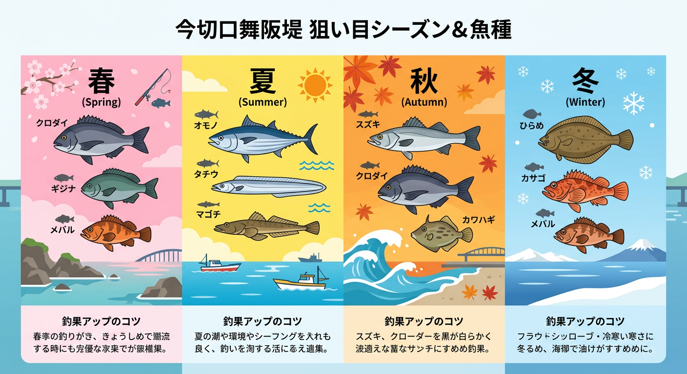

import Map from "@components/Map.astro";
import GMapButton from "@components/GMapButton.astro";

「釣！浜名湖」をご覧いただきありがとうございます！

本記事では、表浜名湖の中でも特にダイナミックな釣りが楽しめる **今切口舞阪堤** をご紹介します。

浜名湖と太平洋を繋ぐ今切口は、潮の出入りが最も激しく、常に大型魚が回遊する一級ポイントです。しかし、その激流と険しいテトラ帯は、アングラーの腕と道具が厳しく試される場所でもあります。中級者から上級者まで、ここで 1 枚を手にするための秘訣を解説します。

## 今切口舞阪堤の基本情報

<Map lat={34.679560} lng={137.599383} name="今切口舞阪堤" />

<GMapButton url="https://maps.app.goo.gl/eJgHYCuxfXQwaBBR8" />

*   **ポイント名** : 今切口舞阪堤（いまぎれぐちまいさかてい）
*   **所在地** : 静岡県浜松市中央区舞阪町舞阪2668-1
*   **アクセス方法** : 国道 1 号線バイパス「舞阪表浜IC」すぐ。
*   **駐車場** : 有料（舞阪表浜駐車場 1回410円）。千円札までしか対応していないことが多いため、小銭の用意を。
*   **トイレ** : 駐車場内に完備。
*   **近くの釣具店** : 荒川釣具店、あけぼの釣具店

> [!CAUTION]
> **安全第一！ライフジャケット必須！**
> 今切口は潮流が極めて速く、外海に面しているため波も高いエリアです。特にテトラ帯では滑落の危険があるため、必ず「フローティングベスト（ライフジャケット）」と「スパイクシューズ」を着用してください。

## 今切口舞阪堤の特徴と攻略ポイント

舞阪堤は、その形状と地形から大きく 2 つのエリアに分かれます。

### 1. 堤防広場エリア（初心者〜中級者）
駐車場から近く、足場が開けているエリアです。足元から約10m先までは沈み石がありますが、その先は砂地が広がっており、**投げ釣り** でのキスやカレイ、**サビキ釣り** でのアジ・サバが狙えます。

### 2. テトラ帯「ヨーカン」（上級者専用）
巨大なテトラポッドが整然と積まれたエリアで、通称「ヨーカン」と呼ばれます。穴釣りでの根魚はもちろん、テトラの際を狙う **前打ち** での大型クロダイ実績が抜群です。足場が非常に悪いため、ベテランアングラー向けのエリアです。

## 今切口舞阪堤の狙い目シーズンと魚種

### 狙い目のシーズン

*   **クロダイ・メジナ** : オールシーズン（特に春・秋）
*   **シーバス** : 秋〜初冬（外洋へ出る「落ちシーバス」）
*   **青物（ブリ・カンパチ）** : 7月〜10月
*   **根魚（カサゴ・メバル）** : 12月〜3月

### シーズンごとに釣れやすい魚

*   **春：クロダイ、メジナ、メバル**
    *   3月の「乗っ込み」シーズン。激流に揉まれたパワフルな大型クロダイが狙えます。
*   **夏：青物、タチウオ、シロギス、マゴチ**
    *   今切口にベイトフィッシュ（イワシ等）が入ると、青物の回遊が始まります。ナブラが起きることも珍しくありません。
*   **秋：シーバス、クロダイ、メジナ、カワハギ**
    *   シーバスのランカー狙いには最高の季節。激流の中に潜む個体をドリフトで狙うのが定番です。
*   **冬：カレイ、カサゴ、メバル**
    *   北風が強く外海が荒れている日は、テトラの隙間を狙う「穴釣り」が堅実な釣果をもたらします。

### ✨ポイントの補足

*   **潮流の影響**: 潮の勢いが驚くほど強いため、通常の仕掛けでは一瞬で流されます。重めのオモリや、流れに負けないタフなタックルが求められます。
*   **夜釣りの照明**: 公園側の街灯はありますが、テトラ帯は暗いため、高性能なヘッドライトが必須です。

## エサで釣れる魚とおすすめタックル

*   **対象魚** : クロダイ、メジナ、カサゴ、カレイ
*   **おすすめエサ** : カニ、カラス貝（前打ち）、アオイソメ（穴釣り・投げ）
*   **おすすめタックル** : 6m 以上の前打ち竿、または 5.4m 前後の磯竿

テトラの先を攻略するには、**長さ** が絶対的な武器です。また、激流の中でのやり取りになるため、ライン（道糸・ハリス）は通常より一段太めを推奨します。

## ルアーで釣れる魚とおすすめタックル

*   **対象魚** : シーバス、青物、ショアジギ
*   **おすすめルアー** : ヘビーウェイトミノー、シンキングペンシル、メタルジグ（30〜40g）
*   **おすすめタックル** : 9〜10ft 前後のタフなシーバスロッド、ショアジギングロッド

流れの中でもしっかり泳ぐ、自重のあるルアーを選びましょう。青物狙いの場合は、いつ大型が来てもいいようにドラグ調整を万全に。

## 周辺観光情報

### 舞阪漁港「えんばい朝市」
不定期開催ですが、舞阪ならではの海の幸を満喫できます。

### 今切パーク 海釣公園
向かい側には「新居弁天海釣公園」があり、ファミリーで楽しむならそちらもおすすめです。

## まとめ：熟練者が集う、浜名湖最強の激流攻略ポイント

今切口舞阪堤は、決して手軽なポイントではありませんが、だからこそ手にできる「価値ある 1 枚」がここにはあります。

> [!CAUTION]
> 無理な釣行は絶対に避けましょう。波が高い日や強風の日はテトラに近づかないでください。また、釣り場に落ちたゴミを一つでも拾って帰ることが、未来の釣り場を守ります。

ルールとマナーをしっかり守り、今切の大物たちに挑んでみてください！
