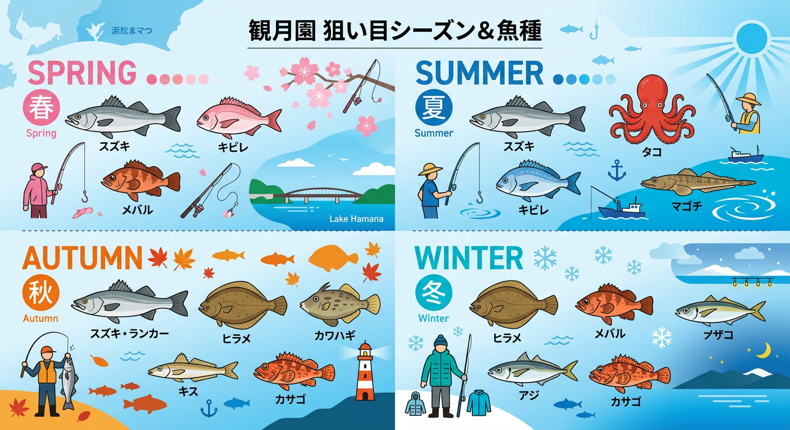

import Map from "@components/Map.astro";
import GMapButton from "@components/GMapButton.astro";

「釣！浜名湖」をご覧いただきありがとうございます！

本記事では、表浜名湖の中でも少しミステリアスな雰囲気を漂わせる **観月園（かんげつえん）付近** のポイントをご紹介します。

弁天島は人工島の総称でして、大雑把に4つのエリアがあります。

ポイント紹介で出した「渚園」「乙女園」。JR駅があるのは「蓬莱園」といい、蓬莱園と渚園の間にあるのは「千鳥園」といいます。

航空地図でみると、なんか小さな島が見えると思います。一見すると絶好のポイントに見えますが、足場の高さや交通量の多さなど、攻略には一工夫必要な「通（つう）」好みのエリアといえます。

## 観月園付近の基本情報

<Map lat={34.69679} lng={137.60100} name="観月橋" />

<GMapButton url="https://maps.app.goo.gl/8RrzHCbWftTL3JYQ9" />

*   **ポイント名** : 観月園（かんげつはし）付近
*   **所在地** : 静岡県浜松市中央区舞阪町弁天島
*   **アクセス方法** : JR「弁天島駅」より徒歩約 15 分。
*   **駐車場** : なし。隣接する「乙女園公園」の有料駐車場（1回410円）に停めて歩くのが最短かつベストなルートです。
*   **近くの釣具店** : 弁天島釣りセンター、大橋屋つり具センター

> [!WARNING]
> **橋の上からの釣りは禁止です**
> 観月橋は交通量が多く、橋の上からの釣りは極めて危険です。法律でも禁止されており、落下防止のネットも設置されています。釣りは必ず橋の袂（たもと）や護岸、あるいはウェーディングで行ってください。

## 観月園の特徴と攻略ポイント

観月園周辺は、 **地形の変化を読み解く力が試されるエリア** です。

### 1. 橋脚周りと明暗の攻略
シーバス狙いなら、観月橋の脚周りのヨレや、夜間の明暗がメインとなります。現地に行くと、シーバサーなら思わずルアーを通したくなるポイントですけど、橋とほぼ同じ高さから投げるのは地味に難しいです。

渚園とつながる陸橋の下は、潮が通り抜けるためベイトが集まりやすく、ルアーでのピンポイント爆撃が有効です。観月園なら北側、渚園からは西側でウェーディングができるけど、潜在的に良いエリアなら **橋の西側がベスト** です。

### 2. 広大なシャローとミオ筋
橋の周辺よりも、その先（弁天島北西部）に広がる浅瀬エリアもおすすめです。春や秋には、チョイ投げ釣りで色々な魚を狙えます。

春と秋なら、東西の角からぶん投げて、戻りと落ちの乗っ込み時期を狙い撃ちましょう。わりと穴場なので混雑しません。

## 観月橋付近の狙い目シーズンと魚種

### 狙い目のシーズン

*   **シーバス・キビレ** : 4月〜11月（特に春・秋の回遊期）
*   **カレイ** : 11月〜1月
*   **メバル・カサゴ** : 12月〜3月
*   **タコ** : 6月〜8月

### シーズンごとに釣れやすい魚

*   **春：シーバス、キビレ、メバル**
    *   水温上昇とともにシーバスが接岸します。ナイトゲームでのシンキングペンシルによる明暗攻めが楽しい時期。
*   **夏：シーバス、キビレ、タコ、マゴチ**
    *   日中は酷暑となりますが、タコエギを持ってシャローを散策するのもあり。朝夕のマヅメ時はマゴチの活性も上がります。
*   **秋：シーバス、カレイ、カワハギ、キス、カサゴ**
    *   魚種が最も豊富。シーバスのランカーサイズが期待できるほか、冬に向けた「落ちカレイ」の先駆けも狙えます。
*   **冬：カレイ、メバル、アジ、カサゴ**
    *   寒冷期のメインは投げ釣りのカレイと、橋脚周りのメバリング。北風を避けられるスポットを探して丁寧に探りましょう。

### ✨ポイントの補足

*   **マナーと目立ちやすさ**: 非常に目立つ場所であるため、日中の釣行は特に周囲への配慮が必要です。交通の邪魔にならないよう注意してください。
*   **周辺エリアの活用**: 観月橋にこだわらず、弁天島北西部の護岸をラン＆ガンするほうが、結果的に良い釣果に恵まれることが多いです。

## 観月園の観光情報

### スズキ塾 観月園研修センター
観光って場所じゃないけれど、ランドマークとしてかなり目立ちます（地図上でも）。スズキの研修センターのため一般の利用はできません。

### 夕焼けはけっこう映える
観月園はもともと別荘地として開発された島。北側の景色は開けており、広い浜名湖を一望しながら釣りを楽しむことができます。

西側から南を見れば、東海道線と夕日を撮ることができて、北側なら湖面が静かなら反射する夕日を撮影できるかもしれません。撮影なら視界の良い秋～冬がおすすめです。

## まとめ：テクニカルな要素を詰め込んだ「攻略しがい」のある場所

観月橋付近は、島外周から小島、橋脚まで含めると非常にターゲットが広いエリアです。

上級者が地図で見ると、「攻略しがいがあるな」と唸るでしょう。初心者は「どこでやったらいいんだ……」と困惑するかもしれません。

> [!IMPORTANT]
> 決して「簡単」な場所ではありませんが、季節や潮に合わせた場所選びができれば、網干場などのメジャーポイントに負けないポテンシャルを持っています。上級者アングラーの方は、ぜひ自分だけの「黄金ルート」を見つけてみてください。

ルールとマナーを遵守し、弁天島の隠れた実力派エリアに挑んでみましょう！

.
