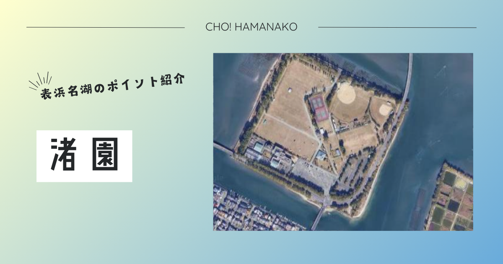

import Map from "@components/Map.astro";
import GMapButton from "@components/GMapButton.astro";
import BlogCard from "@components/BlogCard.astro";
import Callout from "@components/Callout.astro";

「釣！浜名湖」へようこそ！

今回ご紹介するのは、浜名湖で最もアクティブなレジャーの島 <strong>「渚園（なぎさえん）」</strong> です。

弁天島の北側に位置するこの円形の島は、周囲をぐるりと石積みの護岸に囲まれ、その外側には <strong>「広大なシャロー（浅瀬）」</strong> が続いています。ここは単なるキャンプ場ではありません。夏、水面が静まり返る早朝にルアーを投げれば、クロダイが水面を割って飛び出す――。そんなエキサイティングな <strong>「チヌトップ（Topwater Black Bream）」</strong> の聖地として、全国から熱狂的なアングラーが集結します。

キャンプのBBQを楽しみながら、横の海でハゼと戯れる。あるいは、深夜にテントを抜け出してランカーシーバスを追う。そんな <strong>「渚園流・泊まりがけ釣行」</strong> を120%満喫するための全知識を、3000文字超の圧倒的スケールでお届けします。

---

## 🧭 ポイント概要：テントから「徒歩30秒」のフロンティア

渚園が釣り場として最強である理由は、 <strong>「宿泊施設とフィールドの圧倒的な近さ」</strong> にあります。

### ① 「泊まる・釣る・食う」が完備された島
渚園は島全体がスポーツ・レジャー施設として整備されており、 <strong>渚園キャンプ場</strong> はフリーサイトなら格安で宿泊可能です。
- <strong>キャンプ・フィッシング</strong>：「夜はキャンプの焚き火を楽しみ、朝マズメは目の前の護岸からルアーを投げる」という、究極の非日常体験が可能です。
- <strong>聖地巡礼</strong>：人気アニメ <strong>「ゆるキャン△」</strong> に登場したことでも知られ、その景観の良さと利便性は折り紙付きです。

### ② 駐車場とアクセスの利便性
- <strong>駐車場</strong>：巨大な専用駐車場（1回400円）があり、荷物の積み下ろしもスムーズです。
- <strong>公共交通機関</strong>：JR <strong>「弁天島駅」</strong> から徒歩約15分。駅から歩いてキャンプ道具と竿を持ってくる「電車キャンパー・アングラー」も少なくありません。

---

## 🌊 水中地形と戦略：水深50cmの「キッチン」を狙え

渚園の周囲は、満潮時でも水深1.5m〜2m、干潮時には底が露出するほどの <strong>「ドシャロー（超浅瀬）」</strong> です。

### 攻略の鍵：アマモ（海草）とベイトフィッシュ
海底には砂泥に混じって <strong>「アマモ」</strong> が群生しています。ここにはエビ、カニ、ゴカイ、そして小魚が密集しており、それを捕食するためにクロダイやシーバスが浅場へと乗り込んできます。

1. <strong>東側〜南側の「砂浜」エリア</strong>
   ここは渚園で最も浅いエリアです。
   - <strong>戦略</strong>：夏の <strong>「チヌトップ」</strong> のメイン会場。膝下までの水深があれば、クロダイは回遊してきます。ルアーの飛沫で魚を誘い出す快感は、渚園ならではの特権です。

2. <strong>西側・北側の「導流堤・橋脚」エリア</strong>
   弁天島とを結ぶ橋があり、潮の流れがわずかに複雑になります。
   - <strong>戦略</strong>：少し水深があるため、 <strong>サビキ釣りやチョイ投げ</strong> に適しています。キャンプの合間にサッパやアジを釣るならこちらがおすすめ。

---

## 🎣 ターゲット別・「渚園スタイル」攻略ガイド

### 【☀️ 夏：6月〜9月】伝説のチヌトップ・ゲーム
渚園の看板メニューです。
- <strong>タクティクス</strong>：朝マズメ、波が穏やかな時間を狙い、 <strong>ペンシルベイトやポッパー</strong> を遠投。クロダイがルアーを追って背ビレを出し、 <strong>「バフッ！」</strong> と水面を割る瞬間を楽しみます。
- <strong>関連記事</strong>： <BlogCard slug="kurodai" /> <BlogCard slug="wading-seabass-fukabori" />

### 【🍂 秋：9月〜11月】落ちハゼとキャンプ飯の共演
数釣りが楽しめる最高のシーズンです。
- <strong>タクティクス</strong>： <strong>「チョイ投げ」や「ハゼクランク（ルアー）」</strong> で護岸沿いを探り歩きます。釣れたハゼをその場でキャンプ料理にするのは、渚園でしか味わえない贅沢。
- <strong>関連記事</strong>： <BlogCard slug="kisu-tactics" />

### 【🌑 夜間】シャロー・シーバス攻略
キャンプの静寂の中、シーバス（セイゴ・フッコ）がボイル（魚の跳ね）を繰り返します。
- <strong>タクティクス</strong>：浅瀬でも根掛かりしにくい <strong>フローティングミノーやシンキングペンシル</strong> をデッドスロー（超低速）で引きます。ライトの光が届かない闇の境界線が狙い目。

---

## ⚠️ 【最重要】アカエイ対策とキャンプ・エチケット

渚園のフィールドには、無視できないリスクとルールがあります。

> [!CAUTION]
> <strong>【命を守る警告】アカエイの「ゆりかご」に注意！</strong>
> 渚園周辺の穏やかなシャローは、 <strong>アカエイの生息密度が極めて高い</strong> エリアです。
> - もしウェーディングをするなら、絶対に足を上げずに底を這わせて歩く <strong>「すり足」</strong> を徹底してください。
> - エイの毒棘はウェーダーを貫通します。 <strong>エイガード</strong> の着用を強く推奨します。

> [!IMPORTANT]
> <strong>【キャンプマナー】夜間の音とライト</strong>
> 渚園は多くのキャンパーが眠る場所です。
> - <strong>夜21時以降</strong> の激しいキャスト音、大声での会話、明るすぎるライトの照射は控えましょう。
> - <strong>「釣り針の放置」</strong> は絶対に厳禁。芝生で遊ぶお子様やペットが怪我をする原因になります。

---

## 🚀 まとめ：テントのジッパーを開け、最高のフィールドへ

渚園は、 <strong>「自然と遊び」が最も身近に存在する島</strong> です。

- <strong>「チヌトップ」</strong> という極上のルアー体験。
- <strong>「キャンプ」</strong> という非日常の宿泊スタイル。
- <strong>「ファミリー」</strong> で楽しめる安全な足場。

マナーを守り、ゴミを拾い、キャンプの静寂に感謝しながら、最高の1匹と出会ってください。今年の夏、渚園の護岸でロッドを振るあなたの姿を、浜名湖の風は待っています。

---

---

### さらに一歩先へ：エキスパートのための深掘りガイド

<BlogCard slug="points/fukabori/chining-fukabori" />
渚園周辺のシャローで炸裂する「チヌトップ」。クロダイ・キビレを誘い出す最新メソッド完全解説。

<BlogCard slug="ajing-fukabori" />
夜の渚園で静かに楽しむアジング。ライトゲームでアジ・メバル・カサゴを射抜く繊細テクニック。

<BlogCard slug="wading-seabass-fukabori" />
渚園を含む中浜名エリアの「水中地形」と、命を守るエイ対策をさらに深掘り。ステップアップしたいアングラー必読です。

<BlogCard slug="seabass-season-fukabori" />
渚園のシャローを通過する大型シーバス。春の乗っ込みから秋の落ちシーズンまで、回遊待ちを制する年間タクティクス。

<BlogCard slug="bentenjimakaihinkouen" />

隣接する「弁天島海浜公園」。より観光気分で「赤鳥居」を眺めながら釣るならこちら。

<BlogCard slug="araibenten-umiduripark" />
対岸の「新居弁天」。本格的な激流攻略やサビキの数釣りにシフトするなら、ここから移動も容易です。
