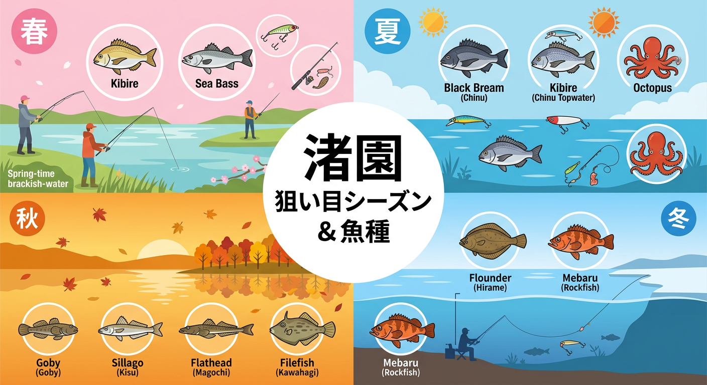

import Map from "@components/Map.astro";
import GMapButton from "@components/GMapButton.astro";
import TackleCard from "@components/TackleCard.astro";

「釣！浜名湖」をご覧いただきありがとうございます！

本記事では、釣り・キャンプ・レジャーが融合した **渚園（なぎさえん）** をご紹介します。

JR 弁天島駅から徒歩圏内という抜群のアクセスと、広大な芝生広場を持つ渚園は、まさに浜名湖レジャーの拠点。特に夏のトップゲームの聖地として知られています。

<Map lat={34.698563} lng={137.607007} name="渚園" />

<GMapButton url="https://maps.app.goo.gl/scWDD9569WhnhNjNA" />

*   **ポイント名** : 渚園（なぎさえん）
*   **所在地** : 静岡県浜松市中央区舞阪町弁天島5005-1
*   **駐車場** : 有料（1回400円）
*   **トイレ** : 公園内に完備

> [!TIP]
> 渚園は「ゆるキャン△」の聖地としても有名で、全国からキャンパーが集まります。宿泊しながら朝夕の「まずめ時」をじっくり狙えるのは、渚園アングラーだけの贅沢です。

## 渚園の特徴と攻略ポイント

渚園の周囲は護岸されており、全方位で釣りが可能です。

### 1. 広大なシャロー（干潟）エリア
渚園の東側から北側にかけては非常に浅い干潟が広がっています。満潮時にベイトを追ってクロダイやキビレが浅場に差してくるため、これらを狙い撃つのが定番です。

### 2. チヌトップゲームの聖地
夏の浜名湖といえば「チヌトップ」。水面を割ってルアーに飛び出すクロダイの迫力は、一度味わうと病みつきになります。

### 🐟️シーズン別攻略ガイド

*   **🌸 春（3月〜6月）**：キビレ、シーバス
    *   **【攻略】** 水温上昇とともに活性が上がります。夜間のウェーディングやボトム狙いが有効です。

<TackleCard id="kibire/ima-chappy-80" />

*   **☀️ 夏（7月〜9月）**：クロダイ、キビレ、マゴチ、ハゼ
    *   **【攻略】** なんといっても「チヌトップ」！早朝の凪を狙ってペンシルベイトをアクションさせましょう。また、足元でのハゼ釣りもファミリーにおすすめ。

<TackleCard id="kibire/bremia-risewalk-65f" />
<TackleCard id="haze/sasame-choi-haze-set-5go" />

*   **🍂 秋（10月〜11月）**：ハゼ、シロギス、マゴチ
    *   **【攻略】** 落ちハゼのシーズン。護岸沿いを丁寧に探れば、良型の数釣りが楽しめます。

<TackleCard id="flatfish/major-craft-maki-jig-jet" />

*   **❄️ 冬（12月〜2月）**：カレイ、メバル
    *   **【攻略】** 寒冷期のメインは投げ釣りのカレイ。北風を背に受けて遠投し、じっくりアタリを待ちましょう。

<TackleCard id="karei/berkley-sw-pulse-worm" />

## キャンプと釣りの準備

渚園での夜釣りやキャンプ泊には、しっかりしたライトが欠かせません。

<TackleCard id="common/gentos-headlight-cb-300d" />

<TackleCard id="travel/rakuten-travel-stay" />

## まとめ：キャンプと釣りが高次元で融合するレジャースポット

渚園は、ファミリーからコアなトップゲーマーまで楽しめる懐の広いポイントです。キャンプ場利用者や観光客への配慮を忘れずに、マナーを守って釣りを楽しみましょう！

> [!IMPORTANT]
> **エイへの注意**
> 夏場のシャローエリアは「アカエイ」も多いため、ウェーディングをする際は十分注意してください。
