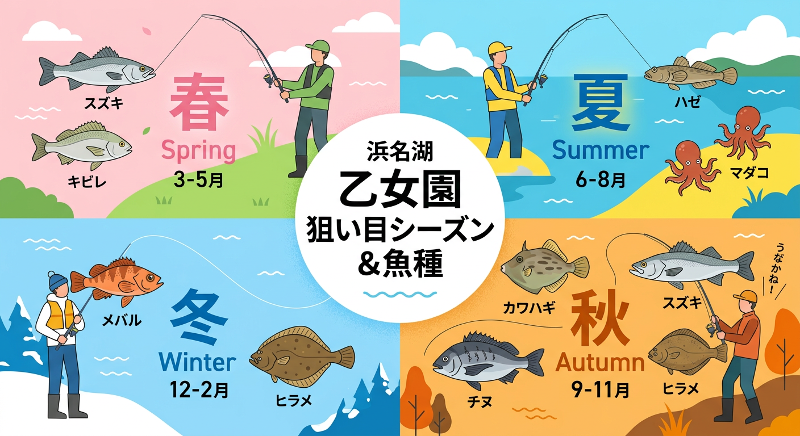

import Map from "@components/Map.astro";
import GMapButton from "@components/GMapButton.astro";

「釣！浜名湖」をご覧いただきありがとうございます！

本記事では、弁天島の北西部に位置する穏やかなポイント **乙女園（おとめえん）** をご紹介します。

巨大な「うなぎ観音」が鎮座するこの場所は、観光地としての顔を持ちながら、知る人ぞ知るクロダイやハゼの好ポイント。周辺の喧騒から少し離れて、落ち着いて竿を出したいアングラーにぴったりのエリアです。

## 乙女園（うなぎ観音）の基本情報

<Map lat={34.69490479372826} lng={137.59440889631668} name="乙女園（うなぎ観音）" />

<GMapButton url="https://maps.app.goo.gl/y9jqeu1KmAwJKgCj6" />

*   **ポイント名** : 乙女園（おとめえん）
*   **所在地** : 静岡県浜松市中央区舞阪町弁天島
*   **駐車場** : 公園駐車場（無料）あり。
*   **トイレ** : 公園内に完備。
*   **近くの釣具店** : 弁天島釣りセンター、あけぼの釣具店

> [!TIP]
> 乙女園は公園として整備されており、ベンチや遊歩道も充実しています。ファミリーでのピクニックを兼ねたフィッシングや、のんびりとした休日を過ごすのに最適な環境です。

## 乙女園の特徴と攻略ポイント

乙女園周辺は、浅い干潟と護岸エリアが組み合わさっています。

### 1. 護岸沿いのチョイ投げ釣り
護岸の足元付近は浅すぎて釣りになりません。ちょっと投げると古い航路があり、少し掘れているので、そこへ投げ込みましょう。夏から秋の高水温時には、クロダイやキビレが泳いでいる姿が見られます。

日中はルアーで、夜は電気ウキを使ってのんびり楽しむことができます。

### 2. カレイの投げ釣り
西側の橋脚付近は航路で深いため、秋からカレイ狙いの人が増えてきます。狭い場所なので早いもの勝ち。

## 乙女園の狙い目シーズンと魚種

### 狙い目のシーズン

*   **クロダイ・キビレ** : 5月〜11月
*   **シーバス** : 4月〜11月（夜間がメイン）
*   **マゴチ** : 6月〜8月
*   **カレイ** : 11月〜1月

### シーズンごとに釣れやすい魚

*   **春：シーバス、キビレ、メバル**
    *   水温が上がるにつれ、夜釣りの電気ウキ釣りでキビレなどの活性が上がります。
*   **夏：ハゼ、チンタ（クロダイ幼魚）、タコ**
    *   ハゼ釣りが最も盛り上がる時期。お子様でも飽きずに釣果を出せる環境です。タコは広範囲を狙う必要があります。
*   **秋：カワハギ、シーバス、クロダイ、カレイ**
    *   サヨリが回遊しているなら、大型シーバスにも期待できます。カレイはここからスタート。キス・カワハギは数こそ期待できませんが、カレイ釣りと両立することも可能です。
*   **冬：メバル、カレイ**
    *   水温が下がると根魚がメイン。夜の静かな護岸で、繊細なライトゲームを楽しめます。

### ✨ポイントの補足

*   **潮の通り**: 弁天島の中では比較的潮が緩む場所ですが、大潮の時はそれなりに流れます。
*   **マナー**: 観音様の周辺や公園利用者への配慮を忘れずに。

## エサで釣れる魚とおすすめタックル

*   **対象魚** : ハゼ、クロダイ、キビレ、サヨリ
*   **おすすめエサ** : 石ゴカイ、アオイソメ、オキアミ
*   **おすすめタックル** : 2.7m〜4.5m ののべ竿（ハゼ用）、またはウキ釣り仕掛けの万能竿。

ハゼを狙うなら、感度の良いのべ竿での「ミャク釣り」が最高にエキサイティングです。魚のプルプルという震えが手元にダイレクトに伝わります。

## ルアーで釣れる魚とおすすめタックル

*   **対象魚** : シーバス、メバル、クロダイ
*   **おすすめルアー** : 小型ミノー、シンキングペンシル、チニング用リグ
*   **おすすめタックル** : 7ft 前後のライトゲームロッド〜シーバスロッド

夜間に照明の明暗を丁寧に探るのが基本です。プレッシャーが低いため、静かにアプローチすれば素直な反応が得られることが多いです。

## 周辺観光・スポット情報

### うなぎ観音
浜名湖名産の「うなぎ」の供養と、湖の安全を願って建立された観音像。その威厳ある姿は必見です。

### 観音山公園
そのまま弁天島の街中を散策すれば、美味しい和菓子屋や地元の食堂を見つけることができます。

## まとめ：観音様に見守られて、心静かに楽しむ海辺の時間

乙女園は、爆釣を追い求めるよりも、景色や雰囲気を楽しみながら「釣りそのもの」を満喫できる貴重な場所です。

水辺に木陰があるので、表浜名湖では唯一といっていい「夏に日陰で釣りができるポイント」でもあります。酷暑の中では推奨しませんが、ど～しても釣りをしたい欲求をかなえつつ、熱中症対策も兼ねるなら、ベストなポイントといえます。

> [!CAUTION]
> 公園施設を汚さないよう、コマセやエサの残りは必ず清掃して帰りましょう。また、ゴミの持ち帰りを徹底し、この静かな環境をいつまでも守り続けましょう。

ルールとマナーをしっかり守り、乙女園での癒やしの釣り体験をしてみてください！
