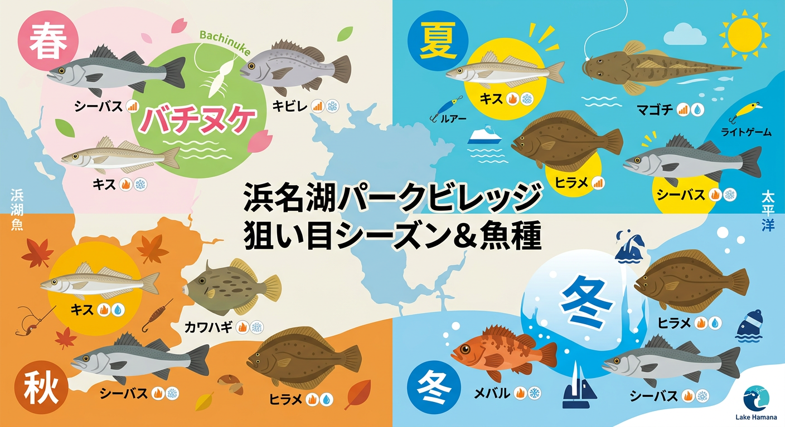

import Map from "@components/Map.astro";
import GMapButton from "@components/GMapButton.astro";

「釣！浜名湖」をご覧いただきありがとうございます！

本記事では、**「浜名湖パークビレッジ付近（新居弁天海水浴場）」** をご紹介します。

ここは、人気スポット「新居弁天海釣公園」のすぐ隣に位置し、キャンプを楽しみながら本格的な釣りができる絶好のロケーションです。目の前に広がる砂浜（ビーチ）は、投げ釣りやルアーフィッシング、そしてウェーディングゲームの好ポイントとなっています。

## 浜名湖パークビレッジ周辺の基本情報

<Map lat={34.685345} lng={137.587234} name="浜名湖パークビレッジ" />

<GMapButton url="https://maps.app.goo.gl/4pnQrRn99x4XBUaU9" />

*   **ポイント名** : 浜名湖パークビレッジ周辺（新居弁天海水浴場）
*   **所在地** : 静岡県湖西市新居町新居3288-201
*   **駐車場** : あり（24時間300円〜）。収容台数も多く安心です。
*   **トイレ** : 施設内およびビーチ周辺に完備。
*   **特記事項** : 7月〜8月は海水浴場となるため、日中の釣りに制限があります。

> [!TIP]
> キャンプで宿泊すれば、移動時間ゼロで「朝マヅメ」のゴールデンタイムを狙えます。焚き火を囲んだ後のナイトゲームや、早朝の爽やかなサーフフィッシングは、パークビレッジならではの醍醐味です。

## パークビレッジ周辺（ビーチ）の特徴と攻略ポイント

ここは表浜名湖の中でも比較的潮流が穏やかで、投げ釣りがしやすいポイントです。

### 1. 広大な砂浜エリア
全体的に砂地が広がっており、根掛かりが少ないのが特徴。シロギスやカレイを狙う投げ釣りに最適です。

### 2. 沖の消波ブロック（テトラ）
沖に設置された消波ブロック付近には、シーバスやメバルが居付いています。ルアーで狙う場合は、これらのストラクチャーを意識してキャストしましょう。

### 3. ウェーディングの推奨
遠浅のエリアが多いため、ルアーフィッシングや本格的な投げ釣りで飛距離を稼ぎたい場合は、ウェーディング（立ち込み）が非常に有効です。

## 浜名湖パークビレッジ周辺の狙い目シーズンと魚種

### 狙い目のシーズン

*   **シーバス** : 3月〜5月、9月〜11月
*   **シロギス** : 5月〜11月
*   **メバル** : 12月〜2月
*   **キビレ・マゴチ** : 5月〜10月

### シーズンごとに釣れやすい魚

*   **春：シーバス、キビレ、キス**
    *   3月頃からバチ抜けに合わせたシーバス、キビレが好調。後半はシロギスも接岸し始めます。
*   **夏：シロギス、マゴチ、ヒラメ、シーバス**
    *   日中は海水浴客で賑わうため、釣りは早朝か夜間に限定されます。朝マヅメのマゴチ狙いがおすすめです。
*   **秋：シロギス、カワハギ、シーバス、カレイ**
    *   投げ釣りのベストシーズン。落ちギスや良型カワハギの数釣りが期待できます。
*   **冬：メバル、カレイ、シーバス**
    *   北風を背にする形になるため、冬場でも比較的釣りがしやすいのがメリット。夜のメバリングが楽しい時期です。

### ✨ポイントの補足

*   **飛距離**: 砂浜から沖のブレイク（深み）まではある程度の距離があるため、投げ釣りなら60m〜100m程度飛ばせると釣果が安定します。
*   **夜間の静寂**: キャンプ場が隣接しているため、夜釣りの際は騒音に配慮し、静かに楽しみましょう。

## エサで釣れる魚とおすすめタックル

*   **対象魚** : シロギス、カレイ、カワハギ
*   **おすすめエサ** : 青ジャムシ、石ゴカイ
*   **おすすめタックル** : 15号～25号の投げ竿（3m〜4m）

秋のカワハギ狙いなら、ハリスの短いカワハギ専用仕掛けを用意すると、エサ取りの名手である彼らを攻略しやすくなります。

## ルアーで釣れる魚とおすすめタックル

*   **対象魚** : シーバス、メバル、マゴチ、ヒラメ
*   **おすすめルアー** : シンキングペンシル、メタルジグ、ワーム
*   **おすすめタックル** : 8.6ft〜9.6ft のシーバス・サーフロッド

サーフ感覚で広範囲を探るならメタルジグやヘビーシンキングペンシルが有利。夜のアジング・メバリングでは軽量ジグヘッドを使い分けましょう。

## 周辺観光・施設情報

### 浜名湖パークビレッジ（公式サイト）
[https://hamanako-p-v.com/](https://hamanako-p-v.com/)
手ぶらBBQプランやレンタサイクルもあり、釣りをしない家族も一日中楽しめます。

### 新居弁天海釣公園
徒歩ですぐ。設備がより整った場所で釣りたい場合は、こちらへ移動するのも手です。

## まとめ：アウトドアと釣りを高次元で欲張るならここ！

浜名湖パークビレッジ周辺は、家族サービスと釣行を両立させたいお父さんアングラーにとって、まさに理想のフィールドです。

> [!WARNING]
> ビーチは釣り人以外の方（散歩や海水浴客）も利用する公共の場所です。特に針やラインの放置は重大な事故に繋がります。ゴミの持ち帰りを徹底し、常にクリーンな釣り場を保ちましょう。

ルールとマナーをしっかり守り、贅沢なキャンプ＆フィッシングライフを楽しんでください！
