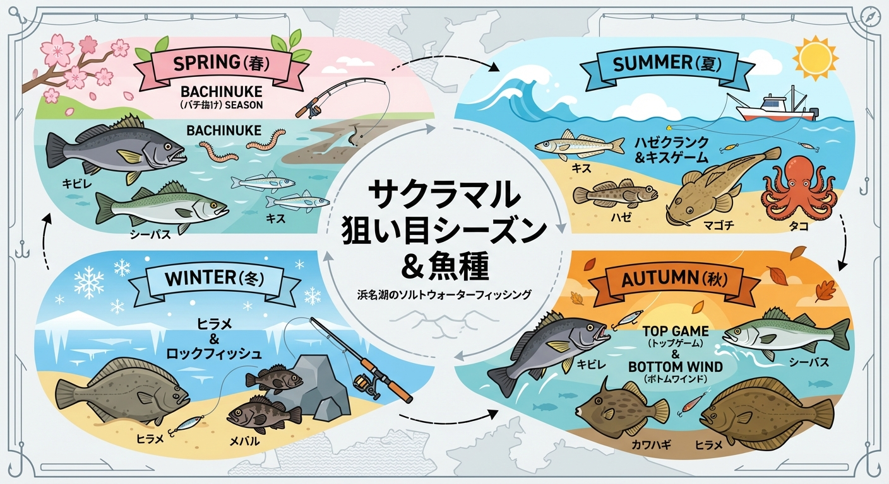

import Map from "@components/Map.astro";
import GMapButton from "@components/GMapButton.astro";
import TackleCard from "@components/TackleCard.astro";

「釣！浜名湖」をご覧いただきありがとうございます！

本記事では、弁天島のシンボルである「赤鳥居」を真正面に望む絶景ポイント、**サクラマル** をご紹介します。

ここは単に景色が良いだけでなく、浜名湖における **キビレ（キチヌ）** 釣りの聖地として、ベテラン勢からも古くから一目置かれているエリアです。

<Map lat={34.69231} lng={137.59374} name="サクラマル" />

<GMapButton url="https://maps.app.goo.gl/ux8QpLBBo4Md1F5i6" />

*   **ポイント名** : サクラマル
*   **所在地** : 静岡県湖西市新居町新居3392付近
*   **アクセス方法** : JR弁天島駅から西へ徒歩約10分。
*   **駐車場** : 近隣の弁天島海浜公園の有料駐車場を利用。路上駐車は厳禁。

> [!TIP]
> サクラマルはJR弁天島駅から徒歩圏内。公共交通機関での釣行にも非常に向いています。会社帰りや、電車旅のついでに少し竿を出すのにも最高のロケーションです。

## サクラマルの特徴とエリア別攻略

東西に走る強い潮流と、中央部に広がる広大なシャローエリアが特徴です。

### 1. 赤鳥居正面エリア（キビレ・マゴチ）
橋脚付近は非常に潮通しが良く、特に下げ潮のタイミングで回遊魚や活性の上がったキビレが集中します。

### 2. 西側：橋脚深場エリア（シーバス・カレイ）
一気に水深が深くなり、強い潮流が発生。夜間はシーバス、冬場は貴重なカレイポイントとなります。

### 🐟️シーズン別攻略ガイド

*   **🌸 春（3月〜6月）**：大型キビレ、シーバス
    *   **【攻略】** バチ抜けが始まり、大型のシーバスやキビレが接岸します。ナイトゲームでの攻略がメインになります。

<TackleCard id="kibire/ima-chappy-80" />

*   **☀️ 夏（7月〜9月）**：マゴチ、タコ、シロギス
    *   **【攻略】** 広いシャローエリアをランガンしてマゴチを狙いましょう。潮止まり付近はタコ狙いも面白い。

<TackleCard id="flatfish/jackson-teppan-blade-20g" />

*   **🍂 秋（10月〜11月）**：キビレ、シーバス、カワハギ
    *   **【攻略】** 魚種豊富で最も勢いのあるシーズン。夜間の電気ウキ釣りでキビレを狙うのもおすすめです。

<TackleCard id="common/shimano-lure-tackle-set" />

*   **❄️ 冬（12月〜2月）**：カレイ、メバル
    *   **【攻略】** 寒冷期のメインは投げ釣りのカレイ。西側の深場を丁寧に探りましょう。

<TackleCard id="karei/berkley-sw-pulse-worm" />

## 夜釣りの装備

サクラマル周辺は街灯がありますが、手元を照らすライトは安全のために必須です。

<TackleCard id="common/gentos-headlight-cb-300d" />

<TackleCard id="travel/rakuten-travel-stay" />

## まとめ：赤鳥居に見守られた、歴史あるキビレ釣りの一等地

サクラマルは、浜名湖らしい景観と豊かな釣果を約束してくれる場所です。アングラー同士の距離を保ち、ゴミの持ち帰りを徹底して、この美しい景観を守っていきましょう。

> [!IMPORTANT]
> **激流への注意**
> 大潮時などは川のように流れます。投げ釣りでは重めのオモリやスパイクオモリを用意しておくと安心です。
