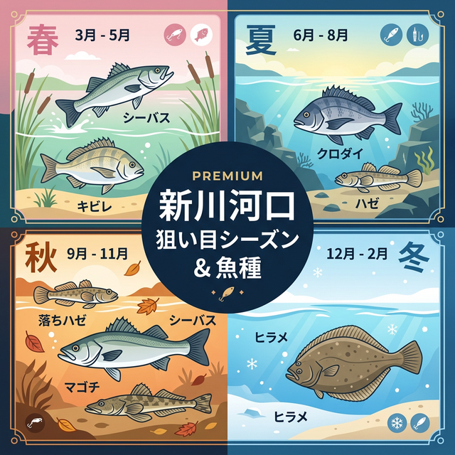

import Map from "@components/Map.astro";
import GMapButton from "@components/GMapButton.astro";
import TackleCard from "@components/TackleCard.astro";

「釣！浜名湖」をご覧いただきありがとうございます！

本記事では、佐鳴湖から浜名湖に注ぐ河川 **「新川の河口部」** 周辺の釣りポイントをご紹介します。

汽水域特有の環境が整っており、特にシーバスアングラーやハゼ釣りファンにとっては見逃せない「穴場」的なスポットです。

<Map lat={34.700498} lng={137.616386} name="新川河口" />

<GMapButton url="https://maps.app.goo.gl/fu2UDArL69c29csr8" />

*   **ポイント名** : 新川河口
*   **所在地** : 静岡県浜松市中央区雄踏町宇布見付近
*   **駐車場** : 雄踏総合公園の有料P（1回310円）または中之島P
*   **近くの釣具店** : フィッシング沖、あけぼの釣具店

> [!TIP]
> 新川は大雨後に濁りが入りやすく、シーバスやクロダイの警戒心が解ける絶好のチャンスとなります。

## 新川河口の特徴と攻略ポイント

河口部は浅く広く、浜名湖の潮汐との合流点になることから、ベイトが集まりやすい特徴があります。

### 1. 「落ちハゼ」の溜まり場
秋が深まると、浅場から水深のある深場へとハゼが移動してきます。この「落ちハゼ」はサイズも良く。11月頃からは投げ釣りで良型が狙えます。

### 2. 穴場のカレイポイント
セブンイレブン南側の護岸は、ある程度（100m程度）投げる必要はありますが、カレイ狙いの穴場として知られています。

### 🐟️シーズン別攻略ガイド

*   **🌸 春（3月〜6月）**：シーバス、キビレ
    *   **【攻略】** 3月下旬からのバチ抜けに合わせ、シーバスが河口付近に集まります。

<TackleCard id="seabass/shimano-exsence-silent-assassin-99f" />

*   **☀️ 夏（7月〜9月）**：クロダイ、キビレ、ハゼ
    *   **【攻略】** 朝夕のマヅメ時はトップゲームでクロダイやキビレを狙いましょう。日中は足元でハゼを狙うのも楽しいです。

<TackleCard id="kibire/ima-chappy-80" />

*   **🍂 秋（10月〜11月）**：落ちハゼ、マゴチ、シーバス
    *   **【攻略】** 新川河口が最も賑わう季節。15cmを超えるような良型ハゼが狙える大チャンスです。

<TackleCard id="haze/sasame-choi-haze-set-5go" />

*   **❄️ 冬（12月〜2月）**：カレイ、ヒラメ
    *   **【攻略】** 投げ釣りでじっくりカレイを狙います。航路付近の深みを丁寧に探りましょう。

<TackleCard id="karei/berkley-sw-pulse-worm" />

## 周辺観光・スポット情報

### 雄踏総合公園
スポーツ施設やプール（夏季）が充実しており、家族で一日過ごすのにも適した公園です。

<TackleCard id="travel/rakuten-travel-stay" />

## まとめ：小規模ながらポテンシャルを秘めた汽水の要所

新川河口は、大きなポイントが混雑している時の避難先としても、テクニカルに攻めたい時のメインポイントとしても頼りになる場所です。

> [!IMPORTANT]
> **近隣への配慮**
> 
> 民家が近いエリアもありますので、夜間の騒音や路上駐車には十分注意し、マナーを守って釣りを楽しみましょう。
