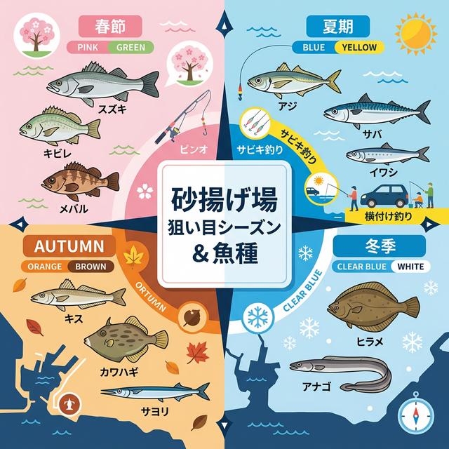

import Map from "@components/Map.astro";
import GMapButton from "@components/GMapButton.astro";
import TackleCard from "@components/TackleCard.astro";

「釣！浜名湖」をご覧いただきありがとうございます！

本記事では、浜名湖全域でも極めて珍しい「車を横付けして釣りができる」神ポイント、**砂揚げ場（新居漁港）** をご紹介します。

重い荷物を運ぶ必要がなく、快適な環境で釣りが楽しめる、特にお子様連れのファミリーに最適なフィールドです。

<Map lat={34.693127} lng={137.581769} name="砂揚げ場（新居漁港）" />

<GMapButton url="https://maps.app.goo.gl/4oKdUShKUA8rpl" />

*   **ポイント名** : 砂揚げ場（すなあげば）
*   **所在地** : 静岡県湖西市新居町
*   **駐車場** : 岸壁への横付けが可能（※漁業・港湾作業を優先）
*   **近くの釣具店** : 大橋屋つり具センター（北側に隣接）

> [!IMPORTANT]
> **港湾関係者の活動を最優先に！**
> 
> 砂揚げ場は現役の漁港・商港です。作業の邪魔にならないよう、最大限の配慮をお願いします。

## 砂揚げ場の特徴と魅力

砂揚げ場の最大の特徴は、なんといっても **「車横付けスタイル」** です。

### 1. ファミリーに優しい圧倒的な利便性
車を釣座のすぐ後ろに停められるため、大量の荷物を運ぶ手間がありません。真夏や真冬、突然の雨でも車内へすぐに避難できる安心感があります。

### 2. 穏やかで深い港内
港の奥まっているため潮流が比較的穏やかです。手前が深く掘られているため、遠投しなくても足元でアジやサバを狙うことができます。

### 🐟️シーズン別攻略ガイド

*   **🌸 春（3月〜6月）**：アジ、サバ、イワシ、サッパ
    *   **【攻略】** 群れが入れば、足元で簡単に鈴なりの釣果が楽しめます。サビキ仕掛けを準備しておきましょう。

<TackleCard id="aji-saba-sappa/hayabusa-sabiki-set" />

*   **☀️ 夏（7月〜10月）**：シロギス、ハゼ、タコ
    *   **【攻略】** 砂地の海底にはシロギスやハゼが豊富。タコエギを使って岸壁沿いを探るのも面白い。

<TackleCard id="kisu/hayabusa-light-shot-set" />

*   **🍂 秋（10月〜12月）**：カワハギ、シーバス、キビレ、サヨリ
    *   **【攻略】** 最も魚種が豊かな季節。朝夕のマヅメ時には大型シーバスの回遊も期待できます。

<TackleCard id="common/shimano-lure-tackle-set" />

*   **❄️ 冬（12月〜2月）**：カレイ、メバル、アナゴ
    *   **【攻略】** 車内から暖かくアタリを待てるカレイ釣りが本番。投げ竿を2〜3本出して待ちましょう。

<TackleCard id="karei/berkley-sw-pulse-worm" />

## あると便利なアイテム

車横付けとはいえ、足場はコンクリートなので、ライフジャケットの着用は必須です。

  <TackleCard id="common/sanka-cooler-6bl" noMargin={true} />
  <TackleCard id="common/gentos-headlight-cb-300d" noMargin={true} />

## 周辺観光・グルメ情報

### 浜松餃子 五味八珍
釣り帰りの空いたお腹に、静岡県民のソウルフード「浜松餃子」はいかがでしょうか。

  <TackleCard id="common/hamamatsu-gyoza-gomihatchin" noMargin={true} />
  <TackleCard id="travel/rakuten-travel-stay" noMargin={true} />

## まとめ：マナーを守って「車横付け」フィッシングを満喫しよう

砂揚げ場は、浜名湖での「手軽な釣り」を体現するファミリーの聖地です。ゴミの持ち帰りや騒音への配慮を忘れずに、みんなで大切に使っていきましょう！

> [!CAUTION]
> **安全への配慮**
> 
> 安全柵がないため、お子様からは目を離さないよう、ライフジャケットの着用を徹底してください。
