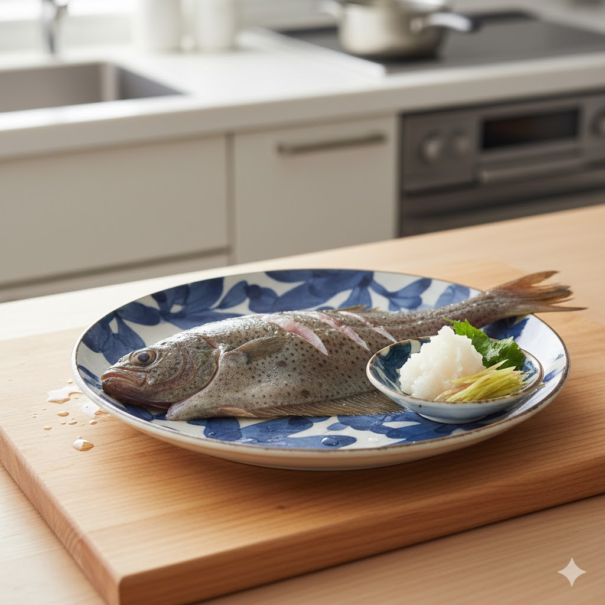

import BlogCard from "@components/BlogCard.astro";

夏の厳しい暑さが和らぎ始める 9月、浜名湖では待望の ** カレイ釣り ** シーズンが幕を開けます。産卵のために接岸してくるカレイは、冬に向けて身がふっくらと肥え、食味も抜群の時期を迎えます。

のんびりと竿を並べてアタリを待つ投げ釣りは、涼しくなった秋の行楽にぴったりです。本記事では、開幕初期のポイント選びから、美味しい調理法までを網羅して解説します。

## 9月の浜名湖カレイ狙い！おすすめポイント5選

9月はまだ水温が高めに残っているため、 ** 適度な水深 ** と ** 新鮮な海水が回る航路付近 ** を狙うのが鉄則です。

### 1. 網干場（舞阪港）
今切口に隣接し、カレイの回遊ルートとして名高い一級ポイントです。
*   **特徴**：潮流が速いですが、それだけ新鮮な魚が入ってきます。
*   **狙い目**：上げ潮に乗って入ってくるカレイを、投げ釣りで待ち構えます。

<BlogCard slug="points/omote/amihosiba" />

### 2. 浜名湖パークビレッジ付近（新居側）
新居弁天の西側、広大なシャローエリアと航路が絡むポイントです。
*   **特徴**：サーフ（砂浜）のような感覚で遠投を楽しめます。
*   **狙い目**：30〜50m先のカケアガリ付近。同時に大型のキスも期待できます。

<BlogCard slug="points/omote/parkvillege" />

### 3. 弁天島海浜公園
アクセス抜群で、家族連れにもおすすめのポイントです。
*   **特徴**：手前は浅いですが、中央の航路付近は深くカレイが溜まりやすい場所です。
*   **狙い目**：潮止まり前後の緩やかなタイミング。

<BlogCard slug="points/omote/bentenjimakaihinkouen" />

### 4. 村櫛海水浴場
広い砂地が続き、のんびりと竿を出せるポイントです。
*   **特徴**：岸から少し離れた航路付近を狙うのがコツ。水温が下がるにつれて接岸数が増えます。

<BlogCard slug="points/naka/murakushi-kaisuiyoku" />

### 5. 瀬戸水道
奥浜名湖と表浜名湖を繋ぐ重要ルートです。
*   **特徴**：水深があり、常に潮が動いています。流下するエサを求めてカレイが定位しやすいポイントです。

<BlogCard slug="points/oku/setosuidou" />

## 数釣りを伸ばす！カレイ釣りの仕掛けとエサ

カレイは「視覚」よりも「匂い」でエサを探すと言われています。

*   **仕掛け**：市販のカレイ専用 2〜3本針仕掛けで OK。派手なビーズや飾り（装飾）が付いたものは、濁りがある時に有効です。
*   **エサ**：イシゴカイやアオイソメを ** 房掛け ** （数匹まとめて針に刺す）にするのが基本。大きく見せて匂いを拡散させるのがポイントです。

## 釣った後のご褒美！絶品カレイ料理

カレイは「煮てよし、揚げてよし、刺身でよし」の万能食材です。

1.  **カレイの煮付け**：甘辛い醤油ベースで煮込めば、ホクホクの身と縁側のコラーゲンが絶品です。
2.  **カレイの唐揚げ**：小ぶりなものは丸ごと揚げて。パリパリの食感は子供にも大人気。
3.  **刺身（薄造り）**：鮮度が良いのは釣り人の特権。透き通った身にポン酢＋もみじおろしが最高です。

## 浜名湖周辺でカレイ料理を楽しめる地元の人気店3選

自分で釣れなかった……あるいはプロの味も知りたい！という方へ。
浜名湖周辺でカレイ料理を楽しめる、口コミ評価が高い地元の人気飲食店を3つご紹介します。

### 1.魚料理専門店 **魚魚一（とといち）**
浜松の新鮮な魚介を扱う割烹料理店として、接待などでも人気のお店です。
*   **カレイ料理**：カレイの煮付け
*   **特徴**：浜名湖特産のカレイを使った濃厚な煮付けを、コース料理の一品として提供。
*   **注目ポイント**：幻の鬼蟹（どうまん蟹）や、珍しい「うなぎの刺身」が食べられることでも有名です。

### 2.弁天島 **山本亭**
浜名湖畔に佇む老舗で、すっぽんやうなぎ、活魚料理を堪能できます。
*   **カレイ料理**：カレイ唐揚げ
*   **特徴**：一品料理として「カレイ唐揚げ（880円〜）」を提供。
*   **注目ポイント**：定食や御膳などのメニューも豊富に揃っており、家族連れでも利用しやすい名店です。

### 3.日本料理 **日の出**
職人技の光る料理が高評価を得ている、素材重視の日本料理店です。
*   **カレイ料理**：かれい活造り
*   **特徴**：店内のいけすから揚げたばかりの魚を調理。鮮度抜群の「かれい」のお造りを楽しめます。
*   **注目ポイント**：四季折々の会席料理や浜名湖産のすっぽん料理など、本格的な日本料理が魅力です。

## まとめ：秋の浜名湖で座って待つ贅沢を

カレイ釣りは、竿を置いてアタリを待つ時間も楽しみの一つです。涼しい秋風に吹かれながら、浜名湖の景色を眺めて過ごす時間は、まさに至福。

9月に接岸し始めるカレイは、これから11月末のハイシーズンに向けてどんどん脂が乗っていきます。ぜひ今回のポイントを参考に、秋のカレイ釣りにチャレンジしてみてください！
