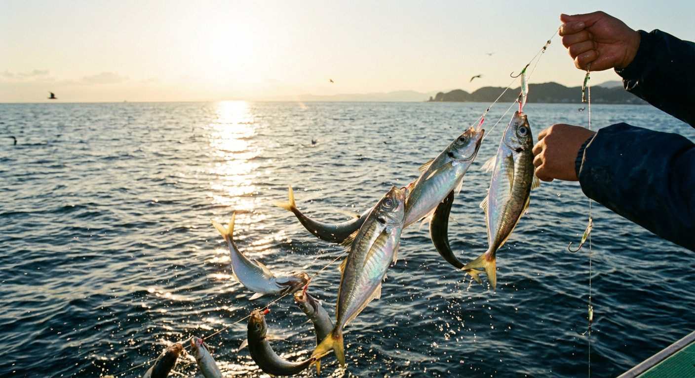

import BlogCard from "@components/BlogCard.astro";

浜名湖の秋は、春から成長したアジが15〜20cmの食べ頃サイズになり、サビキ釣りの最盛期を迎えます。

水温が安定するこの時期は群れの動きも活発で、朝夕のマヅメ時には入れ食い状態になることも珍しくありません。この記事では、浜名湖でアジを効率よく釣るための具体的なポイント選びと、数釣りを伸ばすテクニックを詳しく解説します。

## 浜名湖のアジ釣りおすすめポイント3選

アジ釣りの成否は8割が「場所選び」で決まります。特に実績が高く、初心者でもアクセスしやすいポイントを厳選しました。

### 1. 新居弁天海釣公園
静岡県西部で最も実績のある超メジャーポイントです。

*   **特徴**：T字堤防は潮通しが抜群。多くの釣り人がコマセを撒くため、常にアジの群れが留まっているのが最大のメリットです。
*   **攻略**：足元でのサビキはもちろん、少し沖を狙う「投げサビキ」をすると、一回り大きなサイズが釣れることが多いです。

<BlogCard slug="points/omote/araibenten-umiduripark" />

### 2. 砂揚げ場（すなあげば）
車を横付けできるため、ファミリーフィッシングに最適な環境です。

*   **特徴**：重いクーラーボックスを運ぶ必要がなく、上げ潮に乗って港内まで群れが入ってくると爆釣のチャンス。
*   **攻略**：夕方から夜にかけて常夜灯付近を狙えば、「アジング（ルアー釣り）」での数釣りも期待できます。

<BlogCard slug="points/omote/sunaageba" />

### 3. 網干場（あみほしば）
今切口に近く、常に新鮮な海水と魚が回ってくるポイントです。

*   **特徴**：潮流が速いことが多いため、仕掛けを流す範囲とコマセを入れる位置を意識することが大切です。
*   **ターゲット**：アジだけでなく、サバやカマスも混じるため、五目釣りとしても楽しめます。

<BlogCard slug="points/omote/amihosiba" />

## サビキ釣りで釣果を伸ばす3つのコツ

1.  **「群れを足止めする」コマセワーク**：
    サビキ釣りは、コマセ（アミエビ）を絶やさないことが重要です。魚が回ってきたら、手返しよく仕掛けを投入し、群れをその場に留めましょう。
2.  **タナ（水深）の調整**：
    アジは基本的に「底付近」に居ることが多いですが、活性が高い時は中層まで浮いてくることもあります。仕掛けを落とす位置を微調整して、その日のアタリがある深さを探りましょう。
3.  **針のサイズ選び**：
    アジの口の大きさに合わせることが大事です。秋の15cm前後なら4〜6号程度の針がベストです。

## ステップアップ：夜のアジングに挑戦

サビキ釣りでアジの居場所がわかったら、ルアーで狙う ** アジング ** にも挑戦してみましょう。ワームやジグヘッドを使った繊細な釣りは、サビキとはまた違ったゲーム性があり、近年非常に人気が高まっています。

<BlogCard slug="guide/beginner/hamanako-sabiki-best-season" />

## まとめ：釣った後の楽しみもアジの魅力

浜名湖で釣ったばかりの新鮮なアジは、脂が乗っていて刺身でも塩焼きでも絶品です。特に15〜20cmサイズは骨も柔らかく、小アジよりも食べ応えがあり、料理のバリエーションも広がります。

週末の人気ポイントは早朝から場所取りが始まることもありますので、余裕を持って出発しましょう。しっかりとマナーを守って、秋の浜名湖アジ釣りを存分に楽しんでください！
