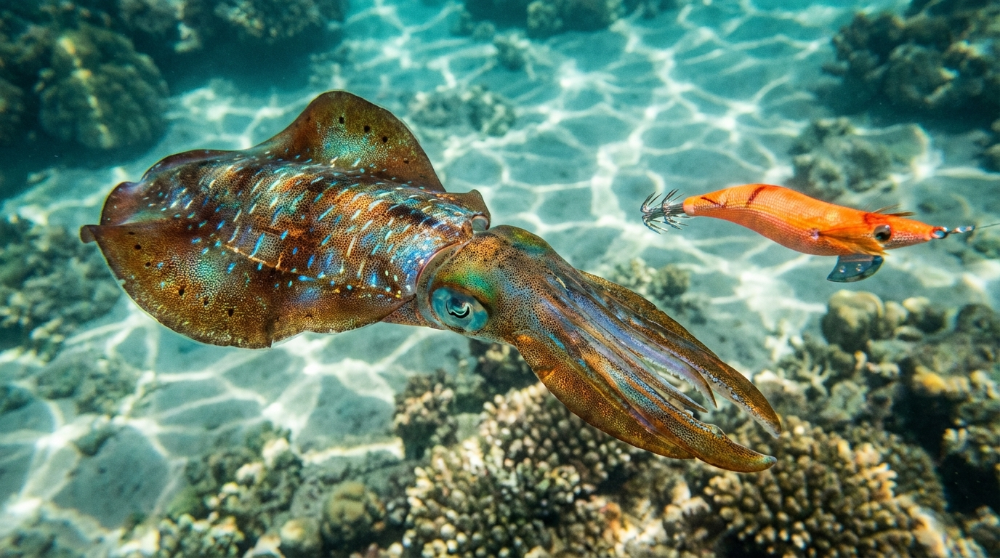

import BlogCard from "@components/BlogCard.astro";

浜名湖のエギングフィールドは、足場が良く、トイレや駐車場などの設備が充実しているため、初心者にとって最高の練習環境です。

特に秋はアオリイカの群れが安定して接岸するため、初めての **「イカ釣り」** に最適。
本記事では、初心者が確実に「釣れた！」という成功体験を積むための、秋シーズン攻略法を詳しく解説します。

## ターゲット別：活動レンジ（層）の違いを理解する

浜名湖ではアオリイカ以外にも、コウイカやタコがエギにかかります。これらを意図的に釣り分ける鍵は **「レンジ（活動層）」** の意識です。

*   **アオリイカ（中層〜底付近）**：
    海底から1〜2mほど浮いた層を意識して誘います。エギを底に放置しすぎないのがコツです。
*   **コウイカ・タコ（完全な底）**：
    海底にエギを接触させ続けることで釣れます。

もしコウイカやタコばかり釣れる場合は、エギが沈みすぎている（層が低い）サインです。シャクリの回数を増やしたり、フォール時間を短く調整してみましょう。

## 初心者が狙いやすい時期：断然「秋」がおすすめ

エギングには春と秋の2つのシーズンがありますが、難易度が大きく異なります。

*   **春（4月〜6月）**：
    400g〜600gの良型、時には1kg超えも出ますが、個体数が少なくマニア向け。
*   **秋（9月〜11月）**：
    200g〜400gの「新子（しんこ）」と呼ばれる若いイカが数多く接岸します。非常に食欲旺盛でエギへの反応が良いため、初心者が基本動作を身につけるのに最高の時期です。

## 浜名湖のアオリイカ実績ポイント

今切口周辺は潮流が速いため、潮の緩むタイミングや、流れを遮る障害物周りを狙うのが定石です。

### 1. 新居弁天海釣公園
今切口に最も近く、潮通しが抜群です。足元に基礎ブロックなどの岩礁帯が点在しており、アオリイカが身を隠しやすい超メジャーポイント。

*   **狙い目**：早朝（5時〜7時）や夕方（16時〜18時）のマヅメ時。
*   **メリット**：足場が良く、ベランダ状の柵もあるため安全にキャストできます。

<BlogCard slug="points/omote/araibenten-umiduripark" />

### 2. 舞阪堤
今切口の舞阪側に位置し、フレッシュな回遊個体が最初に入る場所です。風が弱く、潮が緩んでいるタイミングはサイトフィッシング（目視での釣り）も可能です。

<BlogCard slug="points/omote/imagiremaisakatei" />

### 3. 網干場
漁港内の低めの足場で、手返し良く探れるのが魅力。複雑な石積みが沈んでおり、障害物を丁寧に攻めることで高確率でイカと出会えます。

<BlogCard slug="points/omote/amihosiba" />

## 初心者向け：エギングの基本サイクル

エギングは **「キャスト → 沈める → シャクる → フォール」** の繰り返しです。

1.  **キャスト**：堤防の際やテトラの縁など、変化のある場所を狙って投げます。
2.  **沈める（カウント）**：着水後、頭の中で秒数を数えてエギを狙った層まで落とします（1秒で約1m沈むのが目安）。
3.  **シャクる**：竿をシュッと上に振り上げ、エギを海中で跳ね上げさせてイカにアピールします。
4.  **フォール**：再び沈めます。 **この「沈んでいる最中」にイカがエギを抱く** ため、フォール中は全神経を竿先に集中させましょう。

> [!TIP]
> **ラインの「違和感」を見逃さない！**
> イカがエギを抱くと、張っていたラインが不自然に緩んだり、逆にピンと走ったりします。竿に重みを感じる前にライン（道糸）に変化が出ることが多いので、ラインの動きを注視することが釣果アップの近道です。

## まとめ：秋の浜名湖で「イカのパンチ」を体感しよう

浜名湖のエギングは、秋の新居弁天から始めるのが成功への近道。まずは3号のエギをメインに、中層を意識したレンジコントロールを覚えましょう。

秋の数釣りでコツを掴めば、春に出会えるキロ超えのモンスターへの第一歩となります。

<BlogCard slug="target/aji-saba-sappa/sabiki-guide" />
