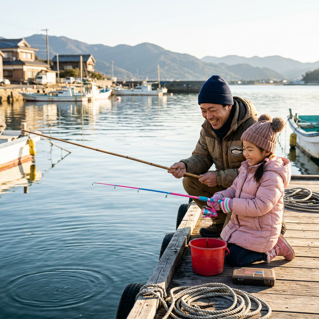

import BlogCard from "@components/BlogCard.astro";

冬の浜名湖で、家族や初心者と一緒に楽しむなら **「カレイ釣り」** が一番の近道です。

特別な技術は必要ありません。

仕掛けを投げて、のんびりとアタリを待つスタイルは、冬の澄んだ空気の中で楽しむレジャーとして最高です。

## 🐟 浜名湖のカレイ入門：まずはこの3種を知ろう

浜名湖では主に3種類のカレイが狙えます。

*   **マコガレイ**：
    秋から冬にかけての主役。煮付けにすると絶品です。
*   **イシガレイ**：
    年明けから大型が混じる種類。背中の「石」のような固い部分が特徴です。
*   **ホシガレイ**：
    滅多に釣れない高級魚。ヒレの斑点が目印です。

## 🎣 初心者が揃えるべき最低限の道具

カレイ釣りは、手持ちの道具でも十分に楽しめます。

1. **竿（ロッド）**：
   2〜3mのコンパクトロッドや、サビキ用の竿でOKです。
2. **リール**：
   2000〜3000番程度の一般的なスピニングリール。
3. **仕掛け**：
   釣具店で売っている「カレイ専用・投げ釣り仕掛け（2本針）」を選んでください。
4. **オモリ**：
   浜名湖は流れが速いため、15〜25号程度の少し重めを用意しましょう。

## 🍱 カレイが釣れる！魔法のテクニック

初心者が釣果を伸ばすための **「鉄則」** はエサの付け方にあります。

> [!TIP]
> **エサの「房掛け」をマスターしよう！**
> 針1本に対して、青イソメを3〜5匹まとめて刺します。
> 見た目の派手さと匂いで、遠くにいるカレイを呼び寄せるのが浜名湖流です。

1. **投げてから10分は待つ**：
   カレイはエサを見つけるのに時間がかかります。焦らずじっくり待ちましょう。
2. **アタリがあっても動かさない**：
   竿先がピクピクしても、すぐに竿を立ててはいけません。
   カレイがエサを飲み込むまで、あと10秒待ってから「ゆっくり」と巻き始めましょう。

## 📍 迷ったらここ！足場の良いおすすめポイント

*   **新居弁天海釣公園**：
    柵があり、駐車場・トイレも完備。お子様連れでも安心です。
*   **弁天島海浜公園**：
    足場が平らで、冬の北風を建物が遮ってくれるため快適に釣りができます。

<BlogCard slug="target/karei/points" />

## まとめ：冬の女王「カレイ」を手軽に狙おう！

カレイ釣りは、難しいことは抜きにして「のんびり待つ」のが最大のコツです。

暖かい飲み物を持って、冬の浜名湖へ家族で出かけてみてください。

<BlogCard slug="target/karei/cooking" />
