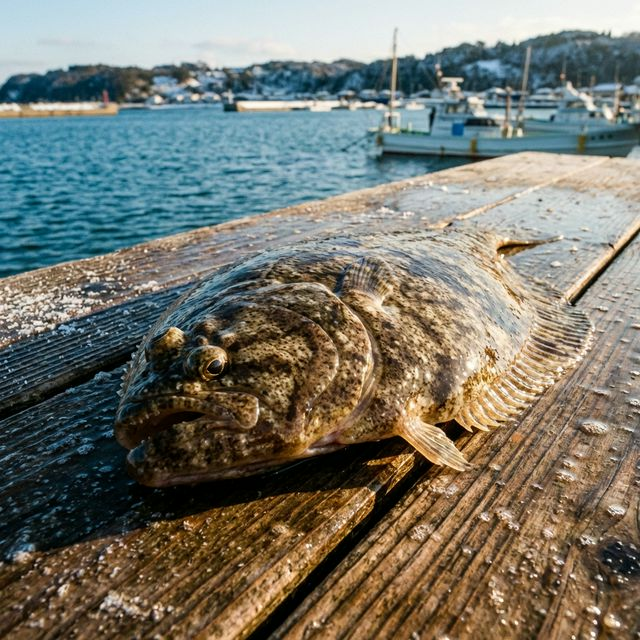

import BlogCard from "@components/BlogCard.astro";

浜名湖でのカレイ釣りは、初心者でも手軽に始められる冬の人気レジャーです。
夏の高水温が落ち着き、産卵のために深場から浅場へと接岸してくるカレイを、陸からの投げ釣りで狙える季節がやってきました。

本記事では、アクセス、設備、釣果実績を網羅した **「カレイ釣り厳選ポイント 5 選」** と、確実に仕留めるためのコツを解説します。

## 🗓️ 浜名湖のカレイ釣り：シーズンとターゲットの種類

浜名湖のカレイ釣りは、 **10月から翌3月頃まで** がシーズンです。
特に **11月上旬から中旬** にかけてが接岸のピークとなり、最も釣果が期待できるチャンスタイムとなります。

主なターゲットは以下の2種類です。
*   **マコガレイ**：秋（10月頃）から釣れ始める、食味抜群の本命。
*   **イシガレイ**：年明けの1月頃からメインとなる大型が期待できる種類。

## 📍 浜名湖のカレイ釣りおすすめポイント 5選

カレイは砂泥底を好みます。基本的には船の通り道となる **一段深くなっている場所（航路やミオ筋・カケアガリ）** を狙うのが鉄則です。

### 1. 網干場（舞阪港付近）
カレイの回遊ルートに位置する絶好のポイントです。
*   **特徴**：砂地が広く、投げ釣りの実績が非常に高いエリア。
*   **コツ**：潮の満ち引きで流れが非常に速くなるため、 **潮止まり前後** の緩いタイミングを狙うのが釣果を伸ばす鍵です。

<BlogCard slug="points/omote/amihosiba" />

### 2. 新居弁天海釣公園
足場が良く駐車場やトイレも完備されているため、初心者や家族連れに最適です。
*   **注意**：潮の流れが極めて速いため、 **25〜30号** の重めのオモリが必須となります。

<BlogCard slug="points/omote/araibenten-umiduripark" />

### 3. 弁天島海浜公園
赤い鳥居の正面に位置する観光地としても人気のポイントです。
*   **狙い目**：少し投げれば届く「航路」の深みを丁寧に探ります。
*   **メリット**：真冬の強い北西風でも背後の建物が風を遮るため、快適に釣りが楽しめます。

<BlogCard slug="points/omote/bentenjimakaihinkouen" />

### 4. 瀬戸水道
奥浜名湖エリアの砂泥底が広がる一級ポイントです。
*   **特徴**：北側が深く広いため、遠投して探るのが有効。
*   **難易度**：潮の流れが速く根掛かりのリスクもありますが、その分 **良型の実績** が非常に高い場所です。

<BlogCard slug="points/oku/setosuidou" />

### 5. 松見ヶ浦
猪鼻湖（奥浜名湖）にある、冬場のカレイの「越冬場所」となる貴重なエリアです。
*   **特徴**：部分的に10m前後の水深がある場所。
*   **スタイル**：西岸の護岸やサーフエリアからの遠投がおすすめです。

<BlogCard slug="points/naka/matsumigaura" />

## カレイを確実に仕留めるタックルと仕掛け

カレイ釣りは **「投げ釣り」** が基本となります。

*   **タックル**：2〜4.5m程度の投げ竿に、3000〜4000番のスピニングリールを合わせます。潮が速い場所では **20〜30号** のオモリ負荷に対応した硬めの竿が必要です。
*   **仕掛け**：市販のカレイ専用投げ釣り仕掛け（2〜3本針）で十分です。カレイは派手なものに興味を示すため、毛鉤やラバーなどの装飾が付いたものが非常に有効です。
*   **エサ**： **青イソメ（青ジャムシ）** や赤イソメが定番。

> [!TIP]
> **エサの「房掛け」が釣果を分ける！**
> カレイに視覚と匂いで強力にアピールするため、針1本に対して青イソメを3〜5匹まとめて掛ける **「房掛け」** にしてボリュームを出すのが、浜名湖でカレイを釣る最大のコツです。

## 失敗しないための釣り方のコツ：待機と誘い

カレイ釣りは **「腰で釣れ」** と言われるほど、じっくり待つことが重要です。

### 1. アタリがあっても即合わせ厳禁
カレイはエサを一気に飲み込まず、ゆっくりと口に入れます。
*   **待ち時間**：竿先に「コツン」とアタリが出てもすぐには反応しません。 **5〜10秒ほど待って** 、竿先がグーッと重く引き込まれるまでしっかり食い込ませ、そこから大きく合わせて確実に針掛かりさせます。

### 2. 積極的な「誘い」でアピール
投げてから1分ほど反応がなければ、リールを少し巻いて仕掛けを底で引きずります。
*   **イメージ**：海底の砂煙を上げるように動かし、エサに生命感を与えてカレイの興味を引きつけましょう。

## まとめ：冬の浜名湖で「冬の女王」に出会おう

10月から本格化する浜名湖のカレイ釣りは、難しい技術よりも「ポイント選び」と「エサのボリューム」が釣果を大きく左右します。寒い時期の釣りになりますので、防寒対策を万全にして、煮付けが絶品な旬のカレイを狙いに出かけてみてください！

<BlogCard slug="guide/hamanako-karei-fishing-season-opener" />
