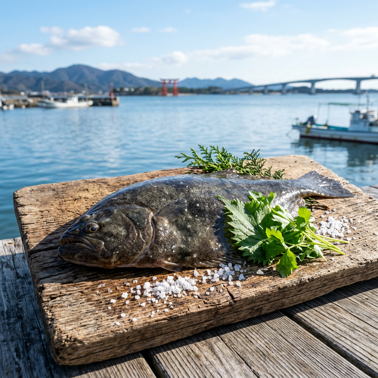

import BlogCard from "@components/BlogCard.astro";

浜名湖は全国的にも珍しい、 **良型カレイの宝庫** です。

特に冬場は「座布団サイズ」と呼ばれる40cmオーバーも夢ではなく、多くの投げ釣り師が竿を並べます。

本ページは、浜名湖のカレイ攻略を全方位からサポートするターミナルページです。

## 🐟 浜名湖のカレイ攻略：4つの切り口

あなたのスキルや目的に合わせて、最適な情報をチェックしてください。

### 1. 【入門】初めてのカレイ釣り（Beginner）
お子様連れや初心者でも安心。簡単な仕掛けと、確実に釣るための基本動作を解説。
<BlogCard slug="target/karei/beginner" />

### 2. 【ルアー】浜名湖発カレイング（Kareing）入門
エサ釣りが一般的なカレイですが、近年はワーム等のルアーで狙う「カレイング」が注目を集めています。
<BlogCard slug="target/karei/kareing" />

### 3. 【攻略】深場攻略とテクニック（Tactics）
激流の浜名湖で大型を狙い撃つ。潮流への対応、エサの房掛け、時合の読み方など。
<BlogCard slug="target/karei/tactics" />

### 4. 【ポイント】実績の高い釣り場（Points）
網干場、海釣公園、弁天島など。カレイが溜まる「ミオ筋」のある場所を厳選。
<BlogCard slug="target/karei/points" />

### 5. 【食・旬】楽しみ方とレシピ（Cooking）
いつが一番美味しい？釣った直後の処理から、煮付け・刺身などの至高のレシピまで。
<BlogCard slug="target/karei/cooking" />

## 📅 シーズン別攻略のポイント

*   **晩秋（11月〜12月）**：
    「乗っ込み」と呼ばれる接岸のピーク。数・型ともに最も期待できるチャンス。
*   **真冬（1月〜2月）**：
    産卵後の「食い渋り」時期。ポイントを絞ってじっくり待つ忍耐の釣り。
*   **初春（3月〜4月）**：
    「戻りカレイ」シーズン。体力が回復した良型が再び浅場へ。

## まとめ：冬の浜名湖の寒さを忘れる「ドラグ音」を！

じっと待つ先に、竿先を揺らす強烈なアタリ。あの感動をぜひ今シーズンの浜名湖で味わってください。

> [!NOTE]
> 防寒対策を万全にして、冬の浜名湖へ挑みましょう。
