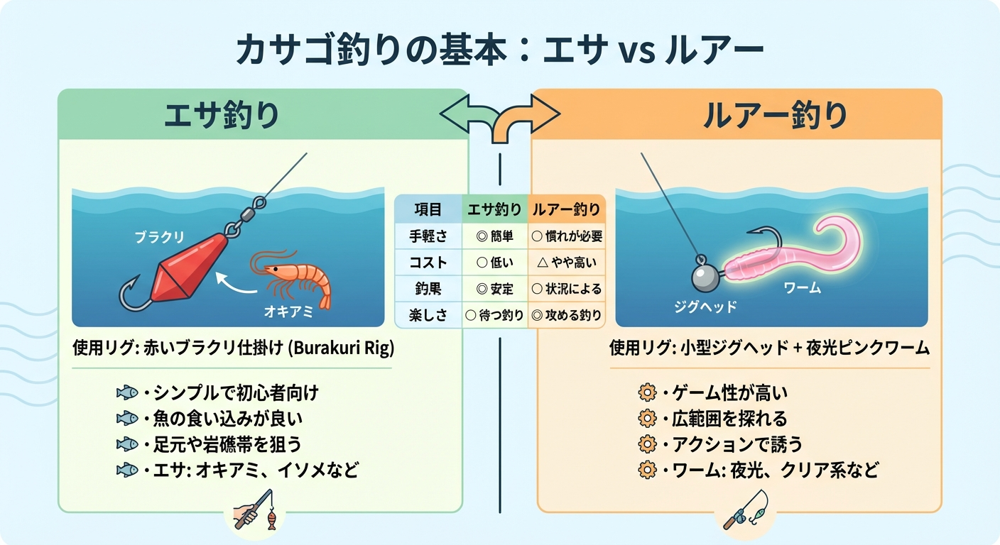
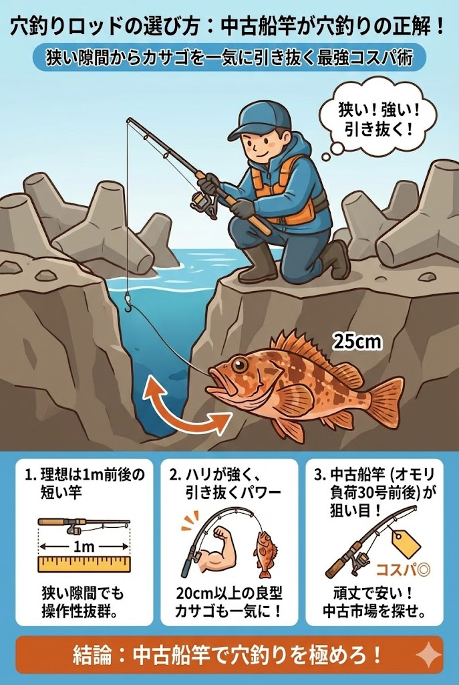

カサゴは **根魚（ロックフィッシュ）** と呼ばれ、冬の人気対象魚です。

岩礁帯に生息する魚のため、砂地な浜名湖に「居ないのでは？」と思われがち。しかし今切口の堤防にはテトラが多くあり、カサゴが身を潜めているため、1年中釣ることができるターゲットです。

本記事では、「 **浜名湖でカサゴを釣るなら？** 」をポイント別で解説しています。ぜひ釣行の参考にしてください！

## 浜名湖のカサゴ釣りの特徴

浜名湖内にカサゴが居るのは、表浜名湖エリアにほぼ限定されます。

奥浜名湖にも岩礁帯があるので、過去にメバルと共に居た記録こそありますが、魚釣りをするなら表浜名湖かつ今切口がおすすめ。ポイントは「 **新居弁天海釣公園** 」と「 **舞阪堤** 」が安定して釣ることができます。

浜名湖で釣れる大きさは、10～20cmくらいの手乗りサイズがメイン。25cmを超えれば珍しく、30cm以上の尺超えは奇跡レベル。カサゴ以外にもソイ（クロソイ・ムラソイ）も居ますし、時期によってはメバルも期待できます。

世間的に「 **根魚 or ロックフィッシュ** 」と呼ばれるカサゴは、エサ釣りはもちろん、ルアーでも人気がある対象魚です。

今切口は外洋と繋がっているため、1年を通して水温が比較的安定しています。そのため冬でも水温が下がりきることもなく、夏でも高くなりすぎることもありません。根魚は暗闇の穴底に隠れているため、そこにエサを届けることさえ出来れば、いつでも釣ることができる相手だったりします。

### 根魚は釣りすぎ厳禁！

カサゴなど根魚は、総じて繁殖力が強い魚ではありません。成長も遅く、イワシやアジのように1年ごとに新しく同じサイズが入れ替わることがありません。

そのため、釣れば釣るほど減ってしまうため、釣りあげても大切に扱い、 **リリース** することが推奨されています。

根魚の旬は冬から春にかけての産卵期が多く、この時期は他にめぼしい対象魚も居ないので、根魚たちを釣る人が増えます。ここで釣りすぎると、未来の釣り人が楽しむことが難しくなることも考慮してください。

## カサゴの基本的な釣り方

カサゴは肉食のため、釣る方法はエサとルアーどちらでも可能です。
 

### エサ釣りなら

エサなら「 **虫エサ（イソメ・ジャムシ）、オキアミ、モエビ、イカの短冊、サンマの切り身など** 」が挙げられます。わりと雑食タイプで、匂いがありつつ目の前に置けばとりあえずパクっと食いつくようなタイプ。

特におすすめなのは、冷凍保存が可能でコスパも良い **オキアミ** です。肉食のイメージが強くサンマやイカなどの切り身が推奨されますけど、オキアミでも尺レベルは釣れるので安心してください。問題は”それが居るかどうか”です。

### ルアー釣りなら

ルアーはいくつか選択肢があります。

ロックフィッシュのリグとして定番の、小型ピンテールワームに5~10gの **ジグヘッド** 。アジング用でも流用可能ですが、カサゴなどの根魚は底に居る魚なので、ウェイトはしっかり底をとれる重さが理想的です。

一昔の定番は「 **スプーン** 」。現在は管釣りのトラウトで使われますが、これでカサゴやメバルなどの根魚も釣ることができます。ただ、カサゴは岩礁帯かつ底に居るため、スプーンは根掛かりがしやすくデメリットもあります。

### カサゴを釣るコツは「眼の前にエサを置く」こと

どちらの釣り方も基本的な考えとして、 **カサゴの眼の前にエサを届ける** ことがコツです。

特にロックフィッシュ狙いのメディア紹介では、軽いリグが有利と紹介されます。それはメバルの話で、カサゴに限定するなら、オモリを重めにしてさっさと水底にエサを届けるのがベスト。

底にエサ（ルアー）が着いたら、少し上下に動かして反応がなければ、「 **居ないかも** 」と判断して次に行くくらいでもOK。

基本的に動き回らない魚ですが、エサが目の前にあると飛びついてくる相手なので、フットワークを軽くして転々と探ることが釣果を伸ばすコツです。

## 浜名湖でカサゴが釣れるおすすめのポイント4選

浜名湖でカサゴを釣るなら、ポイントは表浜名湖限定かつ今切口に絞られます。

### 1. 今切口舞阪堤
**おすすめのシーズン：1年中（サイズ狙いなら3~6月）**

今切口の舞阪堤は、浜名湖でもっともカサゴの魚影が濃いポイントです。

小型のテトラポットが積み重なっている所があり、ここの **穴釣り** はかなり狭い隙間を通す必要があるので、短くて傷ついてもいい竿を使い、誰もやらなそうな穴に入れるほど効果があります。

ロックフィッシュ人気で専用タックルを使う人が多く、わりと高価で傷つけたくない心理が働くため、カサゴ狙いの穴釣りではけっこう穴場なポイントですね。

### 2. 網干場＆舞阪港周辺
**おすすめのシーズン：11~6月**

舞阪堤から続く網干場は、広々とした護岸堤防の際に岩とテトラが沈んでおり、ここをねぐらにしている根魚を狙うことができます。明確に穴が見えないため、手探りで魚を探していく必要があります。

おすすめの時期は、メバルの活性が高めになる晩秋から春にかけて。メバルを狙いつつ、底付近に居るカサゴにも期待しつつ……な攻め方がおすすめです。

### 3. 新居弁天海釣公園
**おすすめのシーズン：1年中**

新居弁天海釣公園はT字堤防を含め、ほぼ全域でカサゴを狙うことができます。

T字堤は足元にエサをつけた仕掛けを底まで落としておき、掛かるまで放置するだけでも釣れます。なので **初心者** 向けのポイントですが、カサゴ自体が動き回らないため、場所が悪いと全く反応がないことも……。

### 4. 砂揚場
**おすすめのシーズン：10~5月**

砂揚場でのカサゴ釣りは、堤防の際にエサを落として待つことが基本です。個体数が多くはないため、もし数釣りを狙うなら堤防全域の際を探る **ランガンスタイル** がおすすめ。

カレイの投げ釣りと併用して、置き竿にしている間に堤防のヘチ（際）を探るスタイルが効率的ですのでおすすめです。

## カサゴを釣るおすすめのタックル構成

### 穴釣りなら1～2mの竿（船釣り用がおすすめ）

穴釣りで使う竿は、1m前後の短い竿でハリが強く、釣れたカサゴを引き抜ける強さがあることが理想です。

狭い隙間に仕掛けを沈めて、食いついた20cm以上のカサゴを一気に引き抜く必要があるため、中古の **船竿** （オモリ負荷30号前後）などが非常に使い勝手が良く、コストパフォーマンスも高いです。

### ルアーロッドならロックフィッシュモデル

メバリングなどロックフィッシュ目的なら、 **7ft前後** のモデルを選択すればいいでしょう。

カサゴ専用で狙うことを考えるなら、より重いウェイトを使えるシーバスモデルでも対応可能です。基本は足元の釣りになるので、取り回しの良さを重視しましょう。

### エサ釣りでおすすめなのは「ブラクリ仕掛け」

カサゴのエサ釣りに使う仕掛けは、オモリと針だけのシンプルな **ブラクリ** 仕掛けが鉄板です。

大きさは2号か3号を選び、オモリ部分がなるべく細長い物を選ぶと、穴釣りで **根掛かり** しにくいのでおすすめです。

## まとめ：カサゴはボウズ逃れに最高の相手！

カサゴ釣りは冬のイメージが強いですが、1年中釣ることはできますし、慣れれば非常に簡単です。

エサを眼の前に落とせば大抵食いついてくれるし、アタリも明確。浜名湖内はサイズ狙いが難しいものの、ポイントを広く歩けば数釣りを楽しむこともできます。

結果も早く出る相手ですので、短時間で何かを釣り上げたい時の選択肢として、ぜひ「 **カサゴ釣り** 」に挑戦してみてください！