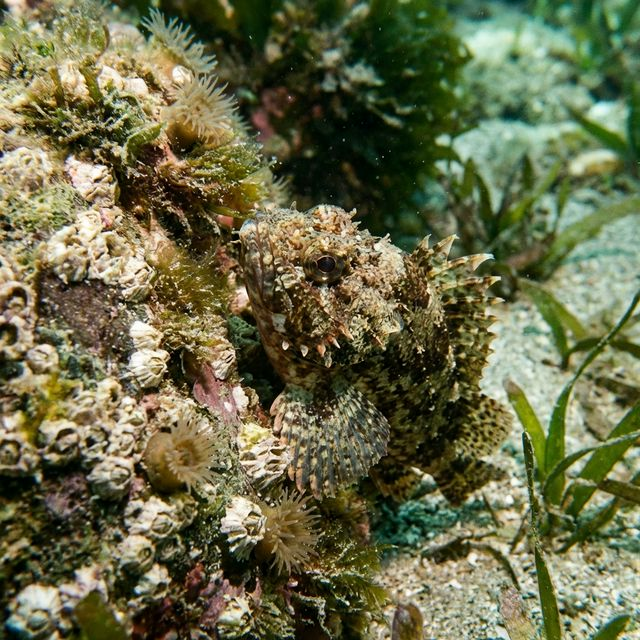

import BlogCard from "@components/BlogCard.astro";

カサゴは岩やテトラポットの隙間に身を潜めている **「根魚（ロックフィッシュ）」** です。目の前にエサが落ちてくると猛然と飛びつく習性があり、初心者でも比較的簡単に釣ることができます。

砂地が多い浜名湖の中で、カサゴが密集する鉄板ポイントや、高確率で仕留めるためのエサ・仕掛けのノウハウをまとめました。

## 浜名湖カサゴ釣りのベストシーズン：狙い目は冬から春

カサゴは水温変動に強く、浜名湖では **1年中（通年）** 狙うことができます。その中でも特におすすめの時期は以下の通りです。

*   **ベストシーズン**： **12月から5月頃**
*   **特徴**：この時期は産卵期にあたるため、大型の食い気が非常に高まります。脂も乗って「冬の旬」として食味も抜群です。
*   **冬の救世主**：他の魚が釣りにくくなる真冬でも安定して釣果が期待できるため、冬のメインターゲットとして非常に人気があります。

## 表浜名湖エリアの厳選カサゴポイント 4選

カサゴは岩礁帯を好むため、ポイントは外洋に近い **「表浜名湖」** や **「今切口周辺」** に集中します。

### 1. 新居弁天海釣公園
T字堤防のヘチ（際）や沈んでいる捨石周りをダイレクトに狙います。
*   **特徴**：足場が非常に良く、駐車場やトイレ完備。
*   **おすすめ**：安全に楽しめるため、ファミリーや初心者の方に最適です。

### 2. 今切口 舞阪堤
小型テトラが密集しており、浜名湖で最もカサゴの魚影が濃いとされる聖地です。
*   **特徴**：テトラの隙間を狙う **「穴釣り」** がメインになります。
*   **注意**：潮の流れが極めて速く、テトラ上での作業となるため、ライフジャケットなどの安全装備は必須です。

### 3. 網干場（あみほしば）
護岸堤防の際に岩やテトラが沈んでおり、広範囲を探る釣りに向いています。
*   **特徴**：メバルも混じるポイントで、夜釣りでの期待値も高いエリアです。

### 4. 砂揚げ場（すなあげ）・浜名港
堤防の継ぎ目や、岸壁ギリギリを狙う釣りが有効です。
*   **特徴**：車を横付けして釣りができるエリアがあり、寒い冬場でも快適に楽しめます。

## 初心者でも簡単！おすすめの仕掛けとエサ

カサゴ釣りはシンプル。基本は「穴釣り」や「ヘチ釣り」で足元を狙います。

### エサ釣りの決定版：ブラクリ仕掛け
オモリと針が一体化した **「ブラクリ仕掛け」** が圧倒的におすすめです。
*   **理由**：根掛かりしにくく、転がりやすいためテトラの奥深くまでエサを届けてくれます。
*   **誘い方**：底まで落とし、竿先を軽く上下させて「ここにエサがあるよ」とアピールしましょう。

### 状況別おすすめエサ
*   **アオイソメ（青ジャムシ）**：オールラウンドに使える万能エサです。
*   **オキアミ**：安価で食い込みも良いですが、エサ持ちが少し弱いです。
*   **サンマやサバの切り身**：強いニオイで広範囲から引き寄せます。エサ取りに強く、大型狙いには欠かせません。

### タックル選びのポイント
*   **竿**：穴釣りなら1〜2m程度の **短くて硬い竿** が有利。根に潜られる前に一気に引き抜くパワーが必要です。
*   **ルアー**：5〜10g程度のジグヘッドに、小型のワーム（ピンテールなど）を組み合わせて底付近をリフト＆フォールさせます。

> [!IMPORTANT]
> **資源保護にご協力ください（キャッチ＆リリース）**
> カサゴは成長が非常に遅い魚です。資源を守るため、 **15cm以下の小型サイズ** や、お腹が大きく膨らんだ **抱卵個体** が釣れた場合は、優しくリリースしてあげましょう。

## まとめ：冬の浜名湖をカサゴで楽しもう！

カサゴは派手な引きこそありませんが、足元の「小さな宇宙（隙間）」を探る楽しみは格別です。今度のお休みは、温かい飲み物を持って浜名湖の足元を探索してみてはいかがでしょうか。

<BlogCard slug="guide/method/anazuri" />
