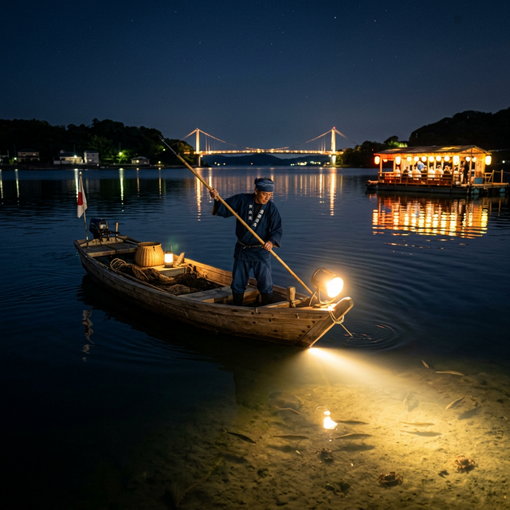

import BlogCard from "@components/BlogCard.astro";
import TackleCard from "@components/TackleCard.astro";

浜名湖の夜には、100年以上続く伝統と、最新のレジャーが融合した「特別な体験」が待っています。

それが、 伝統漁法「たきや漁」 と<strong>大人気アクティビティ「えびすき漁」</strong>です。

どちらも一般の観光客が遊漁船に乗って楽しめる、全国的にも珍しい体験。この記事では、それぞれの魅力と、旅行プランへの組み込み方を徹底解説します。

---

## たきや漁：獲ってその場で食べる！湖上エンターテインメント

「たきや漁」は、船の先端に灯した強い明かりで湖底を照らし、モリで獲物を突く100年以上の歴史を持つ漁法です。

|項目|内容|
| :--- | :--- |
|開催時期| 5月15日〜9月30日（2026年）|
|時間帯|日没後〜約3〜3.5時間 |
| <strong>ターゲット</strong> |カニ（タイワンガザミ）、クロダイ、マゴチ、サヨリなど|
|スタイル| 専用モリで突く|
|料金（1隻）| 料理付き 40,000円 / 繁忙期 44,000円|
|料理なしプラン| 34,000円 / 繁忙期 38,000円|
|定員（1隻）| 大人4名まで（中学生以上は大人扱い）|
|最大受け入れ| 5隻・最大18名まで対応|
|問い合わせ| 090-8910-8075（月〜土 11:00〜15:00）|

### 観光としての最大の魅力：湖上の宴「たきや亭」
漁の後は、浜名湖上に浮かぶイカダの宴会場「たきや亭」へ。

<strong>船頭さんが獲れたての獲物をその場で天ぷらやニンニクソテーに調理</strong>してくれます。夜風に吹かれながら、自分で獲った幸を食べる瞬間は格別です。

※飲み物や食べ物の持ち込みも自由なスタイルが一般的です。

---

## えびすき漁：流れてくるエビをすくう夜の宝探し

「えびすき漁」は、引き潮に乗って浜名湖から外海へ流れ出すクルマエビを、船の上からタモ網ですくう現代の人気アクティビティです。

|項目|内容|
| :--- | :--- |
|開催時期| 春〜秋（潮流条件による）|
|時間帯|満潮から干潮への潮が流れる時間（19時〜深夜2時頃まで） |
| <strong>ターゲット</strong> |クルマエビ、カニ、小魚|
|スタイル|船を橋脚に固定し、流れてくるものを網ですくう|
|料金（1隻）| 1〜3名 33,000円 / 6名 46,200円（人数段階制）|
|定員（1隻）| 1〜6名（1組専用チャーター制）|
|予約| reserva.be 経由（2026年は3月1日より受付）|

### 観光としての最大の魅力：誰でも簡単＆大漁の可能性
モリ突きのような技術は不要！

<strong>「流れてくるエビを網で入れるだけ」</strong>なので、小さなお子様から女性まで誰でも手軽に楽しめます。一度に数百匹という単位で「大漁」になることも珍しくありません。

また、集まってきたシーバスを釣竿で狙うことも可能です。

---

## 【徹底比較】あなたにぴったりの漁はどっち？

どちらも素晴らしい体験ですが、旅のスタイルに合わせて選ぶのがおすすめです。

|比較項目|たきや漁|えびすき漁|
| :--- | :--- | :--- |
|難易度|やや高め（モリ突きの技術） |低い（網ですくうだけ） |
|食事|たきや亭で調理・宴会（飲酒可）| 持ち帰ってBBQ・アヒージョ |
|おすすめ層|**社員旅行・友人グループ・カップル**|ファミリー・キャンプ好き|
|最大人数|18名（5隻）|6名（1隻）|
|料金目安|40,000〜44,000円/隻|33,000〜46,200円/隻|

---

## 社員旅行・友人グループで使う

たきや漁は「夜に集まって獲って食べて飲む」という流れが最初から設計されているため、<strong>幹事が一番楽なアクティビティ</strong>のひとつだ。

- **最大18名（5隻）まで対応**。4〜8名の小グループから10名超の大人数まで複数隻で対応できる
- 帰漁後は筏の宴会場「たきや亭」へ移動。獲れたての天ぷら・ソテーを囲んで飲酒可
- 幻想的な夜の湖面×宴会×獲れたて料理はそのままSNS映えするコンテンツになる
- 大型バス対応駐車場あり。バスで団体移動しても乗り付けられる

> **団体割引について**: 2026年9月時点で公式サイト上に特別割引の記載はなく、料金は1隻単位の設定のみ。10名を超える大人数や特殊な要件は電話（090-8910-8075）で直接相談を。

---

## 失敗しないための予約とプランニング

これらの漁は「夜間」に行われるため、 <strong>日帰りプランよりも「宿泊」とセットで考えるのがベスト</strong>です。

たきや漁・えびすき漁などの浜名湖体験はアソビューでも検索・予約できます。

<TackleCard id="travel/asoview-banner" />

### 1. 宿泊施設と組み合わせる（たきや漁）

たきや漁は深夜まで盛り上がることが多いため、弁天島周辺のホテルや温泉宿に宿泊するプランが最も快適だ。

弁天島湖畔の民宿「<strong>水辺のおやど いのうえ</strong>」では、たきや漁体験＋筏でのディナー＋一泊朝食付きのセットプランが組まれている（英語通訳同行・インバウンド対応）。

| 人数 | 通常期（/人） | 休日・盆期間（/人） |
| :--- | :--- | :--- |
| 2名 | 56,100円 | 59,950円 |
| 3〜5名 | 50,600円 | 55,000円 |
| 6〜7名 | 46,200円 | 49,500円 |

※ 予約締切：希望日の10日前まで

  <TackleCard id="travel/rakuten-travel-stay" noMargin={true} />
  <TackleCard id="travel/jalan-net-banner" noMargin={true} />

### 2. キャンプ・BBQと組み合わせる（えびすき漁）
えびすき漁で獲れた大量のクルマエビは、キャンプ場に持ち帰って「BBQ」や「アヒージョ」にするのが最高の贅沢です。

新居・弁天島エリアにはキャンプ場も多いため、アウトドア派に最適です。

---

## 注意点と準備するもの

1.  服装:海水や水しぶきで濡れます。滑らない靴（サンダル不可の船もあります）と、防水の羽織もの（ウインドブレーカーなど）を用意しましょう。
2.  天候判断:夜間のため、悪天候時は安全を考慮して欠航になります。予約時に中止判断のタイミングを確認しておきましょう。
3.  条例とルール:これらは特別な「許可」を得た遊漁船で行うものです。<strong>個人が勝手に夜間にライトで照らしてモリで突く行為は、条例で厳しく禁止されています</strong>。必ず公認の組合や遊漁船を利用してください。

<BlogCard slug="guide/beginner/hamanako-fishing-rules-and-manners" />

---

## まとめ：浜名湖の夜は、水の上にこそ物語がある

静寂な湖面をライトが照らし、獲物を見つけた瞬間の歓声。たきや漁・えびすき漁は、単なる「漁」ではなく、浜名湖の魅力を全身で感じる最高のエンターテインメントです。

今年の夏は、少し夜更かしをして、忘れられない思い出を作りに来ませんか？

<BlogCard slug="araibenten-umiduripark" />
